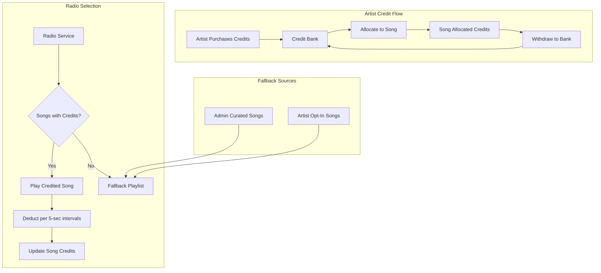

# Credit System Redesign

## CRITICAL BUG FIX: Missing User Creation Endpoint

### Problem

Users can authenticate via Firebase but their profiles are empty and they don't appear in the admin dashboard.

### Root Cause

The `UsersController` is **missing the `@Post()` endpoint** for creating users in Supabase.

- `UsersService.createUser()` exists (line 8-35 in users.service.ts)
- `usersApi.create()` calls `POST /users` from frontend
- But `UsersController` has no `@Post()` handler - returns 404!

### Fix Required

Add to [backend/src/users/users.controller.ts](backend/src/users/users.controller.ts):

```typescript
import { Post } from '@nestjs/common';
import { CreateUserDto } from './dto/create-user.dto';

@Post()
async createUser(
    @CurrentUser() user: FirebaseUser,
    @Body() createUserDto: CreateUserDto,
) {
    return this.usersService.createUser(user.uid, createUserDto);
}
```

This must be fixed BEFORE implementing other features.

---

## Current State

The system has two disconnected credit mechanisms:

- **Artist credits** (`credits.balance`) - purchased via Stripe but never used
- **Song credits** (`songs.credits_remaining`) - checked by radio but never populated

This plan connects them and adds the fallback playlist system.

---

## Architecture Overview



---

## Phase 1: Database Schema Changes

### 1.1 Modify `songs` table

Add new columns:

```sql
ALTER TABLE songs ADD COLUMN fallback_eligible BOOLEAN DEFAULT FALSE;
ALTER TABLE songs ADD COLUMN opt_in_free_play BOOLEAN DEFAULT FALSE;
ALTER TABLE songs ADD COLUMN duration_seconds INTEGER DEFAULT 180;
-- credits_remaining already exists, will represent allocated credits
```

### 1.2 Create `admin_fallback_songs` table

For admin-uploaded royalty-free/house music:

```sql
CREATE TABLE admin_fallback_songs (
    id UUID PRIMARY KEY DEFAULT uuid_generate_v4(),
    title TEXT NOT NULL,
    artist_name TEXT NOT NULL,
    audio_url TEXT NOT NULL,
    artwork_url TEXT,
    duration_seconds INTEGER DEFAULT 180,
    is_active BOOLEAN DEFAULT TRUE,
    play_count INTEGER DEFAULT 0,
    created_at TIMESTAMPTZ DEFAULT NOW(),
    updated_at TIMESTAMPTZ DEFAULT NOW()
);
```

### 1.3 Create `credit_allocations` table (audit trail)

```sql
CREATE TABLE credit_allocations (
    id UUID PRIMARY KEY DEFAULT uuid_generate_v4(),
    artist_id UUID REFERENCES users(id),
    song_id UUID REFERENCES songs(id),
    amount INTEGER NOT NULL,
    direction TEXT NOT NULL CHECK (direction IN ('allocate', 'withdraw')),
    balance_before INTEGER NOT NULL,
    balance_after INTEGER NOT NULL,
    created_at TIMESTAMPTZ DEFAULT NOW()
);
```

---

## Phase 2: Credit Allocation Service

### 2.1 Create new service: `backend/src/credits/credits.service.ts`

```typescript
// Key methods to implement:

async allocateCreditsToSong(artistId: string, songId: string, amount: number) {
    // 1. Verify song belongs to artist
    // 2. Check artist has sufficient balance
    // 3. Deduct from credits.balance
    // 4. Add to songs.credits_remaining
    // 5. Log to credit_allocations table
    // 6. Update credits.total_used
}

async withdrawCreditsFromSong(artistId: string, songId: string, amount: number) {
    // 1. Verify song belongs to artist
    // 2. Check song has sufficient credits_remaining
    // 3. Deduct from songs.credits_remaining
    // 4. Add to credits.balance
    // 5. Log to credit_allocations table
}

async calculateCreditsForDuration(durationSeconds: number): number {
    // Per 5 seconds, rounded up
    return Math.ceil(durationSeconds / 5);
}
```

### 2.2 New endpoints in `backend/src/credits/credits.controller.ts`

```typescript
@Post('songs/:songId/allocate')
async allocateCredits(
    @CurrentUser() user,
    @Param('songId') songId: string,
    @Body() dto: { amount: number }
)

@Post('songs/:songId/withdraw')
async withdrawCredits(
    @CurrentUser() user,
    @Param('songId') songId: string,
    @Body() dto: { amount: number }
)
```

---

## Phase 3: Radio Service Updates

### 3.1 Modify `backend/src/radio/radio.service.ts`

**Critical: Credit validation before playing**

A song will NOT be played unless it has enough credits to cover its FULL playtime. This prevents partial plays.

```typescript
private calculateCreditsRequired(durationSeconds: number): number {
    // Per 5 seconds, rounded up
    return Math.ceil(durationSeconds / 5);
}

private async getCreditedSong() {
    const supabase = getSupabaseClient();
    
    // Get approved songs with credits
    const { data: songs } = await supabase
        .from('songs')
        .select('*')
        .eq('status', 'approved')
        .gt('credits_remaining', 0)
        .order('created_at', { ascending: true });
    
    if (!songs) return null;
    
    // Filter to only songs with ENOUGH credits for full play
    const eligibleSongs = songs.filter(song => {
        const creditsRequired = this.calculateCreditsRequired(song.duration_seconds || 180);
        return song.credits_remaining >= creditsRequired;
    });
    
    // Exclude current song to avoid repeat
    const currentSongId = (await this.getQueueState())?.song_id;
    const nextSong = eligibleSongs.find(s => s.id !== currentSongId) || eligibleSongs[0];
    
    return nextSong || null;
}
```

**Deduct credits after successful play:**

```typescript
private async playSong(song: any) {
    const creditsToDeduct = this.calculateCreditsRequired(song.duration_seconds || 180);
    
    // Double-check credits (defensive)
    if (song.credits_remaining < creditsToDeduct) {
        return null; // Skip to fallback
    }
    
    await supabase
        .from('songs')
        .update({
            credits_remaining: song.credits_remaining - creditsToDeduct,
            play_count: (song.play_count || 0) + 1,
        })
        .eq('id', song.id);
    
    // ... rest of method
}
```

**Add fallback playlist logic:**

```typescript
async getNextTrack() {
    // 1. Try to get credited songs with ENOUGH credits for full play
    const creditedSong = await this.getCreditedSong();
    if (creditedSong) return await this.playSong(creditedSong);
    
    // 2. Fall back to opt-in songs from artists (free play)
    const optInSong = await this.getOptInSong();
    if (optInSong) return await this.playFallbackSong(optInSong);
    
    // 3. Fall back to admin curated playlist
    const fallbackSong = await this.getAdminFallbackSong();
    if (fallbackSong) return await this.playFallbackSong(fallbackSong);
    
    return null;
}

private async getOptInSong() {
    // Songs where opt_in_free_play = true AND status = 'approved'
}

private async getAdminFallbackSong() {
    // Random song from admin_fallback_songs where is_active = true
}

private async playFallbackSong(song: any) {
    // Play without deducting credits (free rotation)
    // Just log the play and return song info
}
```

---

## Phase 4: Frontend - Artist Dashboard

### 4.1 Create "My Songs" Page: `web/src/app/(dashboard)/artist/songs/page.tsx`

Artists need to see all their uploaded songs with:

| Column | Description |
|--------|-------------|
| Title | Song title |
| Status | pending / approved / rejected (with color badge) |
| Duration | e.g., "3:24" |
| Credits | Current allocated credits |
| Plays | Total play count |
| Actions | "Allocate Credits" button (only for approved songs) |

**UI Flow:**

1. Artist visits `/artist/songs`
2. Sees list of all their uploaded songs
3. Pending songs show "Awaiting Review" status
4. Approved songs show "Allocate Credits" button
5. Clicking "Allocate Credits" navigates to `/artist/songs/[id]/allocate`

### 4.2 Create Credit Allocation Page: `web/src/app/(dashboard)/artist/songs/[id]/allocate/page.tsx`

Shows minute bundles with plays calculation for customer clarity:

```
Song: "Track Title" (3:24 duration)
Credits per play: 41 credits (204s / 5s, rounded up)

Your Credit Bank: 500 credits

SELECT A BUNDLE:
  [ ] 1 min  / ~1 play    (12 credits)
  [ ] 3 min  / ~4 plays   (36 credits)
  [ ] 5 min  / ~7 plays   (60 credits)
  [ ] 10 min / ~14 plays  (120 credits)
  [ ] 30 min / ~44 plays  (360 credits)
  [ ] Custom: [____] credits

[Cancel]  [Allocate Credits]
```

**Plays Calculation Formula:**

```typescript
// For each bundle, calculate estimated plays based on song duration
const creditsPerPlay = Math.ceil(song.duration_seconds / 5);
const estimatedPlays = Math.floor(bundleCredits / creditsPerPlay);

// Example for 3:24 song (204 seconds):
// creditsPerPlay = ceil(204/5) = 41 credits
// 60 credit bundle = floor(60/41) = ~1 play
// 360 credit bundle = floor(360/41) = ~8 plays
```

### 4.3 Update Credits Page: `web/src/app/(dashboard)/artist/credits/page.tsx`

Simplify to show:

- Credit bank balance (big number display)
- "Buy Credits" button (existing Stripe flow)
- Link to "Manage Song Credits" -> `/artist/songs`
- Transaction history

### 4.4 Add withdraw feature to allocation page

On the allocation page, if song already has credits:

- Show current allocation amount
- "Add More Credits" option
- "Withdraw Credits" button to return credits to bank
- Toggle for "Opt-in for free play" (fallback rotation when credits depleted)

### 4.5 Backend: Add endpoint for artist's songs

In `backend/src/songs/songs.controller.ts`:

```typescript
@Get('mine')
async getMySongs(@CurrentUser() user: FirebaseUser) {
    // Return all songs where artist_id matches user
    // Include: id, title, status, duration_seconds, credits_remaining, play_count
}
```

### 4.6 Web: Add to `web/src/lib/api.ts`

```typescript
export const creditsApi = {
    getBalance: () => api.get('/credits/balance'),
    allocateToSong: (songId: string, amount: number) => 
        api.post(`/credits/songs/${songId}/allocate`, { amount }),
    withdrawFromSong: (songId: string, amount: number) => 
        api.post(`/credits/songs/${songId}/withdraw`, { amount }),
};

export const songsApi = {
    // Existing methods...
    getMySongs: () => api.get('/songs/mine'),
    toggleOptIn: (songId: string, optIn: boolean) =>
        api.patch(`/songs/${songId}`, { optInFreePlay: optIn }),
};
```

---

## Phase 5: Admin Dashboard Updates

### 5.1 Admin Songs View

Admins should be able to:

- View ALL uploaded songs (not just their own)
- Filter by status (pending/approved/rejected)
- See artist info, duration, credits allocated
- Approve/reject songs (existing)
- Allocate credits to any song (admin override)

Updates needed to `web/src/app/(dashboard)/admin/songs/page.tsx`:

- Add "Credits" column showing `credits_remaining`
- Add "Allocate" action for admin to grant credits directly

---

## Phase 6: Admin Fallback Playlist Management

### 6.1 Backend: Create `backend/src/admin/fallback.service.ts`

```typescript
async addFallbackSong(dto: CreateFallbackSongDto)
async removeFallbackSong(songId: string)
async listFallbackSongs()
async toggleFallbackSongActive(songId: string, isActive: boolean)
```

### 6.2 Admin endpoints in `backend/src/admin/admin.controller.ts`

```typescript
@Post('fallback-songs')
@Get('fallback-songs')
@Delete('fallback-songs/:id')
@Patch('fallback-songs/:id')
```

### 6.3 Admin UI: Create fallback playlist management page

---

## Phase 7: Rejected Song Handling & Cleanup

### 7.1 Database Schema Updates

Add columns to `songs` table:

```sql
ALTER TABLE songs ADD COLUMN rejection_reason TEXT;
ALTER TABLE songs ADD COLUMN rejected_at TIMESTAMPTZ;
```

Create `notifications` table for in-app notifications:

```sql
CREATE TABLE notifications (
    id UUID PRIMARY KEY DEFAULT uuid_generate_v4(),
    user_id UUID REFERENCES users(id) ON DELETE CASCADE,
    type TEXT NOT NULL,  -- 'song_rejected', 'song_approved', etc.
    title TEXT NOT NULL,
    message TEXT,
    metadata JSONB,  -- { songId, songTitle, reason, etc. }
    read BOOLEAN DEFAULT FALSE,
    created_at TIMESTAMPTZ DEFAULT NOW()
);
```

### 7.2 Admin Rejection Flow

Update `backend/src/admin/admin.service.ts`:

```typescript
async rejectSong(songId: string, reason?: string) {
    const supabase = getSupabaseClient();
    
    // Get song details first
    const { data: song } = await supabase
        .from('songs')
        .select('*, users!artist_id(email, display_name)')
        .eq('id', songId)
        .single();
    
    // Update song status
    await supabase
        .from('songs')
        .update({
            status: 'rejected',
            rejection_reason: reason || null,
            rejected_at: new Date().toISOString(),
        })
        .eq('id', songId);
    
    // Create in-app notification
    await this.notificationService.create({
        userId: song.artist_id,
        type: 'song_rejected',
        title: 'Song Rejected',
        message: `Your song "${song.title}" was not approved.${reason ? ` Reason: ${reason}` : ''}`,
        metadata: { songId, songTitle: song.title, reason },
    });
    
    // Send email notification
    await this.emailService.sendSongRejectedEmail(
        song.users.email,
        song.users.display_name,
        song.title,
        reason
    );
}
```

### 7.3 Email Service

Create `backend/src/notifications/email.service.ts`:

```typescript
@Injectable()
export class EmailService {
    async sendSongRejectedEmail(
        email: string,
        artistName: string,
        songTitle: string,
        reason?: string
    ) {
        // Use SendGrid, Resend, or similar
        // Email content:
        // - Song was rejected
        // - Reason (if provided)
        // - 48-hour window to contact support
        // - Support email/link
    }
}
```

### 7.4 Notification Service

Create `backend/src/notifications/notification.service.ts`:

```typescript
@Injectable()
export class NotificationService {
    async create(dto: CreateNotificationDto) { ... }
    async getForUser(userId: string) { ... }
    async markAsRead(notificationId: string) { ... }
    async getUnreadCount(userId: string) { ... }
}
```

### 7.5 Scheduled Cleanup Job

Create `backend/src/tasks/cleanup.service.ts`:

```typescript
import { Injectable } from '@nestjs/common';
import { Cron, CronExpression } from '@nestjs/schedule';

@Injectable()
export class CleanupService {
    // Run every hour
    @Cron(CronExpression.EVERY_HOUR)
    async cleanupRejectedSongs() {
        const supabase = getSupabaseClient();
        const cutoffTime = new Date(Date.now() - 48 * 60 * 60 * 1000); // 48 hours ago
        
        // Get songs to delete
        const { data: songsToDelete } = await supabase
            .from('songs')
            .select('id, audio_url, artwork_url')
            .eq('status', 'rejected')
            .lt('rejected_at', cutoffTime.toISOString());
        
        if (!songsToDelete?.length) return;
        
        for (const song of songsToDelete) {
            // Delete files from storage
            if (song.audio_url) {
                await this.deleteFromStorage('songs', song.audio_url);
            }
            if (song.artwork_url) {
                await this.deleteFromStorage('artwork', song.artwork_url);
            }
            
            // Delete database record
            await supabase.from('songs').delete().eq('id', song.id);
        }
        
        console.log(`Cleaned up ${songsToDelete.length} rejected songs`);
    }
    
    private async deleteFromStorage(bucket: string, url: string) {
        // Extract path from URL and delete from Supabase Storage
    }
}
```

### 7.6 Frontend: Notification Bell

Add notification indicator to dashboard header:

```typescript
// In dashboard layout
const { data: unreadCount } = useNotifications();

<button className="relative">
    <BellIcon />
    {unreadCount > 0 && (
        <span className="absolute -top-1 -right-1 bg-red-500 text-white text-xs rounded-full w-5 h-5">
            {unreadCount}
        </span>
    )}
</button>
```

### 7.7 Frontend: Artist Notifications Page

Create `web/src/app/(dashboard)/notifications/page.tsx`:

- List all notifications
- Mark as read on click
- Show rejection reason
- Link to support contact

### 7.8 Admin UI: Rejection Reason Input

Update admin song approval UI to include optional reason field:

```
┌────────────────────────────────────────┐
│  Reject Song                           │
│                                        │
│  Reason (optional):                    │
│  ┌────────────────────────────────┐   │
│  │ Audio quality too low...       │   │
│  └────────────────────────────────┘   │
│                                        │
│  [Cancel]        [Reject Song]         │
└────────────────────────────────────────┘
```

---

## Future Considerations (Not Implemented Now)

These features are noted for future implementation:

1. **Analytics-Based Selection**: Use play data to prioritize popular songs at peak hours
2. **Tiered Engagement Levels (1-5)**: 
   - Monitor live listeners
   - Scale 1 (low) to 5 (high) listener thresholds
   - Artists pay premium for higher tiers
   - Songs only play when listener count meets threshold
3. **Different Credit Rates per Tier**: Higher tiers deduct credits faster but guarantee more exposure

---

## Files to Create/Modify

| File | Action | Description |
|------|--------|-------------|
| `backend/src/users/users.controller.ts` | Modify | Add POST /users endpoint (CRITICAL BUG FIX) |
| `backend/src/credits/credits.service.ts` | Create | Credit allocation logic |
| `backend/src/credits/credits.controller.ts` | Modify | Add allocate/withdraw endpoints |
| `backend/src/credits/dto/allocate-credits.dto.ts` | Create | DTO for allocation |
| `backend/src/songs/songs.controller.ts` | Modify | Add GET /songs/mine endpoint |
| `backend/src/radio/radio.service.ts` | Modify | Per-5-sec deduction + credit validation + fallback |
| `backend/src/admin/fallback.service.ts` | Create | Fallback playlist management |
| `backend/src/admin/admin.service.ts` | Modify | Add rejection reason + notifications |
| `backend/src/admin/admin.controller.ts` | Modify | Add fallback endpoints + rejection reason |
| `backend/src/notifications/notification.module.ts` | Create | Notification module |
| `backend/src/notifications/notification.service.ts` | Create | In-app notification service |
| `backend/src/notifications/notification.controller.ts` | Create | Notification API endpoints |
| `backend/src/notifications/email.service.ts` | Create | Email notification service |
| `backend/src/tasks/tasks.module.ts` | Create | Task scheduling module |
| `backend/src/tasks/cleanup.service.ts` | Create | Scheduled job for rejected song cleanup |
| `web/src/app/(dashboard)/artist/songs/page.tsx` | Create | Artist "My Songs" dashboard |
| `web/src/app/(dashboard)/artist/songs/[id]/allocate/page.tsx` | Create | Credit allocation with minute bundles |
| `web/src/app/(dashboard)/artist/credits/page.tsx` | Modify | Simplify to bank balance + links |
| `web/src/app/(dashboard)/admin/songs/page.tsx` | Modify | Add credits column + rejection reason |
| `web/src/app/(dashboard)/admin/fallback/page.tsx` | Create | Admin fallback UI |
| `web/src/app/(dashboard)/notifications/page.tsx` | Create | User notifications page |
| `web/src/app/(dashboard)/layout.tsx` | Modify | Add notification bell + artist nav |
| `web/src/lib/api.ts` | Modify | Add new API methods |
| Database migration | Create | Schema changes (songs, notifications tables) |

---

## Navigation Updates

Add to artist sidebar in `web/src/app/(dashboard)/layout.tsx`:

```typescript
const artistNavigation = [
  { name: 'My Songs', href: '/artist/songs', icon: '🎵' },  // NEW
  { name: 'Upload', href: '/artist/upload', icon: '📤' },
  { name: 'Credits', href: '/artist/credits', icon: '💰' },
  { name: 'Stats', href: '/artist/stats', icon: '📈' },
];
```

---

## Credit Calculation Examples

**Per 5-second pricing ensures fair billing regardless of song length:**

For a 3-minute (180 second) song:
- Credits per play = ceil(180 / 5) = **36 credits**

For a 2:30 (150 second) song:
- Credits per play = ceil(150 / 5) = **30 credits**

**Minute Bundle Display Formula:**

```typescript
// Define standard bundles (in credits)
const BUNDLES = [
  { credits: 12, label: '1 min' },    // 12 credits = 60 seconds
  { credits: 36, label: '3 min' },    // 36 credits = 180 seconds
  { credits: 60, label: '5 min' },    // 60 credits = 300 seconds
  { credits: 120, label: '10 min' },  // 120 credits = 600 seconds
  { credits: 360, label: '30 min' },  // 360 credits = 1800 seconds
];

// Calculate plays for each bundle based on song duration
function getBundleWithPlays(bundle, songDurationSeconds) {
  const creditsPerPlay = Math.ceil(songDurationSeconds / 5);
  const estimatedPlays = Math.floor(bundle.credits / creditsPerPlay);
  return `${bundle.label} / ~${estimatedPlays} play${estimatedPlays !== 1 ? 's' : ''}`;
}

// Example: 3:24 song (204 seconds)
// creditsPerPlay = ceil(204/5) = 41
// 60 credits → floor(60/41) = 1 play → "5 min / ~1 play"
// 360 credits → floor(360/41) = 8 plays → "30 min / ~8 plays"
```
