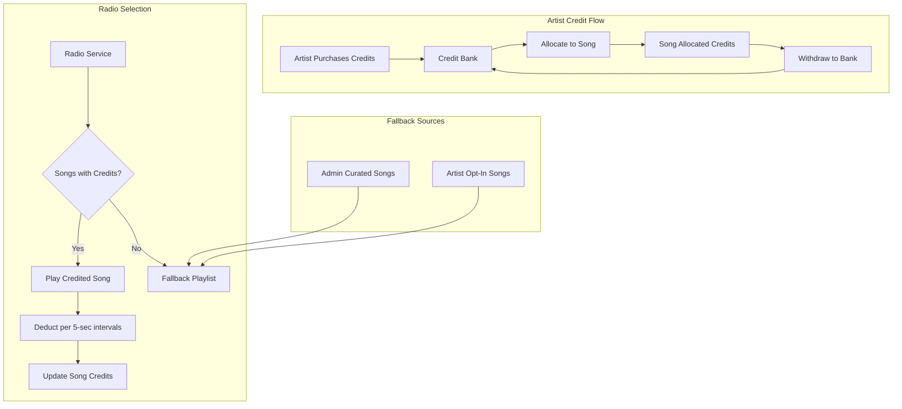

# Credit System Redesign

## Architectural Decisions

These decisions were made after comparing business/logic-focused and architecture/ops-focused approaches:

### 1. Race Conditions: PostgreSQL RPC (Atomic Ledger)

**Decision**: Use `supabase.rpc('allocate_credits')` stored procedures instead of conditional SQL updates.

**Why**: For a financial application, atomicity is non-negotiable. The deduction AND audit log must happen in the exact same transaction. If an artist disputes "I allocated credits but they disappeared," we need 100% proof in the database.

### 2. When to Charge: Pre-Charge Model

**Decision**: Deduct credits BEFORE playing, not after.

**Why**:
- Simpler state management (no locking mechanism, no garbage collector)
- Dispute resolution favors refunds over debt collection
- Already mitigated by filtering songs with `credits >= full_play_cost`

### 3. Duration Validation: Server-Side FFmpeg (Trustless Ingest)

**Decision**: Extract real duration using `fluent-ffmpeg` or `music-metadata` on upload. Overwrite client-provided values.

**Why**: Artists could upload a 10-minute song but tag it as 30 seconds to pay less. The server MUST NOT trust client metadata.

### 4. Radio Selection: Soft-Weighted Random

**Decision**: Use weighted random selection instead of FIFO, with minor nudges:
- Base weight: 1.0 for all eligible songs
- +0.1 bonus for above-average credits allocated
- +0.1 bonus for songs not played in last hour
- Maximum weight: 1.2 (no song >20% more likely than another)

**Why**: FIFO creates predictable rotations. Soft-weighted random keeps it dynamic while giving slight edge to invested artists.

### 5. Mobile UX: WebView Bridge

**Decision**: Add "Manage Credits" button in Flutter that opens web dashboard in WebView/browser.

**Why**: Avoids duplicating complex credit UI in Flutter for Phase 1. Mobile artists aren't locked out.

---

## CRITICAL BUG FIX: Missing User Creation Endpoint

### Problem

Users can authenticate via Firebase but their profiles are empty and they don't appear in the admin dashboard.

### Root Cause

The `UsersController` is **missing the `@Post()` endpoint** for creating users in Supabase.

- `UsersService.createUser()` exists (line 8-35 in users.service.ts)
- `usersApi.create()` calls `POST /users` from frontend
- But `UsersController` has no `@Post()` handler - returns 404!

### Fix Required

Add to [backend/src/users/users.controller.ts](backend/src/users/users.controller.ts):

```typescript
import { Post } from '@nestjs/common';
import { CreateUserDto } from './dto/create-user.dto';

@Post()
async createUser(
    @CurrentUser() user: FirebaseUser,
    @Body() createUserDto: CreateUserDto,
) {
    return this.usersService.createUser(user.uid, createUserDto);
}
```

This must be fixed BEFORE implementing other features.

---

## Current State

The system has two disconnected credit mechanisms:

- **Artist credits** (`credits.balance`) - purchased via Stripe but never used
- **Song credits** (`songs.credits_remaining`) - checked by radio but never populated

This plan connects them and adds the fallback playlist system.

---

## Architecture Overview



---

## Phase 1: Database Schema Changes

### 1.0 Add Safety Constraints

Add CHECK constraint to prevent negative balances:

```sql
ALTER TABLE credits ADD CONSTRAINT credits_balance_non_negative CHECK (balance >= 0);
```

### 1.1 Modify `songs` table

Add new columns:

```sql
ALTER TABLE songs ADD COLUMN fallback_eligible BOOLEAN DEFAULT FALSE;
ALTER TABLE songs ADD COLUMN opt_in_free_play BOOLEAN DEFAULT FALSE;
ALTER TABLE songs ADD COLUMN duration_seconds INTEGER DEFAULT 180;
-- credits_remaining already exists, will represent allocated credits
```

### 1.2 Create `admin_fallback_songs` table

For admin-uploaded royalty-free/house music:

```sql
CREATE TABLE admin_fallback_songs (
    id UUID PRIMARY KEY DEFAULT uuid_generate_v4(),
    title TEXT NOT NULL,
    artist_name TEXT NOT NULL,
    audio_url TEXT NOT NULL,
    artwork_url TEXT,
    duration_seconds INTEGER DEFAULT 180,
    is_active BOOLEAN DEFAULT TRUE,
    play_count INTEGER DEFAULT 0,
    created_at TIMESTAMPTZ DEFAULT NOW(),
    updated_at TIMESTAMPTZ DEFAULT NOW()
);
```

### 1.3 Create `credit_allocations` table (audit trail)

```sql
CREATE TABLE credit_allocations (
    id UUID PRIMARY KEY DEFAULT uuid_generate_v4(),
    artist_id UUID REFERENCES users(id),
    song_id UUID REFERENCES songs(id),
    amount INTEGER NOT NULL,
    direction TEXT NOT NULL CHECK (direction IN ('allocate', 'withdraw')),
    balance_before INTEGER NOT NULL,
    balance_after INTEGER NOT NULL,
    created_at TIMESTAMPTZ DEFAULT NOW()
);
```

### 1.4 Create `allocate_credits` RPC Function (Atomic Ledger)

This PostgreSQL function ensures the balance check, deduction, song credit addition, and audit log happen in ONE atomic transaction:

```sql
CREATE OR REPLACE FUNCTION allocate_credits(
    p_artist_id UUID,
    p_song_id UUID,
    p_amount INTEGER
)
RETURNS JSON
LANGUAGE plpgsql
AS $$
DECLARE
    v_balance_before INTEGER;
    v_balance_after INTEGER;
    v_song_credits_before INTEGER;
    v_song_artist_id UUID;
BEGIN
    -- 1. Verify song belongs to artist
    SELECT artist_id, credits_remaining INTO v_song_artist_id, v_song_credits_before
    FROM songs WHERE id = p_song_id;
    
    IF v_song_artist_id IS NULL THEN
        RETURN json_build_object('success', false, 'error', 'Song not found');
    END IF;
    
    IF v_song_artist_id != p_artist_id THEN
        RETURN json_build_object('success', false, 'error', 'Song does not belong to artist');
    END IF;
    
    -- 2. Get current balance and check sufficiency
    SELECT balance INTO v_balance_before FROM credits WHERE artist_id = p_artist_id;
    
    IF v_balance_before IS NULL OR v_balance_before < p_amount THEN
        RETURN json_build_object('success', false, 'error', 'Insufficient balance');
    END IF;
    
    v_balance_after := v_balance_before - p_amount;
    
    -- 3. Deduct from artist balance
    UPDATE credits SET balance = v_balance_after, total_used = total_used + p_amount
    WHERE artist_id = p_artist_id;
    
    -- 4. Add to song credits
    UPDATE songs SET credits_remaining = COALESCE(credits_remaining, 0) + p_amount
    WHERE id = p_song_id;
    
    -- 5. Log to audit trail
    INSERT INTO credit_allocations (artist_id, song_id, amount, direction, balance_before, balance_after)
    VALUES (p_artist_id, p_song_id, p_amount, 'allocate', v_balance_before, v_balance_after);
    
    RETURN json_build_object(
        'success', true,
        'balance_before', v_balance_before,
        'balance_after', v_balance_after,
        'song_credits', v_song_credits_before + p_amount
    );
END;
$$;
```

### 1.5 Create `withdraw_credits` RPC Function (Atomic Ledger)

```sql
CREATE OR REPLACE FUNCTION withdraw_credits(
    p_artist_id UUID,
    p_song_id UUID,
    p_amount INTEGER
)
RETURNS JSON
LANGUAGE plpgsql
AS $$
DECLARE
    v_balance_before INTEGER;
    v_balance_after INTEGER;
    v_song_credits INTEGER;
    v_song_artist_id UUID;
BEGIN
    -- 1. Verify song belongs to artist and has enough credits
    SELECT artist_id, credits_remaining INTO v_song_artist_id, v_song_credits
    FROM songs WHERE id = p_song_id;
    
    IF v_song_artist_id IS NULL THEN
        RETURN json_build_object('success', false, 'error', 'Song not found');
    END IF;
    
    IF v_song_artist_id != p_artist_id THEN
        RETURN json_build_object('success', false, 'error', 'Song does not belong to artist');
    END IF;
    
    IF v_song_credits IS NULL OR v_song_credits < p_amount THEN
        RETURN json_build_object('success', false, 'error', 'Insufficient song credits');
    END IF;
    
    -- 2. Get current balance
    SELECT balance INTO v_balance_before FROM credits WHERE artist_id = p_artist_id;
    v_balance_after := COALESCE(v_balance_before, 0) + p_amount;
    
    -- 3. Deduct from song credits
    UPDATE songs SET credits_remaining = credits_remaining - p_amount
    WHERE id = p_song_id;
    
    -- 4. Add to artist balance
    UPDATE credits SET balance = v_balance_after
    WHERE artist_id = p_artist_id;
    
    -- 5. Log to audit trail
    INSERT INTO credit_allocations (artist_id, song_id, amount, direction, balance_before, balance_after)
    VALUES (p_artist_id, p_song_id, p_amount, 'withdraw', v_balance_before, v_balance_after);
    
    RETURN json_build_object(
        'success', true,
        'balance_before', v_balance_before,
        'balance_after', v_balance_after,
        'song_credits', v_song_credits - p_amount
    );
END;
$$;
```

### 1.6 Create `deduct_play_credits` RPC Function (Radio Pre-Charge)

Used by radio service to atomically deduct credits before playing:

```sql
CREATE OR REPLACE FUNCTION deduct_play_credits(
    p_song_id UUID,
    p_credits_required INTEGER
)
RETURNS JSON
LANGUAGE plpgsql
AS $$
DECLARE
    v_credits_before INTEGER;
BEGIN
    SELECT credits_remaining INTO v_credits_before FROM songs WHERE id = p_song_id;
    
    IF v_credits_before IS NULL OR v_credits_before < p_credits_required THEN
        RETURN json_build_object('success', false, 'error', 'Insufficient credits');
    END IF;
    
    UPDATE songs 
    SET credits_remaining = credits_remaining - p_credits_required,
        play_count = COALESCE(play_count, 0) + 1
    WHERE id = p_song_id;
    
    RETURN json_build_object(
        'success', true,
        'credits_deducted', p_credits_required,
        'credits_remaining', v_credits_before - p_credits_required
    );
END;
$$;
```

---

## Phase 2: Credit Allocation Service (Uses RPC)

### 2.1 Create new service: `backend/src/credits/credits.service.ts`

The service acts as a thin wrapper around the PostgreSQL RPC functions:

```typescript
import { Injectable, BadRequestException } from '@nestjs/common';
import { getSupabaseClient } from '../config/supabase';

@Injectable()
export class CreditsService {
    async allocateCreditsToSong(artistId: string, songId: string, amount: number) {
        const supabase = getSupabaseClient();
        
        // Call atomic RPC function
        const { data, error } = await supabase.rpc('allocate_credits', {
            p_artist_id: artistId,
            p_song_id: songId,
            p_amount: amount,
        });
        
        if (error) throw new BadRequestException(error.message);
        if (!data.success) throw new BadRequestException(data.error);
        
        return data;
    }

    async withdrawCreditsFromSong(artistId: string, songId: string, amount: number) {
        const supabase = getSupabaseClient();
        
        // Call atomic RPC function
        const { data, error } = await supabase.rpc('withdraw_credits', {
            p_artist_id: artistId,
            p_song_id: songId,
            p_amount: amount,
        });
        
        if (error) throw new BadRequestException(error.message);
        if (!data.success) throw new BadRequestException(data.error);
        
        return data;
    }

    calculateCreditsForDuration(durationSeconds: number): number {
        // Per 5 seconds, rounded up
        return Math.ceil(durationSeconds / 5);
    }
}
```

### 2.2 New endpoints in `backend/src/credits/credits.controller.ts`

```typescript
@Post('songs/:songId/allocate')
async allocateCredits(
    @CurrentUser() user,
    @Param('songId') songId: string,
    @Body() dto: { amount: number }
)

@Post('songs/:songId/withdraw')
async withdrawCredits(
    @CurrentUser() user,
    @Param('songId') songId: string,
    @Body() dto: { amount: number }
)
```

---

## Phase 3: Radio Service Updates (Pre-Charge + Soft-Weighted Random)

### 3.1 Modify `backend/src/radio/radio.service.ts`

**Selection Algorithm: Soft-Weighted Random**

Close to pure random with minor nudges to reward investment and prevent repetition:

```typescript
private calculateCreditsRequired(durationSeconds: number): number {
    // Per 5 seconds, rounded up
    return Math.ceil(durationSeconds / 5);
}

private async getCreditedSong() {
    const supabase = getSupabaseClient();
    
    // Get approved songs with credits
    const { data: songs } = await supabase
        .from('songs')
        .select('*')
        .eq('status', 'approved')
        .gt('credits_remaining', 0);
    
    if (!songs || songs.length === 0) return null;
    
    // Filter to only songs with ENOUGH credits for full play
    const eligibleSongs = songs.filter(song => {
        const creditsRequired = this.calculateCreditsRequired(song.duration_seconds || 180);
        return song.credits_remaining >= creditsRequired;
    });
    
    if (eligibleSongs.length === 0) return null;
    
    // Soft-weighted random selection
    const currentSongId = (await this.getQueueState())?.song_id;
    const oneHourAgo = new Date(Date.now() - 60 * 60 * 1000);
    const avgCredits = eligibleSongs.reduce((sum, s) => sum + s.credits_remaining, 0) / eligibleSongs.length;
    
    const weightedSongs = eligibleSongs.map(song => {
        let weight = 1.0; // Base weight
        
        // +0.1 for above-average credits (reward investment)
        if (song.credits_remaining > avgCredits) weight += 0.1;
        
        // +0.1 for not played recently (anti-repetition)
        if (!song.last_played_at || new Date(song.last_played_at) < oneHourAgo) weight += 0.1;
        
        // Exclude current song to avoid immediate repeat
        if (song.id === currentSongId) weight = 0;
        
        return { song, weight };
    });
    
    // Weighted random selection
    const totalWeight = weightedSongs.reduce((sum, w) => sum + w.weight, 0);
    if (totalWeight === 0) return eligibleSongs[0]; // Fallback to first
    
    let random = Math.random() * totalWeight;
    for (const { song, weight } of weightedSongs) {
        random -= weight;
        if (random <= 0) return song;
    }
    
    return eligibleSongs[0];
}
```

**Pre-Charge Model: Deduct BEFORE playing (atomic via RPC)**

```typescript
private async playSong(song: any) {
    const supabase = getSupabaseClient();
    const creditsToDeduct = this.calculateCreditsRequired(song.duration_seconds || 180);
    
    // Atomic deduction via RPC (pre-charge)
    const { data, error } = await supabase.rpc('deduct_play_credits', {
        p_song_id: song.id,
        p_credits_required: creditsToDeduct,
    });
    
    if (error || !data?.success) {
        // Insufficient credits - skip to fallback
        return null;
    }
    
    // Update last_played_at for anti-repetition
    await supabase
        .from('songs')
        .update({ last_played_at: new Date().toISOString() })
        .eq('id', song.id);
    
    return {
        id: song.id,
        title: song.title,
        artistName: song.artist_name,
        audioUrl: song.audio_url,
        artworkUrl: song.artwork_url,
        duration: song.duration_seconds,
        creditsDeducted: creditsToDeduct,
    };
}
```

**Fallback playlist logic:**

```typescript
async getNextTrack() {
    // 1. Try credited songs (pre-charge model)
    const creditedSong = await this.getCreditedSong();
    if (creditedSong) {
        const result = await this.playSong(creditedSong);
        if (result) return result;
    }
    
    // 2. Fall back to opt-in songs from artists (free play)
    const optInSong = await this.getOptInSong();
    if (optInSong) return await this.playFallbackSong(optInSong);
    
    // 3. Fall back to admin curated playlist
    const fallbackSong = await this.getAdminFallbackSong();
    if (fallbackSong) return await this.playFallbackSong(fallbackSong);
    
    return null;
}

private async getOptInSong() {
    const supabase = getSupabaseClient();
    const { data } = await supabase
        .from('songs')
        .select('*')
        .eq('status', 'approved')
        .eq('opt_in_free_play', true)
        .order('last_played_at', { ascending: true, nullsFirst: true })
        .limit(10);
    
    if (!data || data.length === 0) return null;
    // Random from oldest-played for variety
    return data[Math.floor(Math.random() * data.length)];
}

private async getAdminFallbackSong() {
    const supabase = getSupabaseClient();
    const { data } = await supabase
        .from('admin_fallback_songs')
        .select('*')
        .eq('is_active', true)
        .order('play_count', { ascending: true })
        .limit(10);
    
    if (!data || data.length === 0) return null;
    // Random from least-played for variety
    return data[Math.floor(Math.random() * data.length)];
}

private async playFallbackSong(song: any) {
    const supabase = getSupabaseClient();
    
    // Update play count (no credits deducted)
    await supabase
        .from(song.is_admin_song ? 'admin_fallback_songs' : 'songs')
        .update({ 
            play_count: (song.play_count || 0) + 1,
            last_played_at: new Date().toISOString(),
        })
        .eq('id', song.id);
    
    return {
        id: song.id,
        title: song.title,
        artistName: song.artist_name,
        audioUrl: song.audio_url,
        artworkUrl: song.artwork_url,
        duration: song.duration_seconds,
        isFallback: true,
    };
}
```

---

## Phase 4: Frontend - Artist Dashboard

### 4.1 Create "My Songs" Page: `web/src/app/(dashboard)/artist/songs/page.tsx`

Artists need to see all their uploaded songs with:

| Column | Description |
|--------|-------------|
| Title | Song title |
| Status | pending / approved / rejected (with color badge) |
| Duration | e.g., "3:24" |
| Credits | Current allocated credits |
| Plays | Total play count |
| Actions | "Allocate Credits" button (only for approved songs) |

**UI Flow:**

1. Artist visits `/artist/songs`
2. Sees list of all their uploaded songs
3. Pending songs show "Awaiting Review" status
4. Approved songs show "Allocate Credits" button
5. Clicking "Allocate Credits" navigates to `/artist/songs/[id]/allocate`

### 4.2 Create Credit Allocation Page: `web/src/app/(dashboard)/artist/songs/[id]/allocate/page.tsx`

Shows minute bundles with plays calculation for customer clarity:

```
Song: "Track Title" (3:24 duration)
Credits per play: 41 credits (204s / 5s, rounded up)

Your Credit Bank: 500 credits

SELECT A BUNDLE:
  [ ] 1 min  / ~1 play    (12 credits)
  [ ] 3 min  / ~4 plays   (36 credits)
  [ ] 5 min  / ~7 plays   (60 credits)
  [ ] 10 min / ~14 plays  (120 credits)
  [ ] 30 min / ~44 plays  (360 credits)
  [ ] Custom: [____] credits

[Cancel]  [Allocate Credits]
```

**Plays Calculation Formula:**

```typescript
// For each bundle, calculate estimated plays based on song duration
const creditsPerPlay = Math.ceil(song.duration_seconds / 5);
const estimatedPlays = Math.floor(bundleCredits / creditsPerPlay);

// Example for 3:24 song (204 seconds):
// creditsPerPlay = ceil(204/5) = 41 credits
// 60 credit bundle = floor(60/41) = ~1 play
// 360 credit bundle = floor(360/41) = ~8 plays
```

### 4.3 Update Credits Page: `web/src/app/(dashboard)/artist/credits/page.tsx`

Simplify to show:

- Credit bank balance (big number display)
- "Buy Credits" button (existing Stripe flow)
- Link to "Manage Song Credits" -> `/artist/songs`
- Transaction history

### 4.4 Add withdraw feature to allocation page

On the allocation page, if song already has credits:

- Show current allocation amount
- "Add More Credits" option
- "Withdraw Credits" button to return credits to bank
- Toggle for "Opt-in for free play" (fallback rotation when credits depleted)

### 4.5 Backend: Add endpoint for artist's songs

In `backend/src/songs/songs.controller.ts`:

```typescript
@Get('mine')
async getMySongs(@CurrentUser() user: FirebaseUser) {
    // Return all songs where artist_id matches user
    // Include: id, title, status, duration_seconds, credits_remaining, play_count
}
```

### 4.6 Web: Add to `web/src/lib/api.ts`

```typescript
export const creditsApi = {
    getBalance: () => api.get('/credits/balance'),
    allocateToSong: (songId: string, amount: number) => 
        api.post(`/credits/songs/${songId}/allocate`, { amount }),
    withdrawFromSong: (songId: string, amount: number) => 
        api.post(`/credits/songs/${songId}/withdraw`, { amount }),
};

export const songsApi = {
    // Existing methods...
    getMySongs: () => api.get('/songs/mine'),
    toggleOptIn: (songId: string, optIn: boolean) =>
        api.patch(`/songs/${songId}`, { optInFreePlay: optIn }),
};
```

---

## Phase 5: Admin Dashboard Updates

### 5.1 Admin Songs View

Admins should be able to:

- View ALL uploaded songs (not just their own)
- Filter by status (pending/approved/rejected)
- See artist info, duration, credits allocated
- Approve/reject songs (existing)
- Allocate credits to any song (admin override)

Updates needed to `web/src/app/(dashboard)/admin/songs/page.tsx`:

- Add "Credits" column showing `credits_remaining`
- Add "Allocate" action for admin to grant credits directly

---

## Phase 6: Admin Fallback Playlist Management

### 6.1 Backend: Create `backend/src/admin/fallback.service.ts`

```typescript
async addFallbackSong(dto: CreateFallbackSongDto)
async removeFallbackSong(songId: string)
async listFallbackSongs()
async toggleFallbackSongActive(songId: string, isActive: boolean)
```

### 6.2 Admin endpoints in `backend/src/admin/admin.controller.ts`

```typescript
@Post('fallback-songs')
@Get('fallback-songs')
@Delete('fallback-songs/:id')
@Patch('fallback-songs/:id')
```

### 6.3 Admin UI: Create fallback playlist management page

---

## Phase 7: Rejected Song Handling & Cleanup

### 7.1 Database Schema Updates

Add columns to `songs` table:

```sql
ALTER TABLE songs ADD COLUMN rejection_reason TEXT;
ALTER TABLE songs ADD COLUMN rejected_at TIMESTAMPTZ;
```

Create `notifications` table for in-app notifications:

```sql
CREATE TABLE notifications (
    id UUID PRIMARY KEY DEFAULT uuid_generate_v4(),
    user_id UUID REFERENCES users(id) ON DELETE CASCADE,
    type TEXT NOT NULL,  -- 'song_rejected', 'song_approved', etc.
    title TEXT NOT NULL,
    message TEXT,
    metadata JSONB,  -- { songId, songTitle, reason, etc. }
    read BOOLEAN DEFAULT FALSE,
    created_at TIMESTAMPTZ DEFAULT NOW()
);
```

### 7.2 Admin Rejection Flow

Update `backend/src/admin/admin.service.ts`:

```typescript
async rejectSong(songId: string, reason?: string) {
    const supabase = getSupabaseClient();
    
    // Get song details first
    const { data: song } = await supabase
        .from('songs')
        .select('*, users!artist_id(email, display_name)')
        .eq('id', songId)
        .single();
    
    // Update song status
    await supabase
        .from('songs')
        .update({
            status: 'rejected',
            rejection_reason: reason || null,
            rejected_at: new Date().toISOString(),
        })
        .eq('id', songId);
    
    // Create in-app notification
    await this.notificationService.create({
        userId: song.artist_id,
        type: 'song_rejected',
        title: 'Song Rejected',
        message: `Your song "${song.title}" was not approved.${reason ? ` Reason: ${reason}` : ''}`,
        metadata: { songId, songTitle: song.title, reason },
    });
    
    // Send email notification
    await this.emailService.sendSongRejectedEmail(
        song.users.email,
        song.users.display_name,
        song.title,
        reason
    );
}
```

### 7.3 Email Service

Create `backend/src/notifications/email.service.ts`:

```typescript
@Injectable()
export class EmailService {
    async sendSongRejectedEmail(
        email: string,
        artistName: string,
        songTitle: string,
        reason?: string
    ) {
        // Use SendGrid, Resend, or similar
        // Email content:
        // - Song was rejected
        // - Reason (if provided)
        // - 48-hour window to contact support
        // - Support email/link
    }
}
```

### 7.4 Notification Service

Create `backend/src/notifications/notification.service.ts`:

```typescript
@Injectable()
export class NotificationService {
    async create(dto: CreateNotificationDto) { ... }
    async getForUser(userId: string) { ... }
    async markAsRead(notificationId: string) { ... }
    async getUnreadCount(userId: string) { ... }
}
```

### 7.5 Scheduled Cleanup Job

Create `backend/src/tasks/cleanup.service.ts`:

```typescript
import { Injectable } from '@nestjs/common';
import { Cron, CronExpression } from '@nestjs/schedule';

@Injectable()
export class CleanupService {
    // Run every hour
    @Cron(CronExpression.EVERY_HOUR)
    async cleanupRejectedSongs() {
        const supabase = getSupabaseClient();
        const cutoffTime = new Date(Date.now() - 48 * 60 * 60 * 1000); // 48 hours ago
        
        // Get songs to delete
        const { data: songsToDelete } = await supabase
            .from('songs')
            .select('id, audio_url, artwork_url')
            .eq('status', 'rejected')
            .lt('rejected_at', cutoffTime.toISOString());
        
        if (!songsToDelete?.length) return;
        
        for (const song of songsToDelete) {
            // Delete files from storage
            if (song.audio_url) {
                await this.deleteFromStorage('songs', song.audio_url);
            }
            if (song.artwork_url) {
                await this.deleteFromStorage('artwork', song.artwork_url);
            }
            
            // Delete database record
            await supabase.from('songs').delete().eq('id', song.id);
        }
        
        console.log(`Cleaned up ${songsToDelete.length} rejected songs`);
    }
    
    private async deleteFromStorage(bucket: string, url: string) {
        // Extract path from URL and delete from Supabase Storage
    }
}
```

### 7.6 Frontend: Notification Bell

Add notification indicator to dashboard header:

```typescript
// In dashboard layout
const { data: unreadCount } = useNotifications();

<button className="relative">
    <BellIcon />
    {unreadCount > 0 && (
        <span className="absolute -top-1 -right-1 bg-red-500 text-white text-xs rounded-full w-5 h-5">
            {unreadCount}
        </span>
    )}
</button>
```

### 7.7 Frontend: Artist Notifications Page

Create `web/src/app/(dashboard)/notifications/page.tsx`:

- List all notifications
- Mark as read on click
- Show rejection reason
- Link to support contact

### 7.8 Admin UI: Rejection Reason Input

Update admin song approval UI to include optional reason field:

```
┌────────────────────────────────────────┐
│  Reject Song                           │
│                                        │
│  Reason (optional):                    │
│  ┌────────────────────────────────┐   │
│  │ Audio quality too low...       │   │
│  └────────────────────────────────┘   │
│                                        │
│  [Cancel]        [Reject Song]         │
└────────────────────────────────────────┘
```

---

## Phase 8: Trustless Ingest (FFmpeg Duration Validation)

### 8.1 Install Dependencies

```bash
cd backend
npm install fluent-ffmpeg @types/fluent-ffmpeg music-metadata
```

Note: Requires FFmpeg binary installed on the server. For production, use a Docker image with FFmpeg.

### 8.2 Create Duration Extractor Service

Create `backend/src/uploads/duration.service.ts`:

```typescript
import { Injectable } from '@nestjs/common';
import * as ffmpeg from 'fluent-ffmpeg';
import * as mm from 'music-metadata';
import { Readable } from 'stream';

@Injectable()
export class DurationService {
    /**
     * Extract real duration from audio file.
     * Uses music-metadata for speed, falls back to ffprobe for edge cases.
     */
    async extractDuration(buffer: Buffer): Promise<number> {
        try {
            // Fast path: music-metadata
            const metadata = await mm.parseBuffer(buffer);
            if (metadata.format.duration) {
                return Math.ceil(metadata.format.duration);
            }
        } catch (e) {
            // Fall through to ffprobe
        }

        // Slow path: ffprobe (more reliable for edge cases)
        return this.extractWithFfprobe(buffer);
    }

    private extractWithFfprobe(buffer: Buffer): Promise<number> {
        return new Promise((resolve, reject) => {
            const stream = Readable.from(buffer);
            ffmpeg(stream).ffprobe((err, data) => {
                if (err) return reject(err);
                const duration = data.format.duration;
                resolve(Math.ceil(duration || 180)); // Default 3 min if unknown
            });
        });
    }
}
```

### 8.3 Update Song Upload Flow

In `backend/src/songs/songs.controller.ts`, after file upload:

```typescript
// TRUSTLESS: Extract real duration, overwrite client value
const realDuration = await this.durationService.extractDuration(audioBuffer);

const createSongDto: CreateSongDto = {
    title: dto.title,
    artistName: dto.artistName,
    audioUrl: audioUrlData.publicUrl,
    artworkUrl,
    durationSeconds: realDuration, // Server-validated, NOT client-provided
};
```

---

## Phase 9: Mobile WebView Bridge

### 9.1 Add "Manage Credits" Button in Flutter

In `mobile/lib/features/profile/profile_screen.dart`:

```dart
import 'package:url_launcher/url_launcher.dart';

// Add to profile actions list
ListTile(
  leading: const Icon(Icons.account_balance_wallet, color: Colors.purple),
  title: const Text('Manage Credits'),
  subtitle: const Text('Allocate credits to your songs'),
  trailing: const Icon(Icons.open_in_new),
  onTap: () => _openCreditsWebView(),
),

Future<void> _openCreditsWebView() async {
  // Get Firebase ID token for auth
  final user = FirebaseAuth.instance.currentUser;
  final token = await user?.getIdToken();
  
  // Open web dashboard with token for seamless auth
  final uri = Uri.parse('https://your-domain.com/artist/songs');
  if (await canLaunchUrl(uri)) {
    await launchUrl(uri, mode: LaunchMode.externalApplication);
  }
}
```

### 9.2 Add url_launcher dependency

In `mobile/pubspec.yaml`:

```yaml
dependencies:
  url_launcher: ^6.2.1
```

### 9.3 Alternative: In-App WebView

For a more seamless experience, use `webview_flutter`:

```dart
import 'package:webview_flutter/webview_flutter.dart';

class CreditsWebView extends StatefulWidget {
  @override
  State<CreditsWebView> createState() => _CreditsWebViewState();
}

class _CreditsWebViewState extends State<CreditsWebView> {
  late final WebViewController _controller;

  @override
  void initState() {
    super.initState();
    _initWebView();
  }

  Future<void> _initWebView() async {
    final token = await FirebaseAuth.instance.currentUser?.getIdToken();
    
    _controller = WebViewController()
      ..setJavaScriptMode(JavaScriptMode.unrestricted)
      ..loadRequest(
        Uri.parse('https://your-domain.com/artist/songs'),
        headers: {'Authorization': 'Bearer $token'},
      );
  }

  @override
  Widget build(BuildContext context) {
    return Scaffold(
      appBar: AppBar(title: const Text('Manage Credits')),
      body: WebViewWidget(controller: _controller),
    );
  }
}
```

---

## Future Considerations (Not Implemented Now)

These features are noted for future implementation after market research:

1. **Tiered Engagement Levels (1-5)**: 
   - Monitor live listener count in real-time
   - Artists select tier when allocating credits (higher tier = higher cost)
   - Songs only play when listener count meets tier threshold
   - Example: Tier 3 requires 100+ listeners, costs 2x credits
   
2. **Analytics-Based Selection**: Use play data to prioritize popular songs at peak hours

3. **Different Credit Rates per Tier**: Higher tiers deduct credits faster but guarantee more exposure

---

## Files to Create/Modify

| File | Action | Description |
|------|--------|-------------|
| `backend/src/users/users.controller.ts` | Modify | Add POST /users endpoint (CRITICAL BUG FIX) |
| `Supabase SQL Editor` | Execute | Add CHECK constraint, RPC functions |
| `backend/src/uploads/duration.service.ts` | Create | FFmpeg duration extraction (trustless ingest) |
| `backend/src/credits/credits.service.ts` | Create | Credit allocation logic (calls RPC) |
| `backend/src/credits/credits.controller.ts` | Modify | Add allocate/withdraw endpoints |
| `backend/src/credits/dto/allocate-credits.dto.ts` | Create | DTO for allocation |
| `backend/src/songs/songs.controller.ts` | Modify | Add GET /songs/mine endpoint + duration validation |
| `backend/src/radio/radio.service.ts` | Modify | Pre-charge + soft-weighted random + fallback |
| `backend/src/admin/fallback.service.ts` | Create | Fallback playlist management |
| `backend/src/admin/admin.service.ts` | Modify | Add rejection reason + notifications |
| `backend/src/admin/admin.controller.ts` | Modify | Add fallback endpoints + rejection reason |
| `backend/src/notifications/notification.module.ts` | Create | Notification module |
| `backend/src/notifications/notification.service.ts` | Create | In-app notification service |
| `backend/src/notifications/notification.controller.ts` | Create | Notification API endpoints |
| `backend/src/notifications/email.service.ts` | Create | Email notification service |
| `backend/src/tasks/tasks.module.ts` | Create | Task scheduling module |
| `backend/src/tasks/cleanup.service.ts` | Create | Scheduled job for rejected song cleanup |
| `mobile/lib/features/profile/profile_screen.dart` | Modify | Add "Manage Credits" WebView button |
| `mobile/pubspec.yaml` | Modify | Add url_launcher dependency |
| `web/src/app/(dashboard)/artist/songs/page.tsx` | Create | Artist "My Songs" dashboard |
| `web/src/app/(dashboard)/artist/songs/[id]/allocate/page.tsx` | Create | Credit allocation with minute bundles |
| `web/src/app/(dashboard)/artist/credits/page.tsx` | Modify | Simplify to bank balance + links |
| `web/src/app/(dashboard)/admin/songs/page.tsx` | Modify | Add credits column + rejection reason |
| `web/src/app/(dashboard)/admin/fallback/page.tsx` | Create | Admin fallback UI |
| `web/src/app/(dashboard)/notifications/page.tsx` | Create | User notifications page |
| `web/src/app/(dashboard)/layout.tsx` | Modify | Add notification bell + artist nav |
| `web/src/lib/api.ts` | Modify | Add new API methods |
| Database migration | Create | Schema changes (songs, notifications tables) |

---

## Navigation Updates

Add to artist sidebar in `web/src/app/(dashboard)/layout.tsx`:

```typescript
const artistNavigation = [
  { name: 'My Songs', href: '/artist/songs', icon: '🎵' },  // NEW
  { name: 'Upload', href: '/artist/upload', icon: '📤' },
  { name: 'Credits', href: '/artist/credits', icon: '💰' },
  { name: 'Stats', href: '/artist/stats', icon: '📈' },
];
```

---

## Credit Calculation Examples

**Per 5-second pricing ensures fair billing regardless of song length:**

For a 3-minute (180 second) song:
- Credits per play = ceil(180 / 5) = **36 credits**

For a 2:30 (150 second) song:
- Credits per play = ceil(150 / 5) = **30 credits**

**Minute Bundle Display Formula:**

```typescript
// Define standard bundles (in credits)
const BUNDLES = [
  { credits: 12, label: '1 min' },    // 12 credits = 60 seconds
  { credits: 36, label: '3 min' },    // 36 credits = 180 seconds
  { credits: 60, label: '5 min' },    // 60 credits = 300 seconds
  { credits: 120, label: '10 min' },  // 120 credits = 600 seconds
  { credits: 360, label: '30 min' },  // 360 credits = 1800 seconds
];

// Calculate plays for each bundle based on song duration
function getBundleWithPlays(bundle, songDurationSeconds) {
  const creditsPerPlay = Math.ceil(songDurationSeconds / 5);
  const estimatedPlays = Math.floor(bundle.credits / creditsPerPlay);
  return `${bundle.label} / ~${estimatedPlays} play${estimatedPlays !== 1 ? 's' : ''}`;
}

// Example: 3:24 song (204 seconds)
// creditsPerPlay = ceil(204/5) = 41
// 60 credits → floor(60/41) = 1 play → "5 min / ~1 play"
// 360 credits → floor(360/41) = 8 plays → "30 min / ~8 plays"
```
