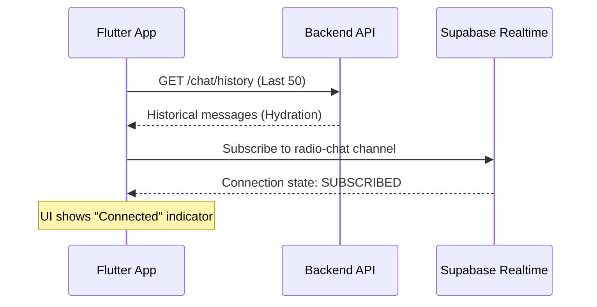
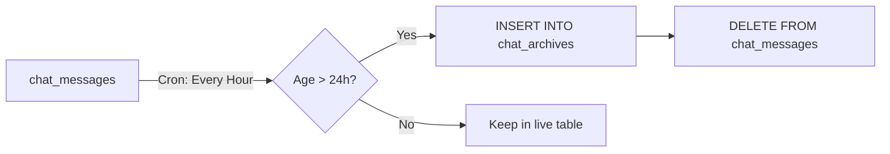
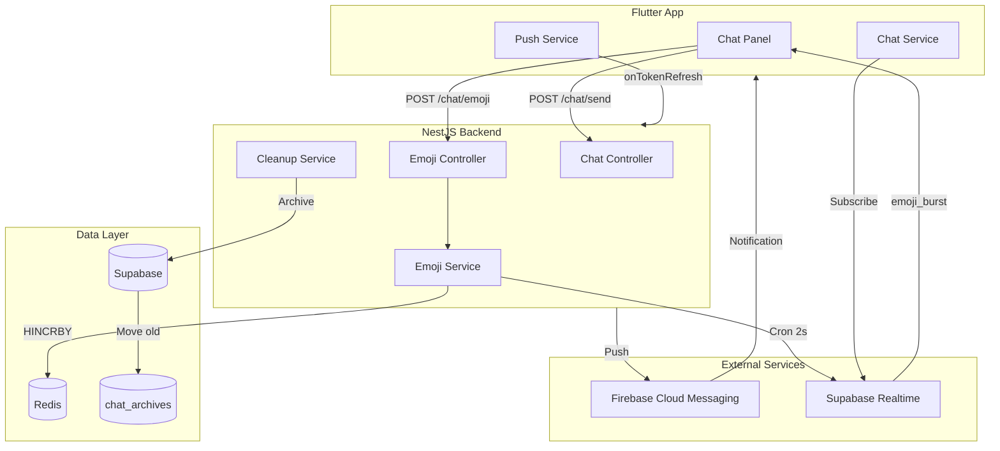

# Mobile Features and Backend Maintenance Implementation (Gold Standard)

This plan implements 4 production-grade features with operational safeguards for scaling, reliability, and user experience:

- Mobile Chat UI with Connection States and Smart Scroll
- Mobile FCM Integration with Token Refresh and Lazy Permissions
- Chat Archival System (preserves business value)
- Redis-Backed Emoji Aggregation (horizontally scalable)

---

## 0. Database Prerequisites

Before implementing features, create the required database structures.

### New Table: `chat_archives` (Cold Storage)

```sql
CREATE TABLE chat_archives (
  id UUID PRIMARY KEY,
  user_id UUID NOT NULL,
  song_id UUID,
  display_name TEXT NOT NULL,
  avatar_url TEXT,
  message TEXT NOT NULL,
  created_at TIMESTAMPTZ NOT NULL,
  archived_at TIMESTAMPTZ DEFAULT NOW()
);

-- Index for analytics queries
CREATE INDEX idx_chat_archives_created ON chat_archives(created_at);
CREATE INDEX idx_chat_archives_user ON chat_archives(user_id);
```

### New Index on `chat_messages`

```sql
CREATE INDEX idx_chat_messages_created_at ON chat_messages(created_at);
```

---

## 1. Mobile Chat Architecture (Production-Grade)

### Initialization Flow



### New Files to Create

**Chat Service** - [mobile/lib/core/services/chat_service.dart](mobile/lib/core/services/chat_service.dart)

Key features from context7 docs:

- **Hydration**: Call `GET /chat/history` on load (last 50 messages)
- **Connection States**: Track `Connecting`, `Connected`, `Reconnecting`, `Offline`
- **Lifecycle Management**: Unsubscribe on `AppLifecycleState.paused`, re-subscribe + re-hydrate on `resumed`
- **Smart Scroll**: Only auto-scroll if user is at bottom of list
```dart
enum ChatConnectionState { connecting, connected, reconnecting, offline }

class ChatService extends ChangeNotifier with WidgetsBindingObserver {
  ChatConnectionState _connectionState = ChatConnectionState.connecting;
  List<ChatMessage> _messages = [];
  RealtimeChannel? _channel;
  bool _isUserAtBottom = true;
  int _unreadCount = 0;

  @override
  void didChangeAppLifecycleState(AppLifecycleState state) {
    if (state == AppLifecycleState.paused) {
      _unsubscribe(); // Save battery
    } else if (state == AppLifecycleState.resumed) {
      _rehydrateAndSubscribe(); // Fresh data
    }
  }

  Future<void> _rehydrateAndSubscribe() async {
    _connectionState = ChatConnectionState.connecting;
    notifyListeners();
    
    // Hydration: Fetch latest history
    final history = await _apiService.get('chat/history?limit=50');
    _messages = (history['messages'] as List)
        .map((m) => ChatMessage.fromJson(m))
        .toList();
    
    // Subscribe to realtime
    await _subscribe();
  }
}
```


**Chat Model** - [mobile/lib/core/models/chat_message.dart](mobile/lib/core/models/chat_message.dart)

```dart
class ChatMessage {
  final String id;
  final String userId;
  final String? songId;
  final String displayName;
  final String? avatarUrl;
  final String message;
  final DateTime createdAt;
  final bool isSystemMessage; // For song transitions

  factory ChatMessage.songTransition(String songTitle) {
    return ChatMessage(
      id: 'system-${DateTime.now().millisecondsSinceEpoch}',
      userId: 'system',
      displayName: 'Radio',
      message: '--- Now Playing: $songTitle ---',
      createdAt: DateTime.now(),
      isSystemMessage: true,
    );
  }
}
```

**Chat Panel Widget** - [mobile/lib/features/player/widgets/chat_panel.dart](mobile/lib/features/player/widgets/chat_panel.dart)

UX Features:

- **Connection Indicator**: Green dot (connected), Yellow (reconnecting), Gray (offline)
- **Smart Scroll**: Auto-scroll only if at bottom; show "New Messages" badge if scrolled up
- **Song Transitions**: Insert system message instead of clearing chat
- **Character Counter**: 280 max with visual feedback
```dart
class ChatPanel extends StatefulWidget {
  final String? currentSongId;
  final String? currentSongTitle;
  
  // When song changes, insert system message
  void _onSongChanged(String newTitle) {
    _chatService.addSystemMessage(
      ChatMessage.songTransition(newTitle)
    );
  }
}
```


### Modifications

**[mobile/pubspec.yaml](mobile/pubspec.yaml)** - Add dependencies:

```yaml
# Realtime subscriptions
supabase_flutter: ^2.8.0

# FCM notifications
firebase_messaging: ^15.1.0
flutter_local_notifications: ^17.2.2
```

---

## 2. Push Notification Pipeline (Reliable)

### Key Insights from Firebase Docs

From context7 documentation:

```dart
// Token refresh listener - CRITICAL for reliability
FirebaseMessaging.instance.onTokenRefresh
    .listen((fcmToken) {
      // Immediately send new token to backend
      _apiService.post('push-notifications/register-device', {
        'fcmToken': fcmToken,
        'deviceType': Platform.isIOS ? 'ios' : 'android',
      });
    })
    .onError((err) {
      // Log error but don't crash
    });
```

### Push Notification Service

**[mobile/lib/core/services/push_notification_service.dart](mobile/lib/core/services/push_notification_service.dart)**

```dart
class PushNotificationService {
  static final PushNotificationService _instance = PushNotificationService._();
  factory PushNotificationService() => _instance;
  PushNotificationService._();

  final FirebaseMessaging _messaging = FirebaseMessaging.instance;
  final ApiService _apiService = ApiService();
  bool _permissionRequested = false;

  /// Initialize without requesting permission (Lazy Permission Strategy)
  Future<void> initialize() async {
    // Set up token refresh listener immediately
    _messaging.onTokenRefresh.listen(_onTokenRefresh);

    // Handle foreground messages
    FirebaseMessaging.onMessage.listen(_handleForegroundMessage);

    // Handle background tap
    FirebaseMessaging.onMessageOpenedApp.listen(_handleNotificationTap);

    // Check if permission already granted
    final settings = await _messaging.getNotificationSettings();
    if (settings.authorizationStatus == AuthorizationStatus.authorized) {
      await _registerToken();
    }
  }

  /// Request permission only when artist uploads first track or toggles "Notify me"
  Future<bool> requestPermissionLazy() async {
    if (_permissionRequested) return true;
    
    final settings = await _messaging.requestPermission(
      alert: true,
      badge: true,
      sound: true,
      provisional: false, // Require explicit permission
    );

    _permissionRequested = true;

    if (settings.authorizationStatus == AuthorizationStatus.authorized) {
      await _registerToken();
      return true;
    }
    return false;
  }

  void _onTokenRefresh(String newToken) async {
    debugPrint('FCM Token refreshed: ${newToken.substring(0, 20)}...');
    await _apiService.post('push-notifications/register-device', {
      'fcmToken': newToken,
      'deviceType': Platform.isIOS ? 'ios' : 'android',
    });
  }
}
```

### Trigger Logic (Backend Already Implemented)

The backend `PushNotificationService` already handles:

- **"Up Next" (T-60s)**: Debounced push notification
- **"Live Now"**: In-app toast + Supabase broadcast

### Android Configuration

**[mobile/android/app/src/main/AndroidManifest.xml](mobile/android/app/src/main/AndroidManifest.xml)**

```xml
<manifest>
    <!-- Notification permission (Android 13+) -->
    <uses-permission android:name="android.permission.POST_NOTIFICATIONS"/>
    
    <application>
        <!-- Default notification channel -->
        <meta-data
            android:name="com.google.firebase.messaging.default_notification_channel_id"
            android:value="radio_alerts"/>
        
        <!-- High priority notifications -->
        <meta-data
            android:name="com.google.firebase.messaging.default_notification_icon"
            android:resource="@drawable/ic_notification"/>
    </application>
</manifest>
```

---

## 3. Chat Archival System (Business Value Preservation)

Instead of deleting chat messages, archive them for artist sentiment analysis.

### Archival Flow



### Modified Cleanup Service

**[backend/src/tasks/cleanup.service.ts](backend/src/tasks/cleanup.service.ts)**

```typescript
import { Injectable, Logger } from '@nestjs/common';
import { Cron, CronExpression } from '@nestjs/schedule';
import { getSupabaseClient } from '../config/supabase.config';

@Injectable()
export class CleanupService {
  private readonly logger = new Logger(CleanupService.name);

  /**
   * Archive old chat messages (preserves business value)
   * Uses Service Role to bypass RLS
   */
  @Cron(CronExpression.EVERY_HOUR)
  async archiveOldChatMessages() {
    this.logger.log('Starting chat message archival...');
    
    const supabase = getSupabaseClient(); // Service role client
    const cutoffTime = new Date(Date.now() - 24 * 60 * 60 * 1000);

    // Step 1: Archive messages to cold storage
    const { error: archiveError } = await supabase.rpc('archive_old_chat_messages', {
      cutoff_timestamp: cutoffTime.toISOString(),
    });

    if (archiveError) {
      this.logger.error(`Archive failed: ${archiveError.message}`);
      return;
    }

    // Step 2: Delete archived messages from live table
    const { count, error: deleteError } = await supabase
      .from('chat_messages')
      .delete()
      .lt('created_at', cutoffTime.toISOString());

    if (deleteError) {
      this.logger.error(`Delete failed: ${deleteError.message}`);
      return;
    }

    this.logger.log(`Archived and cleaned ${count} chat messages`);
  }
}
```

### PostgreSQL RPC Function (Atomic Archive)

```sql
CREATE OR REPLACE FUNCTION archive_old_chat_messages(cutoff_timestamp TIMESTAMPTZ)
RETURNS void AS $$
BEGIN
  INSERT INTO chat_archives (id, user_id, song_id, display_name, avatar_url, message, created_at)
  SELECT id, user_id, song_id, display_name, avatar_url, message, created_at
  FROM chat_messages
  WHERE created_at < cutoff_timestamp;
END;
$$ LANGUAGE plpgsql SECURITY DEFINER;
```

---

## 4. Redis-Backed Emoji Engine (Horizontally Scalable)

### Why Redis is Mandatory

Without Redis, horizontal scaling breaks:

- User A connects to Server 1, sends emoji
- User B connects to Server 2, sends emoji
- In-memory counters are isolated; broadcasts show different counts

### Redis Data Structure

```
Key: song:{currentSongId}:emojis
Type: Hash
Fields: { "❤️": 5, "🔥": 3, "🎵": 7 }
```

### Backend Implementation

**[backend/src/config/redis.config.ts](backend/src/config/redis.config.ts)**

```typescript
import Redis from 'ioredis';

let redisClient: Redis | null = null;

export const getRedisClient = (): Redis => {
  if (!redisClient) {
    redisClient = new Redis(process.env.REDIS_URL || 'redis://localhost:6379');
  }
  return redisClient;
};
```

**[backend/src/chat/emoji.service.ts](backend/src/chat/emoji.service.ts)**

```typescript
import { Injectable, Logger } from '@nestjs/common';
import { Cron } from '@nestjs/schedule';
import { getRedisClient } from '../config/redis.config';
import { getSupabaseClient } from '../config/supabase.config';

// Emoji allowlist to prevent Redis key explosion
const ALLOWED_EMOJIS = ['❤️', '🔥', '🎵', '👏', '😍', '🙌', '💯', '✨'];

@Injectable()
export class EmojiService {
  private readonly logger = new Logger(EmojiService.name);
  private currentSongId: string | null = null;

  // Rate limiting: 1 emoji per second per user
  private lastEmojiTime: Map<string, number> = new Map();

  setCurrentSong(songId: string) {
    this.currentSongId = songId;
  }

  async addReaction(userId: string, emoji: string): Promise<boolean> {
    if (!this.currentSongId) return false;
    
    // Validate emoji allowlist
    if (!ALLOWED_EMOJIS.includes(emoji)) {
      this.logger.warn(`Invalid emoji rejected: ${emoji}`);
      return false;
    }

    // Rate limit check
    const lastTime = this.lastEmojiTime.get(userId);
    if (lastTime && Date.now() - lastTime < 1000) {
      return false; // Too fast
    }
    this.lastEmojiTime.set(userId, Date.now());

    // Atomic increment in Redis
    const redis = getRedisClient();
    await redis.hincrby(`song:${this.currentSongId}:emojis`, emoji, 1);

    return true;
  }

  /**
   * Broadcast aggregated emoji counts every 2 seconds
   */
  @Cron('*/2 * * * * *')
  async broadcastEmojiCounts() {
    if (!this.currentSongId) return;

    const redis = getRedisClient();
    const key = `song:${this.currentSongId}:emojis`;

    // Get all emoji counts
    const counts = await redis.hgetall(key);

    if (Object.keys(counts).length === 0) return;

    // Broadcast to Supabase Realtime
    const supabase = getSupabaseClient();
    const channel = supabase.channel('radio-chat');
    
    await channel.send({
      type: 'broadcast',
      event: 'emoji_burst',
      payload: counts, // { "❤️": "5", "🔥": "3" }
    });

    // Atomic reset
    await redis.del(key);

    this.logger.debug(`Broadcasted emoji burst: ${JSON.stringify(counts)}`);
  }
}
```

**[backend/src/chat/dto/emoji-reaction.dto.ts](backend/src/chat/dto/emoji-reaction.dto.ts)**

```typescript
import { IsString, IsIn } from 'class-validator';

const ALLOWED_EMOJIS = ['❤️', '🔥', '🎵', '👏', '😍', '🙌', '💯', '✨'];

export class EmojiReactionDto {
  @IsString()
  @IsIn(ALLOWED_EMOJIS, { message: 'Invalid emoji' })
  emoji: string;
}
```

**[backend/src/chat/emoji.controller.ts](backend/src/chat/emoji.controller.ts)**

```typescript
import { Controller, Post, Body, UseGuards, Req } from '@nestjs/common';
import { FirebaseAuthGuard } from '../auth/guards/firebase-auth.guard';
import { EmojiService } from './emoji.service';
import { EmojiReactionDto } from './dto/emoji-reaction.dto';

@Controller('chat')
@UseGuards(FirebaseAuthGuard)
export class EmojiController {
  constructor(private readonly emojiService: EmojiService) {}

  @Post('emoji')
  async sendEmoji(@Req() req, @Body() dto: EmojiReactionDto) {
    const success = await this.emojiService.addReaction(req.user.uid, dto.emoji);
    return { success };
  }
}
```

---

## Architecture Diagram (Complete)



---

## Security & Abuse Prevention (Day 1)

Already implemented in backend:

- **Shadow Bans**: `chat.service.ts` checks `user.is_shadow_banned`
- **Rate Limiting**: 5 messages / 60 seconds per user
- **Service Role**: Cleanup uses service role to bypass RLS

---

## Dependency Summary

| Package | Platform | Purpose |
|---------|----------|---------|
| `supabase_flutter: ^2.8.0` | Mobile | Realtime subscriptions + connection states |
| `firebase_messaging: ^15.1.0` | Mobile | Push notifications + token refresh |
| `flutter_local_notifications: ^17.2.2` | Mobile | Foreground notification display |
| `ioredis: ^5.4.1` | Backend | Redis client for emoji aggregation |
