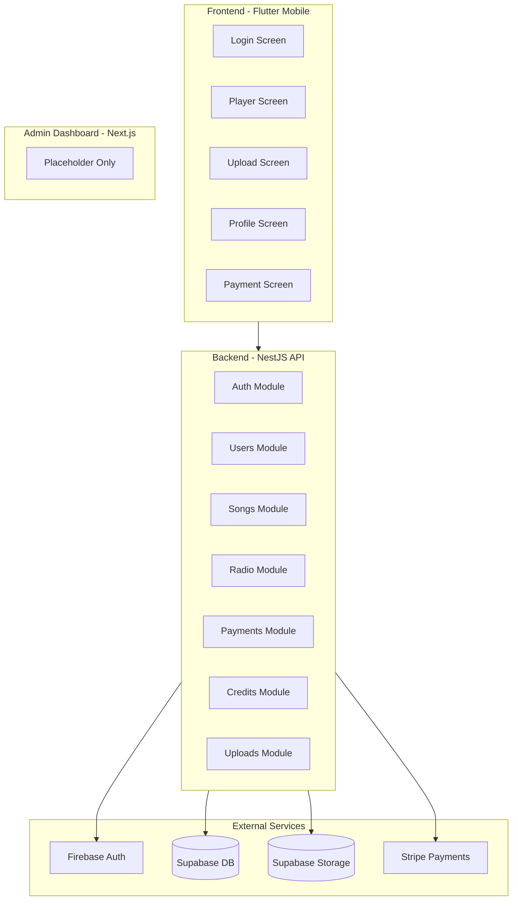

# RadioApp Development Status Review 1

## Project Overview

A radio streaming platform where underground artists upload music and pay for airplay, while listeners enjoy a continuous curated stream.

---

## Architecture Diagram

---

## Implementation Status Summary

| Component | Status | Completion |
|-----------|--------|------------|
| Backend API | Mostly Complete | ~85% |
| Mobile App | Core Features Done | ~70% |
| Database Schema | Complete | 100% |
| Firebase Integration | Complete | 100% |
| Supabase Integration | Complete | 100% |
| Stripe Integration | Backend Complete | ~80% |
| Admin Dashboard | Scaffolded Only | ~5% |

---

## WORKING FEATURES (Fully Implemented)

### Backend ([backend/src/](backend/src/))

**Authentication & Authorization**

- Firebase token verification via `FirebaseAuthGuard`
- Role-based access control with `@Roles()` decorator
- User extraction with `@CurrentUser()` decorator
- Global guards applied in [auth.module.ts](backend/src/auth/auth.module.ts)

**User Management** ([users/](backend/src/users/))

- `POST /api/users` - Create user profile
- `GET /api/users/me` - Get current user
- `PUT /api/users/me` - Update profile
- `GET /api/users/:id` - Get user by ID

**Song Management** ([songs/](backend/src/songs/))

- `POST /api/songs/upload` - Upload song with audio + artwork
- `GET /api/songs` - List songs with filters
- `GET /api/songs/:id` - Get song details
- `POST /api/songs/:id/like` - Like/unlike toggle

**File Uploads** ([uploads/](backend/src/uploads/))

- Audio upload to Supabase `songs` bucket (MP3/WAV, max 50MB)
- Artwork upload to `artwork` bucket (JPEG/PNG/WebP, max 5MB)
- File type and size validation

**Payments** ([payments/](backend/src/payments/))

- `POST /api/payments/create-intent` - Create Stripe payment intent
- `POST /api/payments/webhook` - Stripe webhook handler
- `GET /api/payments/transactions` - Transaction history
- Credit addition on successful payment

**Credits** ([credits/](backend/src/credits/))

- `GET /api/credits/balance` - Get artist credit balance

**Radio** ([radio/](backend/src/radio/))

- `GET /api/radio/current` - Get current track
- `GET /api/radio/next` - Get next track (FIFO queue)
- `POST /api/radio/play` - Report play event

### Mobile App ([mobile/lib/](mobile/lib/))

**Authentication** ([core/auth/auth_service.dart](mobile/lib/core/auth/auth_service.dart))

- Email/password sign in and sign up
- Google Sign-In integration
- Apple Sign-In (code present)
- Auth state management with Provider
- Token management for API calls

**Screens Implemented**

- [login_screen.dart](mobile/lib/widgets/login_screen.dart) - Full auth UI with form validation
- [player_screen.dart](mobile/lib/features/player/player_screen.dart) - Radio player with play/pause/skip
- [upload_screen.dart](mobile/lib/features/upload/upload_screen.dart) - Song upload with file pickers
- [profile_screen.dart](mobile/lib/features/profile/profile_screen.dart) - User profile display
- [payment_screen.dart](mobile/lib/features/payment/payment_screen.dart) - Credit package selection

**Core Services**

- [api_service.dart](mobile/lib/core/services/api_service.dart) - HTTP client with auth
- [radio_service.dart](mobile/lib/core/services/radio_service.dart) - Radio playback logic

### Database (Supabase)

All 8 tables created with RLS enabled:

- `users` - User profiles with role field
- `songs` - Song metadata and stats
- `plays` - Play history
- `likes` - User likes
- `subscriptions` - Artist subscriptions
- `transactions` - Payment records
- `credits` - Artist credit balances
- `rotation_queue` - Radio queue

### Configuration

- Firebase: Fully configured (google-services.json, GoogleService-Info.plist, firebase_options.dart)
- Supabase: Connected with storage buckets (`songs`, `artwork`)
- Stripe: Backend integration complete

---

## PARTIALLY IMPLEMENTED

### Backend Issues

1. **Radio Service** - In-memory state (resets on restart)

   - Current track stored in variable, not database
   - Missing persistent queue management

2. **Credits Module** - No service layer

   - Logic directly in controller
   - Missing credit deduction on play

3. **Error Handling** - Inconsistent

   - Some endpoints throw generic `Error`
   - Should use NestJS exceptions

4. **Security Gap** - `GET /users/:id` not protected

### Mobile App Gaps

1. **Navigation Missing**

   - No bottom nav bar or drawer
   - Can't navigate between Player/Upload/Profile/Payment screens
   - Routes defined but not accessible

2. **Payment Screen** - UI only

   - Creates payment intent
   - Missing Stripe SDK integration for actual payment flow

3. **Player Screen** - Basic only

   - No progress bar/seekbar
   - No previous track button
   - No like button
   - No queue visibility

4. **Profile Screen** - Incomplete navigation

   - Credits screen button does nothing
   - Settings screen not implemented

---

## NOT YET IMPLEMENTED

### Admin Dashboard ([admin/](admin/))

Currently just a placeholder. Needs:

- Admin authentication
- Song approval/rejection workflow
- User management
- Analytics dashboard
- Content moderation tools

### Backend Features Missing

1. **Admin Endpoints**

   - `GET /api/admin/songs` - List songs pending approval
   - `PATCH /api/admin/songs/:id` - Approve/reject song
   - `GET /api/admin/analytics` - Platform stats
   - `GET /api/admin/users` - User management

2. **Song Approval Workflow**

   - Songs currently stuck at "pending" status
   - No way to approve songs for rotation

3. **Advanced Radio Algorithm**

   - Current: Simple FIFO
   - Needed: Credit-weighted rotation, engagement metrics

4. **Subscription System**

   - Tables exist, no implementation

### Mobile Features Missing

1. **Navigation System** - Critical
2. **Stripe Payment Sheet** - For completing payments
3. **Like/Unlike UI** - Backend exists
4. **Credits Screen** - View balance and history
5. **Settings Screen** - App preferences
6. **Song Queue View** - See upcoming tracks
7. **Search/Browse** - Find specific songs

### Testing

- No unit tests
- No integration tests
- No E2E tests

---

## Priority Items for Next Development Phase

### Critical (Blocking Core Functionality)

1. **Admin Song Approval** - Songs can't reach rotation without approval
2. **Mobile Navigation** - Users can't access features
3. **Stripe Payment Completion** - Artists can't buy credits

### High Priority

4. **Persistent Radio Queue** - Current state lost on restart
5. **Admin Dashboard** - Platform management
6. **Like/Unlike in Player** - Engagement feature

### Medium Priority

7. **Advanced Radio Algorithm**
8. **Analytics Dashboard**
9. **Push Notifications**

---

## Configuration Status

| Service | Configured | Notes |
|---------|------------|-------|
| Firebase Auth | Yes | Mobile + Backend |
| Supabase Database | Yes | All tables created |
| Supabase Storage | Yes | `songs` + `artwork` buckets |
| Stripe Backend | Yes | Payment intents working |
| Stripe Mobile | Partial | SDK installed, not integrated |
