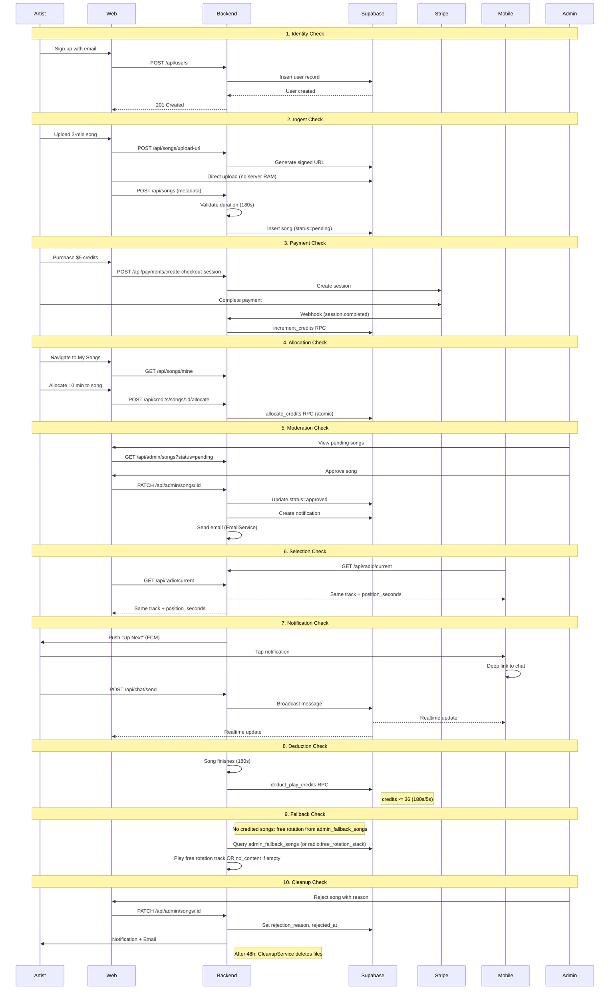

# RadioApp Testing Procedures

This document provides comprehensive testing and debugging procedures for the RadioApp platform, covering backend APIs, web application, mobile application, and end-to-end integration scenarios.

---

## 1. Project Deliveries Checklist

### 1.1 Backend Services (NestJS)

| Module | Status | Files |
|--------|--------|-------|
| User Management | Implemented | [users.controller.ts](backend/src/users/users.controller.ts), [users.service.ts](backend/src/users/users.service.ts) |
| Authentication | Implemented | [auth.controller.ts](backend/src/auth/auth.controller.ts), [firebase.config.ts](backend/src/config/firebase.config.ts) |
| Song Management | Implemented | [songs.controller.ts](backend/src/songs/songs.controller.ts), [songs.service.ts](backend/src/songs/songs.service.ts) |
| Radio Engine | Implemented | [radio.controller.ts](backend/src/radio/radio.controller.ts), [radio.service.ts](backend/src/radio/radio.service.ts) |
| Credit System | Implemented | [credits.controller.ts](backend/src/credits/credits.controller.ts), [credits.service.ts](backend/src/credits/credits.service.ts) |
| Payment Gateway | Implemented | [payments.controller.ts](backend/src/payments/payments.controller.ts), [payments.service.ts](backend/src/payments/payments.service.ts) |
| Admin Suite | Implemented | [admin.controller.ts](backend/src/admin/admin.controller.ts), [admin.service.ts](backend/src/admin/admin.service.ts) |
| Live Chat | Implemented | [chat.controller.ts](backend/src/chat/chat.controller.ts), [chat.service.ts](backend/src/chat/chat.service.ts) |
| Push Notifications | Implemented | [push-notification.controller.ts](backend/src/push-notifications/push-notification.controller.ts) |
| In-App Notifications | Implemented | [notification.controller.ts](backend/src/notifications/notification.controller.ts) |

### 1.2 Web Application (Next.js)

| Feature | Route | Files |
|---------|-------|-------|
| Landing Page | `/` | [web/src/app/(marketing)/page.tsx](web/src/app/(marketing)/page.tsx) |
| About/Pricing/FAQ | `/about`, `/pricing`, `/faq` | [(marketing)](web/src/app/(marketing)/) |
| Login/Signup | `/login`, `/signup` | [(auth)](web/src/app/(auth)/) |
| Dashboard | `/dashboard` | [web/src/app/(dashboard)/dashboard/page.tsx](web/src/app/(dashboard)/dashboard/page.tsx) |
| Radio Player | `/listen` | [web/src/app/(dashboard)/listen/page.tsx](web/src/app/(dashboard)/listen/page.tsx) |
| Artist Songs | `/artist/songs` | [web/src/app/(dashboard)/artist/songs/page.tsx](web/src/app/(dashboard)/artist/songs/page.tsx) |
| Credit Allocation | `/artist/songs/[id]/allocate` | Dynamic route |
| Admin Songs | `/admin/songs` | [web/src/app/(dashboard)/admin/songs/page.tsx](web/src/app/(dashboard)/admin/songs/page.tsx) (status=all, search, sort, credits_remaining, free rotation toggle) |
| Admin Fallback | `/admin/fallback` | [web/src/app/(dashboard)/admin/fallback/page.tsx](web/src/app/(dashboard)/admin/fallback/page.tsx) |
| Admin Free Rotation | `/admin/free-rotation` | [web/src/app/(dashboard)/admin/free-rotation/page.tsx](web/src/app/(dashboard)/admin/free-rotation/page.tsx) |
| Chat Sidebar | Component | [web/src/components/chat/ChatSidebar.tsx](web/src/components/chat/ChatSidebar.tsx) (Supabase Realtime status; 10s assumed connected) |

### 1.3 Mobile Application (Flutter)

| Feature | Files |
|---------|-------|
| Player Screen | [mobile/lib/features/player/player_screen.dart](mobile/lib/features/player/player_screen.dart) |
| Upload Screen | [mobile/lib/features/upload/upload_screen.dart](mobile/lib/features/upload/upload_screen.dart) |
| Credits Screen | [mobile/lib/features/credits/credits_screen.dart](mobile/lib/features/credits/credits_screen.dart) |
| Payment Screen | [mobile/lib/features/payment/payment_screen.dart](mobile/lib/features/payment/payment_screen.dart) |
| Profile Screen | [mobile/lib/features/profile/profile_screen.dart](mobile/lib/features/profile/profile_screen.dart) |
| Auth Service | [mobile/lib/core/auth/auth_service.dart](mobile/lib/core/auth/auth_service.dart) |
| API Service | [mobile/lib/core/services/api_service.dart](mobile/lib/core/services/api_service.dart) |
| Radio Service | [mobile/lib/core/services/radio_service.dart](mobile/lib/core/services/radio_service.dart) |

---

## 2. Database Tables and RPC Functions

### 2.1 Core Tables

- `users` - User profiles and authentication (roles: listener, artist, admin)
- `songs` - Song metadata and file references (`credits_remaining`, `admin_free_rotation`, `status`)
- `plays` - Play history for rotation algorithm
- `likes` - User song likes
- `credits` - Artist play credits balance
- `credit_allocations` - Audit trail for allocations/withdrawals
- `transactions` - Stripe payment records
- `rotation_queue` - Legacy/backup current rotation state (primary: Redis `radio:current`)

### 2.2 Chat and Notifications

- `chat_messages` - Ephemeral chat (24h auto-delete)
- `chat_config` - Kill switch configuration
- `notifications` - In-app notifications
- `user_device_tokens` - FCM push notification tokens
- `artist_notification_cooldowns` - 4-hour cooldown tracking

### 2.3 Admin and Radio State Tables

- `admin_fallback_songs` - Curated free rotation playlist (source for free rotation stack; `is_active`)
- `radio_playlist_state` - Persistent playlist state: `playlist_type` (free_rotation | paid), `fallback_stack` (JSONB), `fallback_position`, `stack_version_hash`, `songs_played_since_checkpoint`, `last_switched_at`, `last_checkpoint_at`. Single row `id='global'`.
- `play_decision_log` - Algorithm transparency: song_id, selected_at, selection_reason (credits | admin_fallback | …), listener_count, weight_score, competing_songs.

### 2.4 Redis Keys (Radio and State)

- `radio:current` - JSON RadioState (songId, startedAt, durationMs, isFallback, isAdminFallback, playedAt)
- `radio:listeners` - Listener count (increment/decrement on connect/disconnect)
- `radio:free_rotation_stack` - Shuffled song IDs from `admin_fallback_songs` (popped per play; refilled when empty)
- `radio:playlist_type` - `'free_rotation'` | `'paid'`
- `radio:fallback_position` - Current position in free rotation (checkpointed to Supabase)
- `radio:songs_since_checkpoint` - Counter for periodic checkpoint (every `CHECKPOINT_INTERVAL` songs)

### 2.5 RPC Functions (Atomic Operations)

- `allocate_credits` - Bank to song transfer
- `withdraw_credits` - Song to bank transfer
- `deduct_play_credits` - Pre-charge before playback (1 credit per 5 seconds)
- `increment_credits` - Add purchased credits to bank

---

## 3. API Endpoint Test Matrix

### 3.1 Authentication Endpoints

| Endpoint | Method | Auth | Test Cases |
|----------|--------|------|------------|
| `/api/auth/verify` | GET | Required | Valid token, expired token, invalid token |

### 3.2 User Endpoints

| Endpoint | Method | Auth | Test Cases |
|----------|--------|------|------------|
| `POST /api/users` | POST | Required | New user creation (with role), duplicate user, missing fields |
| `GET /api/users/me` | GET | Required | Valid user, profile not found, Firebase-only (no Supabase) |
| `PUT /api/users/me` | PUT | Required | Update display name, update avatar, sync to Supabase |
| `POST /api/users/upgrade-to-artist` | POST | Required | Listener upgrades to artist, credits record created |
| `GET /api/users/:id` | GET | None | Valid ID, invalid ID |

### 3.3 Song Endpoints

| Endpoint | Method | Auth/Role | Test Cases |
|----------|--------|-----------|------------|
| `POST /api/songs/upload-url` | POST | Artist | Valid request, oversized file |
| `POST /api/songs` | POST | Artist | Valid metadata, missing fields, invalid duration |
| `GET /api/songs` | GET | None | Filter by status, pagination |
| `GET /api/songs/mine` | GET | Artist | Artist's songs only |
| `PATCH /api/songs/:id` | PATCH | Artist | Update title, toggle opt-in |
| `POST /api/songs/:id/like` | POST | Required | Like song, unlike song |

### 3.4 Radio Endpoints

| Endpoint | Method | Auth | Test Cases |
|----------|--------|------|------------|
| `GET /api/radio/current` | GET | None | Song playing, no song (auto getNextTrack), sync timing, `no_content` when no songs |
| `GET /api/radio/next` | GET | None | Next track (paid or free rotation), `no_content` when admin_fallback_songs empty |
| `POST /api/radio/play` | POST | None | Trigger next song |
| `GET /api/radio/queue` | GET | None | List upcoming credited songs (preview) |
| `DELETE /api/radio/queue` | DELETE | None | Clear current state (admin) |

### 3.5 Credit Endpoints

| Endpoint | Method | Auth/Role | Test Cases |
|----------|--------|-----------|------------|
| `GET /api/credits/balance` | GET | Required | Has credits, zero balance |
| `GET /api/credits/transactions` | GET | Required | With history, empty history |
| `POST /api/credits/songs/:id/allocate` | POST | Artist | Valid amount, insufficient bank balance, negative |
| `POST /api/credits/songs/:id/withdraw` | POST | Artist | Valid withdrawal, insufficient song credits |

### 3.6 Payment Endpoints

| Endpoint | Method | Auth/Role | Test Cases |
|----------|--------|-----------|------------|
| `POST /api/payments/create-intent` | POST | Required | Mobile PaymentIntent flow |
| `POST /api/payments/create-checkout-session` | POST | Artist | Web Checkout Session flow |
| `POST /api/payments/webhook` | POST | Stripe | payment_intent.succeeded, checkout.session.completed |

### 3.7 Admin Endpoints

| Endpoint | Method | Role | Test Cases |
|----------|--------|------|------------|
| `GET /api/admin/songs` | GET | Admin | status=all|pending|approved|rejected, search, sortBy, sortOrder, credits_remaining in response |
| `PATCH /api/admin/songs/:id` | PATCH | Admin | Approve song, reject with reason |
| `GET /api/admin/users` | GET | Admin | Filter by role, search |
| `PATCH /api/admin/users/:id/role` | PATCH | Admin | Change user role |
| `GET /api/admin/fallback-songs` | GET | Admin | List fallback playlist |
| `POST /api/admin/fallback-songs` | POST | Admin | Add fallback song |
| `PATCH /api/admin/fallback-songs/:id` | PATCH | Admin | Toggle is_active |
| `DELETE /api/admin/fallback-songs/:id` | DELETE | Admin | Remove from fallback |
| `GET /api/admin/free-rotation/search/songs` | GET | Admin | Search songs for free rotation (q, min 2 chars) |
| `GET /api/admin/free-rotation/search/users` | GET | Admin | Search users |
| `GET /api/admin/free-rotation/users/:id/songs` | GET | Admin | User's songs for free rotation |
| `PATCH /api/admin/free-rotation/songs/:id` | PATCH | Admin | Toggle free rotation (enabled: boolean) |
| `GET /api/admin/free-rotation/songs` | GET | Admin | Songs in free rotation |
| `POST /api/admin/chat/toggle` | POST | Admin | Enable/disable chat |
| `POST /api/admin/chat/shadow-ban/:userId` | POST | Admin | Shadow ban user |

### 3.8 Chat Endpoints

| Endpoint | Method | Auth | Test Cases |
|----------|--------|------|------------|
| `POST /api/chat/send` | POST | Required | Valid message, rate limit, shadow banned |
| `GET /api/chat/history` | GET | None | Recent messages, limit parameter |
| `GET /api/chat/status` | GET | None | Chat enabled/disabled |

### 3.9 Notification Endpoints

| Endpoint | Method | Auth | Test Cases |
|----------|--------|------|------------|
| `GET /api/notifications` | GET | Required | With notifications, empty |
| `GET /api/notifications/unread-count` | GET | Required | Count accuracy |
| `PATCH /api/notifications/:id/read` | PATCH | Required | Mark single as read |
| `POST /api/notifications/mark-all-read` | POST | Required | Mark all as read |

---

## 3.10 Radio Logic (Intended Behavior)

The radio uses **hysteresis** and a **hybrid paid/free** model. State is in **Redis** (runtime) and **Supabase** `radio_playlist_state` (durability).

### Configuration (env)

- `THRESHOLD_ENTER_PAID` (default 5): switch from free_rotation → paid when listeners ≥ this.
- `THRESHOLD_EXIT_PAID` (default 3): switch from paid → free_rotation when listeners ≤ this.
- `CHECKPOINT_INTERVAL` (default 5): persist `fallback_position` to Supabase every N free-rotation songs.

### Flow (getNextTrack)

1. **Current song** – If a track is playing and `time_remaining_ms > 2s`, return it.
2. **Listener count** – From `radio:listeners`.
3. **Playlist type (hysteresis)**:
   - `free_rotation` → `paid` only when `listeners >= THRESHOLD_ENTER_PAID`.
   - `paid` → `free_rotation` only when `listeners <= THRESHOLD_EXIT_PAID`.
4. **Playlist switch**:
   - **Free → Paid:** Save `fallback_position` to Supabase; set `playlist_type=paid`.
   - **Paid → Free:** Load `fallback_stack` and `fallback_position` from Supabase into Redis; set `playlist_type=free_rotation`.
5. **Selection**:
   - **Paid mode:** Try credited songs (approved, `credits_remaining >= ceil(duration/5)`). Soft-weighted random. Pre-charge via `deduct_play_credits` RPC. If none, fall through to free rotation.
   - **Free rotation:** Pop from `radio:free_rotation_stack`. If empty, refill from `admin_fallback_songs` (is_active), shuffle, save to Redis; optionally persist full stack to `radio_playlist_state` only when content changes (stack_version_hash). Play from `admin_fallback_songs`; log `admin_fallback`. After each free-rotation play, checkpoint: every `CHECKPOINT_INTERVAL` songs, write `fallback_position` to Supabase.
6. **No content:** If `admin_fallback_songs` is empty (and no credited songs), return `no_content: true` and `message: 'Sorry for the inconvenience. No songs are currently available.'`. Frontend shows “Station Offline” / retry.

### Data sources

- **Paid:** `songs` (status=approved, enough credits). Deduction via `deduct_play_credits`.
- **Free:** `admin_fallback_songs` (is_active). `radio:free_rotation_stack` holds shuffled IDs; refill when stack empty.

### Notes

- **Trial rotation** and **opt-in free play** are removed. Free rotation is **only** `admin_fallback_songs`.
- **Paid-play check** before free-rotation eligibility is **commented out** (see README “Temporarily Disabled”); easy to restore later.
- `play_decision_log` records `selection_reason`: `credits` or `admin_fallback`.
- **Redis optional:** If Redis is unavailable, backend falls back to DB; `radio:listeners` may be 0 and `radio:free_rotation_stack` empty, so behavior may differ (e.g. always free rotation or more no_content).

---

## 4. Radio Logic Test Cases

Use these to verify hysteresis, persistence, and fallbacks. Prefer backend/integration tests; some can be driven via `/api/radio/current` and `/api/radio/next`.

| ID | Scenario | Preconditions | Steps | Expected |
|----|----------|---------------|-------|----------|
| R1 | **Hysteresis: enter paid** | `playlist_type=free_rotation`, 4 listeners | Set listeners=5, call getNextTrack | `playlist_type` → paid; play credited if available else free rotation |
| R2 | **Hysteresis: stay free at 4** | `playlist_type=free_rotation`, 4 listeners | Call getNextTrack | Remain free_rotation; play from free rotation stack |
| R3 | **Hysteresis: exit paid** | `playlist_type=paid`, 5 listeners | Set listeners=3, call getNextTrack | `playlist_type` → free_rotation; load stack+position from DB; play free rotation |
| R4 | **Hysteresis: stay paid at 4** | `playlist_type=paid`, 4 listeners | Call getNextTrack | Remain paid; play credited or free fallback |
| R5 | **Free→Paid: position saved** | Free rotation with non-empty stack, 5 listeners | Trigger switch to paid | `radio_playlist_state.fallback_position` (or equivalent) updated in Supabase before switching |
| R6 | **Paid→Free: position restored** | Paid mode, saved `fallback_stack` and `fallback_position` in DB, 3 listeners | Trigger switch to free | Redis `free_rotation_stack` and `fallback_position` match DB; next play continues from correct position in stack |
| R7 | **Checkpoint every N songs** | Free rotation, `CHECKPOINT_INTERVAL=5` | Play 5 free-rotation songs | Supabase `radio_playlist_state.fallback_position` and `last_checkpoint_at` updated at 5th song |
| R8 | **No content** | No credited songs, `admin_fallback_songs` empty | GET /api/radio/current or getNextTrack | Response has `no_content: true`, `message` with “Sorry for the inconvenience”; `audio_url` null. Frontend shows “Station Offline” / retry |
| R9 | **Credited only when enough credits** | Song approved, `credits_remaining=2`, duration 180s (needs 36) | Listeners=5, getNextTrack | Song not selected; play free rotation or no_content |
| R10 | **Paid mode falls back to free** | `playlist_type=paid`, 5 listeners, no credited songs, `admin_fallback_songs` has entries | getNextTrack | Play from `admin_fallback_songs` (free rotation); `selection_reason=admin_fallback` |
| R11 | **Free rotation stack refill** | `radio:free_rotation_stack` empty, `admin_fallback_songs` has 3 active | getNextTrack | Stack refilled with shuffled IDs; one song played; `stack_version_hash` updated only if content changed |
| R12 | **Current track returned when time left** | `radio:current` has song with 30s left | GET /api/radio/current | Same song, `is_playing: true`, `time_remaining_ms` ~30000, no getNextTrack |
| R13 | **play_decision_log** | Play credited song | After play | `play_decision_log` has row: `selection_reason=credits`, song_id, listener_count |
| R14 | **play_decision_log admin_fallback** | Play free rotation song | After play | `play_decision_log` has row: `selection_reason=admin_fallback` |

**Clarification:** If any of the above (e.g. “position” semantics, or when `stack_version_hash` is written) does not match your implementation, adjust the test steps or expected results accordingly.

---

## 5. Master End-to-End Test Scenario

This "Happy Path" touches every major system component:



### Step-by-Step Test Instructions

#### Test 1: Identity Check
**Objective:** Verify `POST /api/users` creates Supabase profile from Firebase auth; role selection for new users

1. Sign up at `/signup` with email/password, or sign in with Google
2. Verify Firebase user created
3. **New users (no Supabase profile):** RoleSelectionModal prompts for listener vs artist before `POST /api/users`. Verify Supabase `users` table gets correct `role` (not always `listener`).
4. **Existing users:** Supabase `users` has matching `firebase_uid`; no modal
5. **Expected:** Profile with chosen `role`; artists must not be defaulted to listener

**Debug:** `web/src/contexts/AuthContext.tsx` (pendingGoogleUser, RoleSelectionModal), `backend/src/users/users.service.ts`

---

#### Test 2: Ingest Check
**Objective:** Verify signed URL upload and duration calculation

1. Navigate to `/artist/upload`
2. Select 3-minute MP3 file (should be ~4MB for 128kbps)
3. Upload audio and artwork
4. **Expected:** 
   - Upload completes without server timeout
   - Song record shows `duration_seconds: 180`
   - Status is `pending`

**Debug:** Check `backend/src/songs/songs.service.ts` and `duration.service.ts`

---

#### Test 3: Payment Check
**Objective:** Verify Stripe integration and credit addition

1. Navigate to `/artist/credits`
2. Click "Buy 25 Credits" ($5.00)
3. Complete Stripe Checkout with test card `4242 4242 4242 4242`
4. **Expected:**
   - Redirect back to app with success
   - Credits balance increases by 25
   - Transaction appears in history

**Debug:** 
- Use Stripe CLI: `stripe listen --forward-to localhost:3000/api/payments/webhook`
- Check `increment_credits` RPC execution in Supabase logs

---

#### Test 4: Allocation Check
**Objective:** Verify atomic credit allocation

1. Navigate to `/artist/songs`
2. Click "Allocate" on pending/approved song
3. Allocate 10 minutes (120 credits at 1 credit/5s)
4. **Expected:**
   - Bank balance decreases by 120
   - Song `credits_remaining` increases by 120
   - Allocation logged in `credit_allocations` table

**Debug:** Check `allocate_credits` RPC in Supabase SQL editor

---

#### Test 4b: Upgrade to Artist
**Objective:** Listener can upgrade to artist; credits record created; profile/UI updated

1. Log in as **listener** at `/profile`
2. Click "Upgrade to Artist"
3. **Expected:** `POST /api/users/upgrade-to-artist` succeeds; `users.role` → artist; `credits` row with `artist_id` and `balance: 0`; auth context refreshes; redirect or nav to artist dashboard
4. **Profile updates:** Change display name → `PUT /api/users/me`; verify Supabase `users` updated

**Debug:** `backend/src/users/users.service.ts` (upgradeToArtist), `web/src/app/(dashboard)/profile/page.tsx`, `web/src/lib/api.ts` (upgradeToArtist)

---

#### Test 5: Moderation Check
**Objective:** Verify admin approval flow with notifications

1. Log in as admin at `/admin/songs`
2. Find pending song and click "Approve"
3. **Expected:**
   - Song status changes to `approved`
   - Artist receives in-app notification
   - Artist receives email (check console in dev mode)

**Debug:** Check `backend/src/admin/admin.service.ts` for notification creation

---

#### Test 6: Selection Check (Cross-Platform Sync)
**Objective:** Verify global stream synchronization; paid vs free_rotation; no_content handling

1. Open `/listen` on web and mobile. Ensure at least one user has interacted (play/pause) so autoplay is allowed.
2. **Expected:**
   - Both show SAME song; `position_seconds` within ~2s; advance to next together
   - With listeners ≥ THRESHOLD_ENTER_PAID and credited songs: paid mode, `is_fallback` false
   - With listeners below THRESHOLD_ENTER_PAID or no credited songs: free rotation from `admin_fallback_songs` or `no_content`
3. **No content:** Empty `admin_fallback_songs` and no credited songs → `no_content: true`; UI shows “Station Offline” or retry, no autoplay of invalid `audio_url`

**Debug:** `/api/radio/current`, `radio:playlist_type`, `radio:current`; `web/src/components/radio/RadioPlayer.tsx` (hasUserInteracted, noContent)

---

#### Test 7: Notification and Engagement Check
**Objective:** Verify push notifications and live chat

1. Wait for "Up Next" push notification (sent T-60s before play)
2. Tap notification on mobile
3. **Expected:**
   - App opens to player with chat expanded
   - Send message - appears on both web and mobile instantly
   - Send emoji - aggregates correctly

**Debug:** 
- Check FCM delivery in Firebase Console
- Check Supabase Realtime channel `radio-chat`

---

#### Test 8: Deduction Check
**Objective:** Verify pre-charge credit deduction

1. Let credited song play to completion (or use test endpoint)
2. **Expected:**
   - Song `credits_remaining` reduced by `ceil(duration/5)`
   - For 180s song: 36 credits deducted
   - Play logged in `plays` table

**Debug:** Check `deduct_play_credits` RPC execution

---

#### Test 9: Fallback Check
**Objective:** Verify free rotation and no_content when no credited songs

1. Withdraw all credits from all songs (or have no approved songs with sufficient credits)
2. Ensure `admin_fallback_songs` has at least one `is_active` row
3. Trigger next song (GET /api/radio/current or wait for track end)
4. **Expected:**
   - Radio plays from `admin_fallback_songs` (free rotation stack). `is_admin_fallback: true`, `selection_reason=admin_fallback` in `play_decision_log`
   - No silence or error; stack refills from DB when empty
5. **No content:** Clear or deactivate all `admin_fallback_songs`. **Expected:** `no_content: true`, `audio_url: null`, message “Sorry for the inconvenience…”. UI: “Station Offline” / retry.

**Debug:** `backend/src/radio/radio.service.ts` (getNextFreeRotationSong, buildNoContentResponse), `admin_fallback_songs`, `radio:free_rotation_stack`

---

#### Test 10: Cleanup Check
**Objective:** Verify rejection notification and auto-cleanup

1. As admin, reject song with reason "Audio quality too low"
2. Verify artist notification contains reason
3. **Expected:**
   - Notification shows rejection reason
   - Email sent to artist
   - After 48h: `CleanupService` deletes audio/artwork from storage

**Debug:** Check `backend/src/tasks/cleanup.service.ts` cron job

---

## 6. Unit Test Scenarios

### 6.1 Radio Service Tests

```typescript
// backend/src/radio/__tests__/radio.service.spec.ts

describe('RadioService', () => {
  describe('calculateCreditsRequired', () => {
    it('should return 1 credit for 5 seconds', () => {
      expect(service.calculateCreditsRequired(5)).toBe(1);
    });
    it('should return 36 credits for 180 seconds', () => {
      expect(service.calculateCreditsRequired(180)).toBe(36);
    });
    it('should ceil partial intervals', () => {
      expect(service.calculateCreditsRequired(7)).toBe(2);
    });
  });

  describe('getCreditedSong', () => {
    it('should return song with enough credits for full duration (credits_remaining >= ceil(duration/5))');
    it('should not return songs with insufficient credits');
    it('should not return unapproved songs');
    it('should use soft-weighted random (credits, recency)');
    it('should exclude current song from selection');
  });

  describe('getNextTrack / hysteresis', () => {
    it('should switch to paid when listeners >= THRESHOLD_ENTER_PAID and currently free_rotation');
    it('should switch to free_rotation when listeners <= THRESHOLD_EXIT_PAID and currently paid');
    it('should not oscillate when listeners hover between 3 and 5');
  });

  describe('free rotation and no content', () => {
    it('should return no_content when admin_fallback_songs empty and no credited songs');
    it('should refill free_rotation stack from admin_fallback_songs when stack empty');
    it('should play free rotation when paid has no credited songs');
  });

  describe('buildNoContentResponse', () => {
    it('should return no_content: true, audio_url: null, and message');
  });
});
```

### 6.2 RadioStateService Tests

```typescript
describe('RadioStateService', () => {
  describe('playlist type and position', () => {
    it('getCurrentPlaylistType returns redis or Supabase fallback');
    it('setCurrentPlaylistType updates Redis and Supabase');
    it('checkpointPosition updates Redis; syncs to Supabase every CHECKPOINT_INTERVAL');
    it('loadPlaylistStateFromDb returns fallbackStack, fallbackPosition, playlistType');
  });
  describe('free rotation stack', () => {
    it('popFreeRotationSong returns and removes head');
    it('setFreeRotationStack persists to Redis');
  });
});
```

### 6.3 Credit Service Tests

```typescript
describe('CreditsService', () => {
  describe('allocateCredits', () => {
    it('should fail if bank balance insufficient');
    it('should fail if amount is negative');
    it('should atomically transfer credits');
    it('should log allocation in credit_allocations');
  });
});
```

### 6.4 Chat Service Tests

```typescript
describe('ChatService', () => {
  describe('sendMessage', () => {
    it('should reject messages over 280 chars');
    it('should rate limit to 1 msg/3s');
    it('should rate limit burst to 5 msg/10s');
    it('should silently drop shadow-banned user messages');
    it('should broadcast via Supabase Realtime');
  });
});
```

---

## 7. Integration Test Scenarios

### 7.1 Payment to Credits Flow

```typescript
describe('Payment Integration', () => {
  it('should add credits after successful Stripe webhook', async () => {
    // 1. Create checkout session
    // 2. Simulate Stripe webhook with valid signature
    // 3. Verify credits added via RPC
    // 4. Verify transaction logged
  });
});
```

### 7.2 Upload to Approval Flow

```typescript
describe('Song Upload Integration', () => {
  it('should create pending song and notify admin', async () => {
    // 1. Generate signed upload URL
    // 2. Submit song metadata
    // 3. Verify song in pending status
    // 4. Admin approves
    // 5. Verify artist notification
  });
});
```

---

## 8. Debugging Procedures

### 8.1 Backend Issues

**Firebase Auth Failures:**
```bash
# Check Firebase config
cat backend/.env | grep FIREBASE

# Verify Firebase Admin SDK initialization
# Check backend/src/config/firebase.config.ts
```

**Supabase Connection Issues:**
```bash
# Test Supabase connectivity
curl -H "apikey: YOUR_ANON_KEY" \
  https://YOUR_PROJECT.supabase.co/rest/v1/users?select=id&limit=1
```

**RPC Function Errors:**
```sql
-- Test RPC directly in Supabase SQL Editor
SELECT * FROM allocate_credits(
  'user-uuid',
  'song-uuid',
  100
);
```

### 8.2 Web Issues

**API Connection:**
```javascript
// Check browser console for CORS or auth errors
// Verify NEXT_PUBLIC_API_URL in web/.env.local
```

**Supabase Realtime:**
```javascript
// Debug realtime subscription
const channel = supabase.channel('radio-chat');
channel.on('broadcast', { event: '*' }, (payload) => {
  console.log('Received:', payload);
});
```

**Hydration mismatch (body):** Often from browser extensions (e.g. Grammarly `data-gr-*`). Root layout uses `suppressHydrationWarning` on `<body>` to avoid noise.

**Radio autoplay (NotAllowedError):** Browsers block `play()` until user gesture. `RadioPlayer` uses `hasUserInteracted`; initial load does not autoplay; after user taps play/pause or “Jump to Live”, subsequent track changes may autoplay.

### 8.3 Mobile Issues

**API Service Debug:**
```dart
// Add logging to api_service.dart
print('Request: $method $endpoint');
print('Headers: $headers');
print('Response: ${response.statusCode} ${response.body}');
```

**Firebase Messaging:**
```dart
// Check FCM token registration
final token = await FirebaseMessaging.instance.getToken();
print('FCM Token: $token');
```

---

## 9. Performance Testing

### 9.1 Load Test Scenarios

| Scenario | Target | Tool |
|----------|--------|------|
| Concurrent listeners | 1000 users | k6, Artillery |
| Chat message throughput | 100 msg/s | k6 |
| Credit operations | 50 tx/s | k6 |
| Upload concurrent | 10 files | k6 |

### 9.2 Key Metrics

- **Radio sync latency:** < 2 seconds drift
- **Chat message latency:** < 500ms end-to-end
- **API response time:** < 200ms p95
- **Credit operation:** < 100ms (atomic RPC)

---

## 10. Security Testing Checklist

- [ ] Firebase ID tokens verified on all authenticated endpoints
- [ ] Role guards enforced on admin/artist endpoints
- [ ] Stripe webhook signatures validated
- [ ] Shadow ban prevents broadcast (returns 200 OK)
- [ ] Rate limiting prevents chat spam
- [ ] Signed URLs expire after use
- [ ] SQL injection prevented (Supabase parameterized queries)
- [ ] XSS prevented in chat messages

---

## 11. Environment Configuration

### Required Environment Variables

**Backend (.env):**
```
PORT=3000
SUPABASE_URL=
SUPABASE_SERVICE_KEY=
FIREBASE_PROJECT_ID=
FIREBASE_CLIENT_EMAIL=
FIREBASE_PRIVATE_KEY=
STRIPE_SECRET_KEY=
STRIPE_WEBHOOK_SECRET=
EMAIL_PROVIDER=console

# Radio: hysteresis and persistence
THRESHOLD_ENTER_PAID=5
THRESHOLD_EXIT_PAID=3
CHECKPOINT_INTERVAL=5
```

**Web (.env.local):**
```
NEXT_PUBLIC_API_URL=http://localhost:3000/api
NEXT_PUBLIC_SUPABASE_URL=
NEXT_PUBLIC_SUPABASE_ANON_KEY=
NEXT_PUBLIC_STRIPE_PUBLISHABLE_KEY=
```

**Mobile (.env):**
```
API_BASE_URL=http://localhost:3000
STRIPE_PUBLISHABLE_KEY=
```

---

## 12. Test Data Setup

### Seed Script Checklist

1. Create test users (listener, artist, admin)
2. Create approved songs with varied credits
3. Create fallback playlist entries
4. Seed chat messages for history testing
5. Create sample notifications
