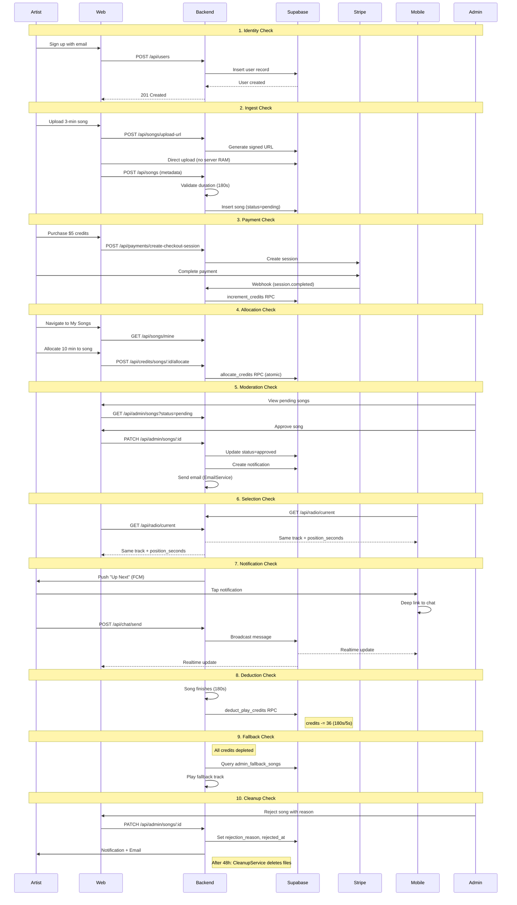

# RadioApp Testing Procedures

This document provides comprehensive testing and debugging procedures for the RadioApp platform, covering backend APIs, web application, mobile application, and end-to-end integration scenarios.

---

## 1. Project Deliveries Checklist

### 1.1 Backend Services (NestJS)

| Module | Status | Files |
|--------|--------|-------|
| User Management | Implemented | [users.controller.ts](backend/src/users/users.controller.ts), [users.service.ts](backend/src/users/users.service.ts) |
| Authentication | Implemented | [auth.controller.ts](backend/src/auth/auth.controller.ts), [firebase.config.ts](backend/src/config/firebase.config.ts) |
| Song Management | Implemented | [songs.controller.ts](backend/src/songs/songs.controller.ts), [songs.service.ts](backend/src/songs/songs.service.ts) |
| Radio Engine | Implemented | [radio.controller.ts](backend/src/radio/radio.controller.ts), [radio.service.ts](backend/src/radio/radio.service.ts) |
| Credit System | Implemented | [credits.controller.ts](backend/src/credits/credits.controller.ts), [credits.service.ts](backend/src/credits/credits.service.ts) |
| Payment Gateway | Implemented | [payments.controller.ts](backend/src/payments/payments.controller.ts), [payments.service.ts](backend/src/payments/payments.service.ts) |
| Admin Suite | Implemented | [admin.controller.ts](backend/src/admin/admin.controller.ts), [admin.service.ts](backend/src/admin/admin.service.ts) |
| Live Chat | Implemented | [chat.controller.ts](backend/src/chat/chat.controller.ts), [chat.service.ts](backend/src/chat/chat.service.ts) |
| Push Notifications | Implemented | [push-notification.controller.ts](backend/src/push-notifications/push-notification.controller.ts) |
| In-App Notifications | Implemented | [notification.controller.ts](backend/src/notifications/notification.controller.ts) |

### 1.2 Web Application (Next.js)

| Feature | Route | Files |
|---------|-------|-------|
| Landing Page | `/` | [web/src/app/(marketing)/page.tsx](web/src/app/(marketing)/page.tsx) |
| About/Pricing/FAQ | `/about`, `/pricing`, `/faq` | [(marketing)](web/src/app/(marketing)/) |
| Login/Signup | `/login`, `/signup` | [(auth)](web/src/app/(auth)/) |
| Dashboard | `/dashboard` | [web/src/app/(dashboard)/dashboard/page.tsx](web/src/app/(dashboard)/dashboard/page.tsx) |
| Radio Player | `/listen` | [web/src/app/(dashboard)/listen/page.tsx](web/src/app/(dashboard)/listen/page.tsx) |
| Artist Songs | `/artist/songs` | [web/src/app/(dashboard)/artist/songs/page.tsx](web/src/app/(dashboard)/artist/songs/page.tsx) |
| Credit Allocation | `/artist/songs/[id]/allocate` | Dynamic route |
| Admin Songs | `/admin/songs` | [web/src/app/(dashboard)/admin/songs/page.tsx](web/src/app/(dashboard)/admin/songs/page.tsx) |
| Admin Fallback | `/admin/fallback` | [web/src/app/(dashboard)/admin/fallback/page.tsx](web/src/app/(dashboard)/admin/fallback/page.tsx) |
| Chat Sidebar | Component | [web/src/components/chat/ChatSidebar.tsx](web/src/components/chat/ChatSidebar.tsx) |

### 1.3 Mobile Application (Flutter)

| Feature | Files |
|---------|-------|
| Player Screen | [mobile/lib/features/player/player_screen.dart](mobile/lib/features/player/player_screen.dart) |
| Upload Screen | [mobile/lib/features/upload/upload_screen.dart](mobile/lib/features/upload/upload_screen.dart) |
| Credits Screen | [mobile/lib/features/credits/credits_screen.dart](mobile/lib/features/credits/credits_screen.dart) |
| Payment Screen | [mobile/lib/features/payment/payment_screen.dart](mobile/lib/features/payment/payment_screen.dart) |
| Profile Screen | [mobile/lib/features/profile/profile_screen.dart](mobile/lib/features/profile/profile_screen.dart) |
| Auth Service | [mobile/lib/core/auth/auth_service.dart](mobile/lib/core/auth/auth_service.dart) |
| API Service | [mobile/lib/core/services/api_service.dart](mobile/lib/core/services/api_service.dart) |
| Radio Service | [mobile/lib/core/services/radio_service.dart](mobile/lib/core/services/radio_service.dart) |

---

## 2. Database Tables and RPC Functions

### 2.1 Core Tables

- `users` - User profiles and authentication
- `songs` - Song metadata and file references
- `plays` - Play history for rotation algorithm
- `likes` - User song likes
- `credits` - Artist play credits balance
- `credit_allocations` - Audit trail for allocations/withdrawals
- `transactions` - Stripe payment records
- `rotation_queue` - Current rotation state

### 2.2 Chat and Notifications

- `chat_messages` - Ephemeral chat (24h auto-delete)
- `chat_config` - Kill switch configuration
- `notifications` - In-app notifications
- `user_device_tokens` - FCM push notification tokens
- `artist_notification_cooldowns` - 4-hour cooldown tracking

### 2.3 Admin Tables

- `admin_fallback_songs` - Curated fallback playlist

### 2.4 RPC Functions (Atomic Operations)

- `allocate_credits` - Bank to song transfer
- `withdraw_credits` - Song to bank transfer
- `deduct_play_credits` - Pre-charge before playback
- `increment_credits` - Add purchased credits to bank

---

## 3. API Endpoint Test Matrix

### 3.1 Authentication Endpoints

| Endpoint | Method | Auth | Test Cases |
|----------|--------|------|------------|
| `/api/auth/verify` | GET | Required | Valid token, expired token, invalid token |

### 3.2 User Endpoints

| Endpoint | Method | Auth | Test Cases |
|----------|--------|------|------------|
| `POST /api/users` | POST | Required | New user creation, duplicate user, missing fields |
| `GET /api/users/me` | GET | Required | Valid user, profile not found |
| `PUT /api/users/me` | PUT | Required | Update display name, update avatar |
| `GET /api/users/:id` | GET | None | Valid ID, invalid ID |

### 3.3 Song Endpoints

| Endpoint | Method | Auth/Role | Test Cases |
|----------|--------|-----------|------------|
| `POST /api/songs/upload-url` | POST | Artist | Valid request, oversized file |
| `POST /api/songs` | POST | Artist | Valid metadata, missing fields, invalid duration |
| `GET /api/songs` | GET | None | Filter by status, pagination |
| `GET /api/songs/mine` | GET | Artist | Artist's songs only |
| `PATCH /api/songs/:id` | PATCH | Artist | Update title, toggle opt-in |
| `POST /api/songs/:id/like` | POST | Required | Like song, unlike song |

### 3.4 Radio Endpoints

| Endpoint | Method | Auth | Test Cases |
|----------|--------|------|------------|
| `GET /api/radio/current` | GET | None | Song playing, no song, sync timing |
| `GET /api/radio/next` | GET | None | Queue has songs, queue empty |
| `POST /api/radio/play` | POST | None | Trigger next song |
| `GET /api/radio/queue` | GET | None | List upcoming songs |

### 3.5 Credit Endpoints

| Endpoint | Method | Auth/Role | Test Cases |
|----------|--------|-----------|------------|
| `GET /api/credits/balance` | GET | Required | Has credits, zero balance |
| `GET /api/credits/transactions` | GET | Required | With history, empty history |
| `POST /api/credits/songs/:id/allocate` | POST | Artist | Valid amount, insufficient bank balance, negative |
| `POST /api/credits/songs/:id/withdraw` | POST | Artist | Valid withdrawal, insufficient song credits |

### 3.6 Payment Endpoints

| Endpoint | Method | Auth/Role | Test Cases |
|----------|--------|-----------|------------|
| `POST /api/payments/create-intent` | POST | Required | Mobile PaymentIntent flow |
| `POST /api/payments/create-checkout-session` | POST | Artist | Web Checkout Session flow |
| `POST /api/payments/webhook` | POST | Stripe | payment_intent.succeeded, checkout.session.completed |

### 3.7 Admin Endpoints

| Endpoint | Method | Role | Test Cases |
|----------|--------|------|------------|
| `GET /api/admin/songs` | GET | Admin | Filter pending/approved/rejected |
| `PATCH /api/admin/songs/:id` | PATCH | Admin | Approve song, reject with reason |
| `GET /api/admin/users` | GET | Admin | Filter by role |
| `PATCH /api/admin/users/:id/role` | PATCH | Admin | Change user role |
| `POST /api/admin/chat/toggle` | POST | Admin | Enable/disable chat |
| `POST /api/admin/chat/shadow-ban/:userId` | POST | Admin | Shadow ban user |

### 3.8 Chat Endpoints

| Endpoint | Method | Auth | Test Cases |
|----------|--------|------|------------|
| `POST /api/chat/send` | POST | Required | Valid message, rate limit, shadow banned |
| `GET /api/chat/history` | GET | None | Recent messages, limit parameter |
| `GET /api/chat/status` | GET | None | Chat enabled/disabled |

### 3.9 Notification Endpoints

| Endpoint | Method | Auth | Test Cases |
|----------|--------|------|------------|
| `GET /api/notifications` | GET | Required | With notifications, empty |
| `GET /api/notifications/unread-count` | GET | Required | Count accuracy |
| `PATCH /api/notifications/:id/read` | PATCH | Required | Mark single as read |
| `POST /api/notifications/mark-all-read` | POST | Required | Mark all as read |

---

## 4. Master End-to-End Test Scenario

This "Happy Path" touches every major system component:



### Step-by-Step Test Instructions

#### Test 1: Identity Check
**Objective:** Verify `POST /api/users` creates Supabase profile from Firebase auth

1. Sign up at `/signup` with email/password
2. Verify Firebase user created
3. Verify Supabase `users` table has matching `firebase_uid`
4. **Expected:** User profile with `role='listener'` (or `artist` if selected)

**Debug:** Check `backend/src/users/users.service.ts` for profile creation logic

---

#### Test 2: Ingest Check
**Objective:** Verify signed URL upload and duration calculation

1. Navigate to `/artist/upload`
2. Select 3-minute MP3 file (should be ~4MB for 128kbps)
3. Upload audio and artwork
4. **Expected:** 
   - Upload completes without server timeout
   - Song record shows `duration_seconds: 180`
   - Status is `pending`

**Debug:** Check `backend/src/songs/songs.service.ts` and `duration.service.ts`

---

#### Test 3: Payment Check
**Objective:** Verify Stripe integration and credit addition

1. Navigate to `/artist/credits`
2. Click "Buy 25 Credits" ($5.00)
3. Complete Stripe Checkout with test card `4242 4242 4242 4242`
4. **Expected:**
   - Redirect back to app with success
   - Credits balance increases by 25
   - Transaction appears in history

**Debug:** 
- Use Stripe CLI: `stripe listen --forward-to localhost:3000/api/payments/webhook`
- Check `increment_credits` RPC execution in Supabase logs

---

#### Test 4: Allocation Check
**Objective:** Verify atomic credit allocation

1. Navigate to `/artist/songs`
2. Click "Allocate" on pending/approved song
3. Allocate 10 minutes (120 credits at 1 credit/5s)
4. **Expected:**
   - Bank balance decreases by 120
   - Song `credits_remaining` increases by 120
   - Allocation logged in `credit_allocations` table

**Debug:** Check `allocate_credits` RPC in Supabase SQL editor

---

#### Test 5: Moderation Check
**Objective:** Verify admin approval flow with notifications

1. Log in as admin at `/admin/songs`
2. Find pending song and click "Approve"
3. **Expected:**
   - Song status changes to `approved`
   - Artist receives in-app notification
   - Artist receives email (check console in dev mode)

**Debug:** Check `backend/src/admin/admin.service.ts` for notification creation

---

#### Test 6: Selection Check (Cross-Platform Sync)
**Objective:** Verify global stream synchronization

1. Open `/listen` on web browser
2. Open player on mobile device
3. **Expected:**
   - Both show SAME song
   - `position_seconds` matches within 2 seconds
   - Both advance to next song simultaneously

**Debug:** Compare `server_time` and `position_seconds` from `/api/radio/current`

---

#### Test 7: Notification and Engagement Check
**Objective:** Verify push notifications and live chat

1. Wait for "Up Next" push notification (sent T-60s before play)
2. Tap notification on mobile
3. **Expected:**
   - App opens to player with chat expanded
   - Send message - appears on both web and mobile instantly
   - Send emoji - aggregates correctly

**Debug:** 
- Check FCM delivery in Firebase Console
- Check Supabase Realtime channel `radio-chat`

---

#### Test 8: Deduction Check
**Objective:** Verify pre-charge credit deduction

1. Let credited song play to completion (or use test endpoint)
2. **Expected:**
   - Song `credits_remaining` reduced by `ceil(duration/5)`
   - For 180s song: 36 credits deducted
   - Play logged in `plays` table

**Debug:** Check `deduct_play_credits` RPC execution

---

#### Test 9: Fallback Check
**Objective:** Verify radio continues when no credits

1. Withdraw all credits from all songs
2. Trigger next song selection
3. **Expected:**
   - Radio plays song from `admin_fallback_songs` OR
   - Radio plays artist song with `allow_free_play=true`
   - No silence or error

**Debug:** Check `backend/src/radio/radio.service.ts` fallback logic

---

#### Test 10: Cleanup Check
**Objective:** Verify rejection notification and auto-cleanup

1. As admin, reject song with reason "Audio quality too low"
2. Verify artist notification contains reason
3. **Expected:**
   - Notification shows rejection reason
   - Email sent to artist
   - After 48h: `CleanupService` deletes audio/artwork from storage

**Debug:** Check `backend/src/tasks/cleanup.service.ts` cron job

---

## 5. Unit Test Scenarios

### 5.1 Radio Service Tests

```typescript
// backend/src/radio/__tests__/radio.service.spec.ts

describe('RadioService', () => {
  describe('calculateCreditsRequired', () => {
    it('should return 1 credit for 5 seconds', () => {
      expect(service.calculateCreditsRequired(5)).toBe(1);
    });
    it('should return 36 credits for 180 seconds', () => {
      expect(service.calculateCreditsRequired(180)).toBe(36);
    });
    it('should ceil partial intervals', () => {
      expect(service.calculateCreditsRequired(7)).toBe(2);
    });
  });

  describe('getCreditedSong', () => {
    it('should return song with highest weighted score');
    it('should not return recently played songs');
    it('should not return songs with zero credits');
  });
});
```

### 5.2 Credit Service Tests

```typescript
describe('CreditsService', () => {
  describe('allocateCredits', () => {
    it('should fail if bank balance insufficient');
    it('should fail if amount is negative');
    it('should atomically transfer credits');
    it('should log allocation in credit_allocations');
  });
});
```

### 5.3 Chat Service Tests

```typescript
describe('ChatService', () => {
  describe('sendMessage', () => {
    it('should reject messages over 280 chars');
    it('should rate limit to 1 msg/3s');
    it('should rate limit burst to 5 msg/10s');
    it('should silently drop shadow-banned user messages');
    it('should broadcast via Supabase Realtime');
  });
});
```

---

## 6. Integration Test Scenarios

### 6.1 Payment to Credits Flow

```typescript
describe('Payment Integration', () => {
  it('should add credits after successful Stripe webhook', async () => {
    // 1. Create checkout session
    // 2. Simulate Stripe webhook with valid signature
    // 3. Verify credits added via RPC
    // 4. Verify transaction logged
  });
});
```

### 6.2 Upload to Approval Flow

```typescript
describe('Song Upload Integration', () => {
  it('should create pending song and notify admin', async () => {
    // 1. Generate signed upload URL
    // 2. Submit song metadata
    // 3. Verify song in pending status
    // 4. Admin approves
    // 5. Verify artist notification
  });
});
```

---

## 7. Debugging Procedures

### 7.1 Backend Issues

**Firebase Auth Failures:**
```bash
# Check Firebase config
cat backend/.env | grep FIREBASE

# Verify Firebase Admin SDK initialization
# Check backend/src/config/firebase.config.ts
```

**Supabase Connection Issues:**
```bash
# Test Supabase connectivity
curl -H "apikey: YOUR_ANON_KEY" \
  https://YOUR_PROJECT.supabase.co/rest/v1/users?select=id&limit=1
```

**RPC Function Errors:**
```sql
-- Test RPC directly in Supabase SQL Editor
SELECT * FROM allocate_credits(
  'user-uuid',
  'song-uuid',
  100
);
```

### 7.2 Web Issues

**API Connection:**
```javascript
// Check browser console for CORS or auth errors
// Verify NEXT_PUBLIC_API_URL in web/.env.local
```

**Supabase Realtime:**
```javascript
// Debug realtime subscription
const channel = supabase.channel('radio-chat');
channel.on('broadcast', { event: '*' }, (payload) => {
  console.log('Received:', payload);
});
```

### 7.3 Mobile Issues

**API Service Debug:**
```dart
// Add logging to api_service.dart
print('Request: $method $endpoint');
print('Headers: $headers');
print('Response: ${response.statusCode} ${response.body}');
```

**Firebase Messaging:**
```dart
// Check FCM token registration
final token = await FirebaseMessaging.instance.getToken();
print('FCM Token: $token');
```

---

## 8. Performance Testing

### 8.1 Load Test Scenarios

| Scenario | Target | Tool |
|----------|--------|------|
| Concurrent listeners | 1000 users | k6, Artillery |
| Chat message throughput | 100 msg/s | k6 |
| Credit operations | 50 tx/s | k6 |
| Upload concurrent | 10 files | k6 |

### 8.2 Key Metrics

- **Radio sync latency:** < 2 seconds drift
- **Chat message latency:** < 500ms end-to-end
- **API response time:** < 200ms p95
- **Credit operation:** < 100ms (atomic RPC)

---

## 9. Security Testing Checklist

- [ ] Firebase ID tokens verified on all authenticated endpoints
- [ ] Role guards enforced on admin/artist endpoints
- [ ] Stripe webhook signatures validated
- [ ] Shadow ban prevents broadcast (returns 200 OK)
- [ ] Rate limiting prevents chat spam
- [ ] Signed URLs expire after use
- [ ] SQL injection prevented (Supabase parameterized queries)
- [ ] XSS prevented in chat messages

---

## 10. Environment Configuration

### Required Environment Variables

**Backend (.env):**
```
PORT=3000
SUPABASE_URL=
SUPABASE_SERVICE_KEY=
FIREBASE_PROJECT_ID=
FIREBASE_CLIENT_EMAIL=
FIREBASE_PRIVATE_KEY=
STRIPE_SECRET_KEY=
STRIPE_WEBHOOK_SECRET=
EMAIL_PROVIDER=console
```

**Web (.env.local):**
```
NEXT_PUBLIC_API_URL=http://localhost:3000/api
NEXT_PUBLIC_SUPABASE_URL=
NEXT_PUBLIC_SUPABASE_ANON_KEY=
NEXT_PUBLIC_STRIPE_PUBLISHABLE_KEY=
```

**Mobile (.env):**
```
API_BASE_URL=http://localhost:3000
STRIPE_PUBLISHABLE_KEY=
```

---

## 11. Test Data Setup

### Seed Script Checklist

1. Create test users (listener, artist, admin)
2. Create approved songs with varied credits
3. Create fallback playlist entries
4. Seed chat messages for history testing
5. Create sample notifications
