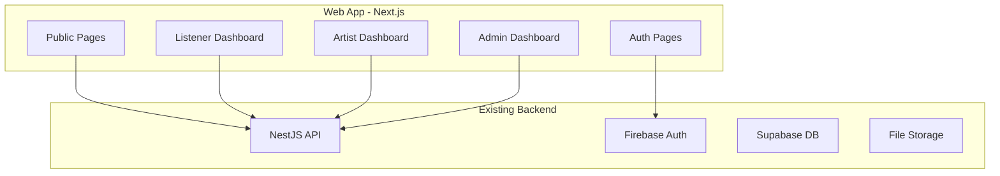

# Web Application Implementation Plan

## Architecture Overview



## Project Structure

```
RadioApp/
├── web/                          # NEW - Main web application
│   ├── app/
│   │   ├── (public)/            # Public routes (no auth)
│   │   │   ├── page.tsx         # Marketing homepage
│   │   │   └── layout.tsx
│   │   ├── (auth)/              # Auth routes
│   │   │   ├── login/page.tsx
│   │   │   ├── signup/page.tsx
│   │   │   └── layout.tsx
│   │   ├── (dashboard)/         # Protected routes
│   │   │   ├── radio/page.tsx   # Radio player (all users)
│   │   │   ├── profile/page.tsx # User profile
│   │   │   ├── upload/page.tsx  # Artist: song upload
│   │   │   ├── credits/page.tsx # Artist: credits management
│   │   │   ├── admin/           # Admin section
│   │   │   │   ├── page.tsx     # Admin dashboard
│   │   │   │   ├── songs/page.tsx
│   │   │   │   └── users/page.tsx
│   │   │   └── layout.tsx       # Sidebar + auth guard
│   │   ├── layout.tsx           # Root layout
│   │   └── globals.css
│   ├── components/
│   │   ├── ui/                  # Reusable UI components
│   │   ├── radio/               # Radio player components
│   │   ├── auth/                # Auth forms
│   │   └── dashboard/           # Dashboard components
│   ├── lib/
│   │   ├── api.ts               # API client
│   │   ├── firebase.ts          # Firebase config
│   │   └── hooks/               # Custom hooks
│   └── contexts/
│       └── AuthContext.tsx
├── admin/                        # EXISTING - Keep as-is for now
├── backend/                      # EXISTING - No changes needed
└── mobile/                       # EXISTING - No changes needed
```

## Phase 1: Project Setup and Core Infrastructure

### 1.1 Initialize Next.js Project

- Create new Next.js 14+ app with TypeScript in `web/` directory
- Configure Tailwind CSS for styling
- Set up ESLint and project structure

### 1.2 Firebase Authentication Integration

- Copy and adapt Firebase config from existing admin app
- Create AuthContext with login, signup, logout, Google auth
- Implement auth state persistence

### 1.3 API Client Setup

- Create typed API client matching backend endpoints
- Implement token injection for authenticated requests
- Handle error responses consistently

**Key files to reference:**

- [`admin/app/lib/firebase.ts`](admin/app/lib/firebase.ts) - Firebase config
- [`admin/app/lib/api.ts`](admin/app/lib/api.ts) - API client pattern
- [`admin/app/contexts/AuthContext.tsx`](admin/app/contexts/AuthContext.tsx) - Auth context

## Phase 2: Authentication Pages

### 2.1 Login Page (`/login`)

- Email/password login form
- Google sign-in button
- Link to signup page
- Redirect to dashboard on success

### 2.2 Signup Page (`/signup`)

- Email/password registration
- Role selection (Listener/Artist)
- Call `POST /api/users` to create user record
- Auto-login after signup

**Reference mobile implementation:**

- [`mobile/lib/widgets/login_screen.dart`](mobile/lib/widgets/login_screen.dart) - Auth flow logic

## Phase 3: Dashboard Layout and Navigation

### 3.1 Dashboard Layout

- Responsive sidebar navigation
- Role-based menu items:
  - **All users:** Radio, Profile
  - **Artists:** + Upload, Credits
  - **Admins:** + Admin section
- Header with user info and logout

### 3.2 Auth Guard

- Protect dashboard routes
- Redirect unauthenticated users to login
- Role-based route protection

## Phase 4: Listener Features

### 4.1 Radio Player Page (`/radio`)

- Persistent audio player component
- Current track display (title, artist, artwork)
- Play/Pause/Skip controls
- Like/Unlike functionality
- Uses `GET /api/radio/current`, `GET /api/radio/next`, `POST /api/radio/play`

### 4.2 Profile Page (`/profile`)

- Display user info (name, email, role)
- Edit display name
- Avatar display
- Account settings

**API endpoints used:**

- `GET /api/users/me`
- `PUT /api/users/me`

## Phase 5: Artist Features

### 5.1 Upload Page (`/upload`)

- Audio file selector (drag-drop + click)
- Optional artwork upload
- Song title and artist name inputs
- Upload progress indicator
- Uses `POST /api/songs/upload`

### 5.2 Credits Page (`/credits`)

- Credit balance display
- Purchase credit packages (10, 25, 50, 100 credits)
- Transaction history table
- Stripe checkout integration
- Uses `GET /api/credits/balance`, `POST /api/payments/create-intent`, `GET /api/credits/transactions`

**Reference mobile implementation:**

- [`mobile/lib/features/payment/payment_screen.dart`](mobile/lib/features/payment/payment_screen.dart) - Stripe integration

## Phase 6: Admin Features

### 6.1 Admin Dashboard (`/admin`)

- Platform analytics cards
- Pending songs count
- User statistics
- Uses `GET /api/admin/analytics`

### 6.2 Song Management (`/admin/songs`)

- Songs table with filters (pending/approved/rejected)
- Approve/Reject actions
- Song preview player
- Uses `GET /api/admin/songs`, `PATCH /api/admin/songs/:id`

### 6.3 User Management (`/admin/users`)

- Users table with role filter
- Role update functionality
- Uses `GET /api/admin/users`, `PATCH /api/admin/users/:id/role`

**Reference existing admin:**

- [`admin/app/page.tsx`](admin/app/page.tsx) - Dashboard implementation
- [`admin/app/songs/page.tsx`](admin/app/songs/page.tsx) - Songs management

## Phase 7: Marketing Homepage

### 7.1 Public Homepage (`/`)

- Hero section with value proposition
- Feature highlights (for artists and listeners)
- How it works section
- Call-to-action buttons (Sign Up as Artist / Listen Now)
- Modern, visually appealing design

## Dependencies

```json
{
  "dependencies": {
    "next": "^14.2.0",
    "react": "^18.3.0",
    "react-dom": "^18.3.0",
    "firebase": "^11.1.0",
    "@stripe/stripe-js": "^4.0.0",
    "axios": "^1.7.0"
  },
  "devDependencies": {
    "typescript": "^5",
    "tailwindcss": "^3.4.0",
    "@types/react": "^18",
    "@types/node": "^20"
  }
}
```

## Notes

- The existing `admin/` folder will remain functional during development
- Once `web/` is complete with admin features, the old `admin/` can be deprecated
- No backend changes required - all endpoints already exist
- Audio playback will use HTML5 Audio API (no external library needed for basic playback)
