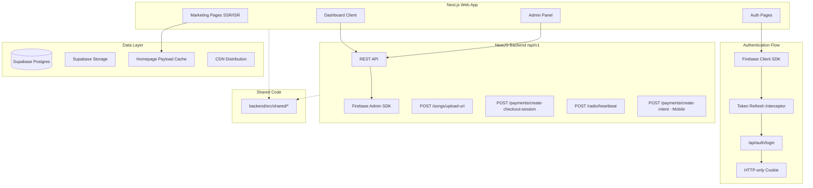
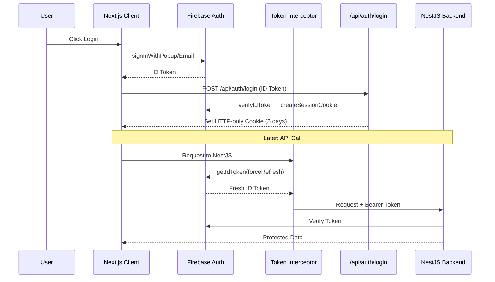
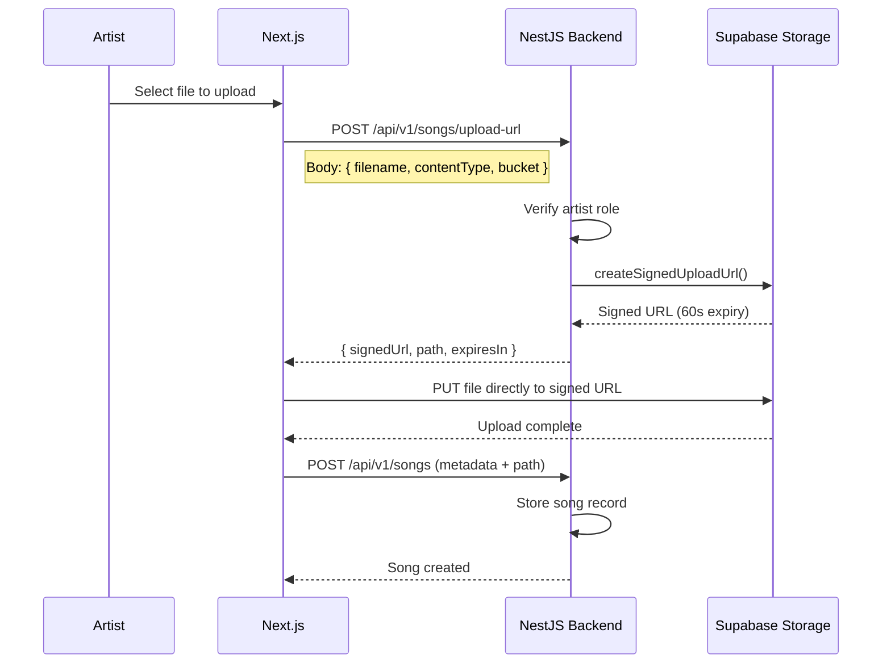
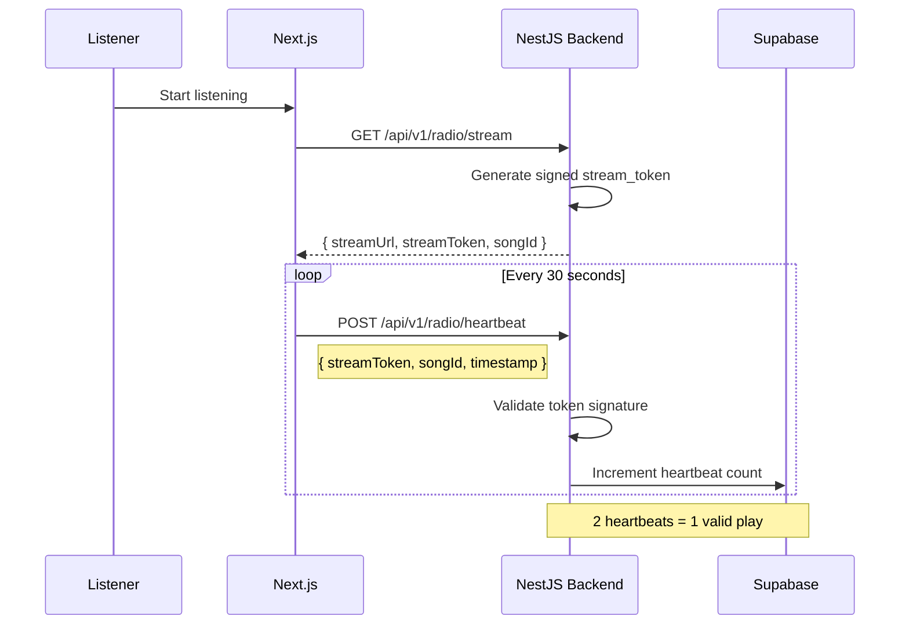

# Web Application Implementation Plan (v2.2)

This plan creates a Next.js web application with improved security (session cookies), scalability (signed uploads), and SEO (SSR/ISR marketing pages). The web app serves three purposes: marketing website, full listener/artist experience, and admin control panel.

## Architecture Overview



## 1. Core Architecture

### Frontend (Web)

- **Framework:** Next.js 14+ (App Router)
- **Styling:** Tailwind CSS
- **Audio Player:** Hls.js + custom React hook (simplified stack)
- **Rendering Strategy:**
  - SSR/ISR for marketing pages and public artist/song pages (SEO)
  - Client components for interactive dashboards and uploads
- **Deployment:** Vercel

### Backend (NestJS - Versioned API)

- **Framework:** NestJS (existing)
- **API Version:** `/api/v1/...` (all endpoints versioned)
- **New Endpoints Required:**
  - `POST /api/v1/songs/upload-url` - Signed URL generation
  - `POST /api/v1/payments/create-checkout-session` - Stripe Checkout for web
  - `POST /api/v1/radio/heartbeat` - Play counting authority
- **Existing (Mobile):**
  - `POST /api/v1/payments/create-intent` - PaymentIntent for flutter_stripe

### Authentication Model (Hardened)

**The Rule (Explicit):**

- **Session Cookie** → UI rendering, SSR personalization, middleware protection
- **Fresh ID Token** → Every API call to NestJS (via interceptor)

This prevents the "Split Brain" problem where cookie is valid but token is expired.

### Database & Storage

- **Database:** Supabase Postgres
- **Storage:** Supabase Storage
  - `songs` bucket (audio files)
  - `artwork` bucket (images)
- **Homepage Cache:** Precomputed JSON payload for marketing pages
- **Access Model:** Backend-generated signed upload URLs

### Shared Code (Decision: TSConfig Path Mapping)

**Chosen Strategy:** TSConfig path mapping (Option 2)

```json
// web/tsconfig.json
{
  "compilerOptions": {
    "paths": {
      "@shared/*": ["../backend/src/shared/*"]
    }
  }
}
```

**Why this choice:**

- No build pipeline changes required
- Backend is source of truth for types
- Works immediately with existing Vercel/Render setup
- Migrate to Turborepo later if needed

**Shared types location:** `backend/src/shared/`

- `user.ts` - User, Role interfaces
- `song.ts` - Song, UploadResponse interfaces
- `payment.ts` - PaymentIntent, CheckoutSession interfaces
- `radio.ts` - StreamToken, Heartbeat interfaces

## 2. Contract Layer (API Authorization)

Explicit definition of endpoint access requirements:

| Endpoint | Auth | Role | Token Type |

|----------|------|------|------------|

| `GET /api/v1/radio/current` | No | Any | None |

| `GET /api/v1/radio/stream` | Yes | Any | ID Token |

| `POST /api/v1/radio/heartbeat` | Yes | Any | ID Token + StreamToken |

| `POST /api/v1/songs/upload-url` | Yes | Artist | ID Token |

| `POST /api/v1/songs` | Yes | Artist | ID Token |

| `GET /api/v1/songs` | No | Any | None |

| `POST /api/v1/payments/create-intent` | Yes | Artist | ID Token |

| `POST /api/v1/payments/create-checkout-session` | Yes | Artist | ID Token |

| `POST /api/v1/payments/webhook` | No | N/A | Stripe Signature |

| `GET /api/v1/admin/*` | Yes | Admin | ID Token |

| `PATCH /api/v1/admin/*` | Yes | Admin | ID Token |

**Public-read endpoints:** radio/current, songs list, artist profiles, song pages

**Session cookie only:** Next.js SSR/middleware (never sent to NestJS)

## 3. Authentication & Authorization Flow



### Token Refresh Interceptor (Critical)

Prevents Cookie/Token drift where UI thinks user is logged in but API rejects calls.

```typescript
// lib/api.ts
import axios from 'axios';
import { getAuth } from 'firebase/auth';

const api = axios.create({
  baseURL: process.env.NEXT_PUBLIC_API_URL + '/api/v1',
});

// Interceptor: Always send fresh ID token
api.interceptors.request.use(async (config) => {
  const auth = getAuth();
  const user = auth.currentUser;
  
  if (user) {
    // forceRefresh ensures token is valid even if cached one expired
    const token = await user.getIdToken(/* forceRefresh */ true);
    config.headers.Authorization = `Bearer ${token}`;
  }
  
  return config;
});

// Response interceptor: Handle 401 gracefully
api.interceptors.response.use(
  (response) => response,
  async (error) => {
    if (error.response?.status === 401) {
      // Token truly invalid - redirect to login
      window.location.href = '/login?session_expired=true';
    }
    return Promise.reject(error);
  }
);

export { api };
```

### Session Cookie Implementation

```typescript
// app/api/auth/login/route.ts
import { cookies } from 'next/headers';
import { adminAuth } from '@/lib/firebase-admin';

export async function POST(request: Request) {
  const { idToken } = await request.json();
  
  // Verify the ID token
  const decodedToken = await adminAuth.verifyIdToken(idToken);
  
  // Create a session cookie (5 days)
  const expiresIn = 60 * 60 * 24 * 5 * 1000;
  const sessionCookie = await adminAuth.createSessionCookie(idToken, { expiresIn });
  
  // Set the cookie
  cookies().set('session', sessionCookie, {
    httpOnly: true,
    secure: process.env.NODE_ENV === 'production',
    sameSite: 'lax',
    maxAge: expiresIn / 1000,
    path: '/',
  });
  
  return Response.json({ success: true, uid: decodedToken.uid });
}
```

### Role Enforcement

- Roles stored in Supabase (`listener`, `artist`, `admin`)
- Role guards enforced in:
  - Next.js middleware (UI access via session cookie)
  - NestJS guards (API access via ID token)

## 4. Project Structure

```
RadioApp/
├── web/                              # NEW - Main web application
│   ├── app/
│   │   ├── (marketing)/              # Public SSR/ISR pages
│   │   │   ├── page.tsx              # Homepage (uses cached payload)
│   │   │   ├── about/page.tsx
│   │   │   ├── pricing/page.tsx
│   │   │   ├── faq/page.tsx
│   │   │   ├── contact/page.tsx
│   │   │   ├── artist/[slug]/page.tsx
│   │   │   └── song/[id]/page.tsx
│   │   ├── (auth)/
│   │   │   ├── login/page.tsx
│   │   │   ├── signup/page.tsx
│   │   │   └── layout.tsx
│   │   ├── (dashboard)/
│   │   │   ├── dashboard/page.tsx
│   │   │   ├── listen/page.tsx       # Radio player
│   │   │   ├── profile/page.tsx
│   │   │   ├── artist/
│   │   │   │   ├── upload/page.tsx
│   │   │   │   ├── stats/page.tsx
│   │   │   │   └── credits/page.tsx
│   │   │   ├── admin/
│   │   │   │   ├── page.tsx
│   │   │   │   ├── songs/page.tsx
│   │   │   │   ├── users/page.tsx
│   │   │   │   └── analytics/page.tsx
│   │   │   └── layout.tsx
│   │   ├── api/
│   │   │   └── auth/
│   │   │       ├── login/route.ts
│   │   │       └── logout/route.ts
│   │   ├── layout.tsx
│   │   └── globals.css
│   ├── components/
│   │   ├── ui/
│   │   ├── marketing/
│   │   ├── radio/
│   │   │   ├── RadioPlayer.tsx       # Hls.js + useRadioState hook
│   │   │   └── useRadioState.ts      # Custom hook for controls
│   │   ├── auth/
│   │   └── dashboard/
│   ├── lib/
│   │   ├── api.ts                    # Axios with token interceptor
│   │   ├── firebase-client.ts
│   │   ├── firebase-admin.ts
│   │   └── hooks/
│   ├── middleware.ts
│   └── tsconfig.json                 # Includes @shared/* path mapping
├── backend/
│   └── src/
│       ├── shared/                   # Shared TypeScript types
│       │   ├── user.ts
│       │   ├── song.ts
│       │   ├── payment.ts
│       │   ├── radio.ts
│       │   └── index.ts
│       ├── songs/
│       │   └── songs.controller.ts   # POST /songs/upload-url
│       ├── payments/
│       │   └── payments.controller.ts # POST /payments/create-checkout-session
│       └── radio/
│           └── radio.controller.ts   # POST /radio/heartbeat
├── admin/                            # EXISTING - Deprecate after Phase 3
└── mobile/                           # EXISTING - No changes
```

## 5. File Upload Flow (Signed URLs)



### Why POST instead of GET

- **No accidental caching** (GET requests can be cached by CDN/browser)
- **No filename leaks in logs** (query params are logged, body is not)
- **Supports batch uploads** (array of files in body, no URL length limits)
- **Better validation** (can enforce contentType, size limits in body)

### Backend Endpoint: POST /api/v1/songs/upload-url

```typescript
// songs.controller.ts
@Post('upload-url')
@UseGuards(FirebaseAuthGuard, RolesGuard)
@Roles('artist')
async getUploadUrl(
  @CurrentUser() user: FirebaseUser,
  @Body() dto: GetUploadUrlDto,
) {
  return this.songsService.getSignedUploadUrl(user.uid, dto);
}

// GetUploadUrlDto
export class GetUploadUrlDto {
  @IsString()
  filename: string;
  
  @IsString()
  @IsIn(['audio/mpeg', 'audio/wav', 'audio/mp3', 'image/jpeg', 'image/png'])
  contentType: string;
  
  @IsString()
  @IsIn(['songs', 'artwork'])
  bucket: 'songs' | 'artwork';
}

// songs.service.ts
async getSignedUploadUrl(userId: string, dto: GetUploadUrlDto) {
  const path = `${userId}/${Date.now()}-${dto.filename}`;
  
  const { data, error } = await supabase.storage
    .from(dto.bucket)
    .createSignedUploadUrl(path, 60);
    
  if (error) throw new BadRequestException(error.message);
  
  return { 
    signedUrl: data.signedUrl, 
    path: data.path,
    expiresIn: 60,
  };
}
```

## 6. Play Counting: Signed Heartbeat Pattern

**The Problem:** Client-reported plays can be scripted/abused.

**The Solution:** Signed heartbeat tokens that prove continuous listening.



### Heartbeat Implementation

```typescript
// radio.controller.ts
@Post('heartbeat')
@UseGuards(FirebaseAuthGuard)
async reportHeartbeat(
  @CurrentUser() user: FirebaseUser,
  @Body() dto: HeartbeatDto,
) {
  return this.radioService.processHeartbeat(user.uid, dto);
}

// radio.service.ts
async processHeartbeat(userId: string, dto: HeartbeatDto) {
  // Verify stream token (JWT signed with server secret)
  const payload = this.verifyStreamToken(dto.streamToken);
  
  if (payload.songId !== dto.songId) {
    throw new BadRequestException('Token/song mismatch');
  }
  
  // Record heartbeat
  await supabase.from('play_heartbeats').insert({
    user_id: userId,
    song_id: dto.songId,
    stream_token: dto.streamToken,
    timestamp: new Date(),
  });
  
  // Check if this completes a play (2+ heartbeats = 60+ seconds)
  const { count } = await supabase
    .from('play_heartbeats')
    .select('*', { count: 'exact' })
    .eq('stream_token', dto.streamToken);
  
  if (count >= 2) {
    // Record valid play (only once per token)
    await this.recordPlay(dto.songId, userId, dto.streamToken);
  }
  
  return { received: true, heartbeatCount: count };
}
```

**Why this works:**

- Token ties heartbeats to a specific session
- Cannot fake 2 heartbeats without waiting 30+ seconds
- Server controls play counting authority
- Prevents scripted abuse

## 7. Audio Streaming & Playback

### Simplified Stack: Hls.js + React Hook

**Decision:** Remove howler.js. Hls.js directly on `<audio>` tag is cleaner.

**Why:**

- Howler wraps HTML5 Audio; Hls.js also wraps audio element
- Combining them adds complexity without benefit
- Custom React hook gives us all the state management we need
```typescript
// components/radio/useRadioState.ts
import { useState, useRef, useCallback, useEffect } from 'react';
import Hls from 'hls.js';

interface RadioState {
  isPlaying: boolean;
  volume: number;
  currentTime: number;
  duration: number;
  currentTrack: Track | null;
}

export function useRadioState() {
  const audioRef = useRef<HTMLAudioElement>(null);
  const hlsRef = useRef<Hls | null>(null);
  const [state, setState] = useState<RadioState>({
    isPlaying: false,
    volume: 1,
    currentTime: 0,
    duration: 0,
    currentTrack: null,
  });

  const loadStream = useCallback((url: string, track: Track) => {
    const audio = audioRef.current;
    if (!audio) return;

    // HLS stream
    if (url.includes('.m3u8') && Hls.isSupported()) {
      if (hlsRef.current) hlsRef.current.destroy();
      
      const hls = new Hls();
      hls.loadSource(url);
      hls.attachMedia(audio);
      hlsRef.current = hls;
    } else {
      // Standard audio
      audio.src = url;
    }

    setState(s => ({ ...s, currentTrack: track }));
  }, []);

  const play = useCallback(() => {
    audioRef.current?.play();
    setState(s => ({ ...s, isPlaying: true }));
  }, []);

  const pause = useCallback(() => {
    audioRef.current?.pause();
    setState(s => ({ ...s, isPlaying: false }));
  }, []);

  const setVolume = useCallback((vol: number) => {
    if (audioRef.current) audioRef.current.volume = vol;
    setState(s => ({ ...s, volume: vol }));
  }, []);

  return { audioRef, state, loadStream, play, pause, setVolume };
}
```
```tsx
// components/radio/RadioPlayer.tsx
export function RadioPlayer() {
  const { audioRef, state, play, pause, setVolume } = useRadioState();
  
  return (
    <div className="radio-player">
      <audio ref={audioRef} />
      
      {state.currentTrack && (
        <div className="track-info">
          
          <div>
            <h3>{state.currentTrack.title}</h3>
            <p>{state.currentTrack.artistName}</p>
          </div>
        </div>
      )}
      
      <div className="controls">
        <button onClick={state.isPlaying ? pause : play}>
          {state.isPlaying ? 'Pause' : 'Play'}
        </button>
        <input
          type="range"
          min={0}
          max={1}
          step={0.1}
          value={state.volume}
          onChange={(e) => setVolume(Number(e.target.value))}
        />
      </div>
    </div>
  );
}
```


## 8. Payments: Dual-Flow Architecture

### Mobile vs Web Flows

| Platform | Endpoint | Stripe Product | UX |

|----------|----------|----------------|-----|

| Mobile | `POST /payments/create-intent` | PaymentIntent | Native flutter_stripe UI |

| Web | `POST /payments/create-checkout-session` | Checkout Session | Redirect to stripe.com |

### Backend: POST /api/v1/payments/create-checkout-session

```typescript
async createCheckoutSession(userId: string, dto: CreateCheckoutSessionDto) {
  // Create pending transaction
  const { data: transaction } = await supabase
    .from('transactions')
    .insert({
      user_id: userId,
      amount: dto.amount,
      credits_purchased: dto.credits,
      status: 'pending',
      payment_method: 'checkout_session',
    })
    .select()
    .single();

  // Create Stripe Checkout Session
  const session = await this.stripe.checkout.sessions.create({
    payment_method_types: ['card'],
    mode: 'payment',
    line_items: [{
      price_data: {
        currency: 'usd',
        product_data: {
          name: `${dto.credits} Radio Credits`,
        },
        unit_amount: dto.amount,
      },
      quantity: 1,
    }],
    metadata: {
      transaction_id: transaction.id,
      user_id: userId,
      credits: dto.credits.toString(),
    },
    success_url: `${process.env.WEB_URL}/artist/credits?success=true`,
    cancel_url: `${process.env.WEB_URL}/artist/credits?canceled=true`,
  });

  return { sessionId: session.id, url: session.url };
}
```

## 9. Marketing Homepage Cache

**Problem:** Data-driven homepage with DB queries can cause slow TTFB or ISR thrashing.

**Solution:** Precomputed homepage payload regenerated on admin action.

### Implementation

```typescript
// Supabase table: homepage_cache
// Columns: id, payload (JSONB), updated_at

// Admin action: "Publish Homepage"
async publishHomepage() {
  const payload = {
    featuredArtists: await this.getFeaturedArtists(),
    trendingTracks: await this.getTrendingTracks(),
    stats: await this.getPlatformStats(),
    updatedAt: new Date().toISOString(),
  };
  
  await supabase
    .from('homepage_cache')
    .upsert({ id: 'main', payload, updated_at: new Date() });
}

// Next.js homepage (ISR)
export const revalidate = 60; // Revalidate every 60 seconds

async function getHomepageData() {
  const { data } = await supabase
    .from('homepage_cache')
    .select('payload')
    .eq('id', 'main')
    .single();
  
  return data?.payload;
}
```

## 10. Failure Modes

Documented system behavior during failures:

| Failure | Behavior | Recovery |

|---------|----------|----------|

| **Stripe webhook delayed** | Transaction stays `pending` | Webhook eventually fires; idempotent handling |

| **Upload succeeds, metadata write fails** | Orphaned file in storage | Cron job cleans orphans after 24h |

| **Session cookie valid, token expired** | Token interceptor refreshes | If refresh fails, redirect to login |

| **Stream server down** | Player shows error state | Polling retries every 10s |

| **Supabase DB unavailable** | API returns 503 | Circuit breaker; cached data where possible |

| **Payment succeeds, credit update fails** | Transaction logged as `payment_received` | Admin alert; manual reconciliation |

## 11. Observability & Logging

### Structured Logging (NestJS)

```typescript
// main.ts
import { Logger } from '@nestjs/common';

app.useLogger(new Logger({
  json: true, // Structured logs for cloud providers
}));

// In services
this.logger.log({
  event: 'payment_completed',
  userId: user.uid,
  amount: dto.amount,
  transactionId: transaction.id,
});
```

### Request IDs

```typescript
// middleware/request-id.middleware.ts
export function requestIdMiddleware(req, res, next) {
  req.requestId = req.headers['x-request-id'] || uuidv4();
  res.setHeader('x-request-id', req.requestId);
  next();
}
```

### Error Reporting

```typescript
// Sentry integration
import * as Sentry from '@sentry/node';

Sentry.init({
  dsn: process.env.SENTRY_DSN,
  environment: process.env.NODE_ENV,
});

// Global exception filter
@Catch()
export class AllExceptionsFilter implements ExceptionFilter {
  catch(exception: unknown, host: ArgumentsHost) {
    Sentry.captureException(exception);
    // ... handle response
  }
}
```

## 12. Deployment & CI/CD

| Component | Platform |

|-----------|----------|

| Web (Next.js) | Vercel |

| Backend (NestJS) | Render / Railway / AWS |

| Database | Supabase |

| Storage | Supabase Storage |

| Streaming | Supabase + CDN |

| Error Tracking | Sentry |

| CI/CD | GitHub Actions |

## 13. Phased Rollout

### Phase 1 - Foundation

- Next.js project setup with TypeScript and Tailwind
- Firebase client auth with **token refresh interceptor**
- Server-side session cookies (`/api/auth/login`)
- Next.js middleware for route protection
- Marketing pages with **precomputed homepage cache**
- TSConfig path mapping for shared types

### Phase 2 - Web App Parity

- Login/signup pages with role selection
- Dashboard layout with role-based navigation
- Web radio player (**Hls.js + React hook**)
- **Backend:** `POST /api/v1/songs/upload-url` endpoint
- Artist upload page (direct to Supabase via signed URL)
- **Backend:** `POST /api/v1/payments/create-checkout-session` endpoint
- Credits and payment page (Stripe Checkout redirect)
- **Backend:** `POST /api/v1/radio/heartbeat` (play counting)

### Phase 3 - Admin & Analytics

- Admin dashboard with platform metrics
- Song moderation page
- User management page
- Artist analytics page
- Homepage publish action

### Phase 4 - Scale & Optimize

- Rate limiting and abuse prevention
- **Observability:** Structured logs, request IDs, Sentry
- CDN integration for audio streaming (HLS)
- Performance optimization
- Old admin deprecation

## Dependencies

```json
{
  "dependencies": {
    "next": "^14.2.0",
    "react": "^18.3.0",
    "react-dom": "^18.3.0",
    "firebase": "^11.1.0",
    "firebase-admin": "^12.0.0",
    "@stripe/stripe-js": "^4.0.0",
    "axios": "^1.7.0",
    "hls.js": "^1.5.0"
  },
  "devDependencies": {
    "typescript": "^5",
    "tailwindcss": "^3.4.0",
    "@types/react": "^18",
    "@types/node": "^20"
  }
}
```

## Summary: v2.2 Changes from v2.1

| Issue | v2.1 | v2.2 |

|-------|------|------|

| Token/Cookie drift | Mentioned | **Token refresh interceptor with forceRefresh** |

| Upload endpoint | GET | **POST (no caching, no log leaks, batch-ready)** |

| Play counting | Duration-based | **Signed heartbeat pattern (abuse-proof)** |

| Shared types | 3 options listed | **Locked: TSConfig path mapping** |

| Audio player | howler.js + Hls.js | **Simplified: Hls.js + React hook only** |

| API versioning | Not mentioned | **All endpoints at /api/v1/** |

| Marketing cache | Not mentioned | **Precomputed homepage payload** |

| Failure modes | Not documented | **Explicit failure/recovery table** |

| Observability | Not mentioned | **Structured logs, request IDs, Sentry** |

| Contract layer | Implicit | **Explicit endpoint auth requirements** |