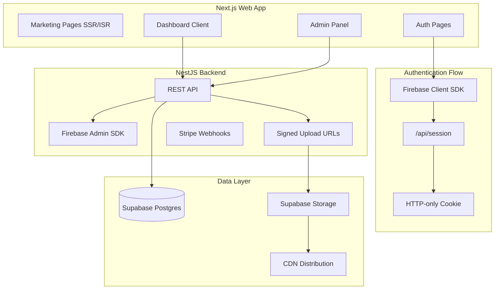
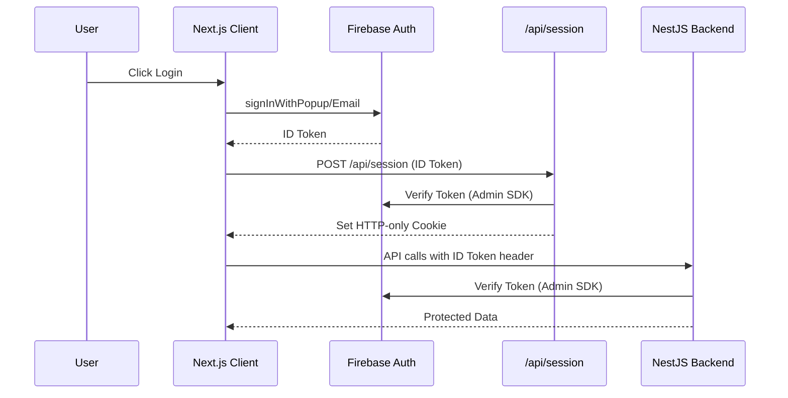
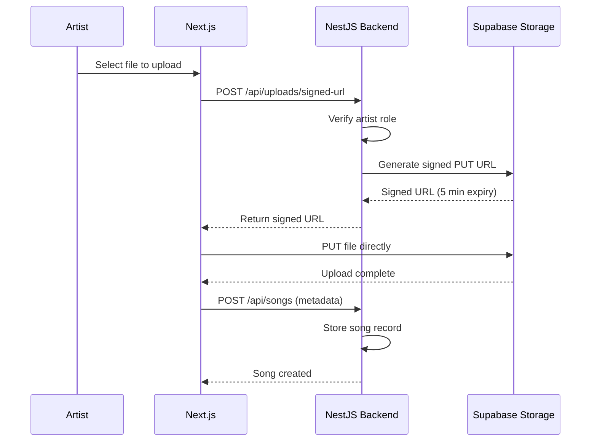

# Web Application Implementation Plan (v2)

This plan creates a Next.js web application with improved security (session cookies), scalability (signed uploads), and SEO (SSR/ISR marketing pages). The web app serves three purposes: marketing website, full listener/artist experience, and admin control panel.

## Architecture Overview



## 1. Core Architecture

### Frontend (Web)

- **Framework:** Next.js 14+ (App Router)
- **Styling:** Tailwind CSS
- **Rendering Strategy:**
  - SSR/ISR for marketing pages and public artist/song pages (SEO)
  - Client components for interactive dashboards and uploads
- **Deployment:** Vercel

### Backend

- **Framework:** NestJS (existing)
- **New Responsibilities:**
  - Signed upload URL generation for Supabase Storage
  - Session validation support (optional)
- **Existing:** Firebase token verification, role guards, payments, analytics

### Authentication Model (Improved)

- Client-side Firebase login (Google, Email, Apple)
- Server-side session cookies for SSR and route protection
- Firebase Admin SDK in Next.js API routes for session creation
- NestJS continues to verify Firebase ID tokens on API calls

### Database & Storage

- **Database:** Supabase Postgres
- **Storage:** Supabase Storage
  - `songs` bucket (audio files)
  - `artwork` bucket (images)
- **Access Model:** Backend-generated signed upload URLs

## 2. Authentication & Authorization Flow



### Session Flow

1. User logs in via Firebase client SDK (Google, Email, Apple)
2. Firebase returns an ID token
3. Client sends ID token to `/api/session`
4. Next.js verifies token via Firebase Admin and issues HTTP-only session cookie
5. Session cookie enables:

   - SSR personalization
   - Middleware route protection
   - Secure server-side API calls

### Role Enforcement

- Roles stored in Supabase (`listener`, `artist`, `admin`)
- Role guards enforced in:
  - Next.js middleware (UI access)
  - NestJS guards (API access)

## 3. Project Structure

```
RadioApp/
├── web/                              # NEW - Main web application
│   ├── app/
│   │   ├── (marketing)/              # Public SSR/ISR pages
│   │   │   ├── page.tsx              # Homepage (featured artists, trending)
│   │   │   ├── about/page.tsx
│   │   │   ├── pricing/page.tsx
│   │   │   ├── faq/page.tsx
│   │   │   ├── contact/page.tsx
│   │   │   ├── artist/[slug]/page.tsx  # Public artist profile
│   │   │   └── song/[id]/page.tsx      # Shareable song page
│   │   ├── (auth)/                   # Auth pages
│   │   │   ├── login/page.tsx
│   │   │   ├── signup/page.tsx
│   │   │   └── layout.tsx
│   │   ├── (dashboard)/              # Protected client pages
│   │   │   ├── dashboard/page.tsx    # Role-aware home
│   │   │   ├── listen/page.tsx       # Radio player + discovery
│   │   │   ├── profile/page.tsx
│   │   │   ├── artist/
│   │   │   │   ├── upload/page.tsx
│   │   │   │   ├── stats/page.tsx    # Artist analytics
│   │   │   │   └── credits/page.tsx
│   │   │   ├── admin/
│   │   │   │   ├── page.tsx          # Admin dashboard
│   │   │   │   ├── songs/page.tsx
│   │   │   │   ├── users/page.tsx
│   │   │   │   └── analytics/page.tsx
│   │   │   └── layout.tsx            # Sidebar + auth guard
│   │   ├── api/
│   │   │   └── session/route.ts      # Session cookie management
│   │   ├── layout.tsx
│   │   └── globals.css
│   ├── components/
│   │   ├── ui/                       # Reusable UI components
│   │   ├── marketing/                # Marketing page components
│   │   ├── radio/                    # Audio player components
│   │   ├── auth/                     # Auth forms
│   │   └── dashboard/                # Dashboard components
│   ├── lib/
│   │   ├── api.ts                    # Backend API client
│   │   ├── firebase-client.ts        # Firebase client config
│   │   ├── firebase-admin.ts         # Firebase Admin SDK (server)
│   │   └── hooks/
│   ├── middleware.ts                 # Route protection
│   └── contexts/
│       └── AuthContext.tsx
├── backend/                          # EXISTING - Minor additions
│   └── src/
│       └── uploads/
│           └── uploads.service.ts    # Add signed URL generation
├── admin/                            # EXISTING - Deprecate after Phase 3
└── mobile/                           # EXISTING - No changes
```

## 4. File Upload Flow (Signed URLs)



### Benefits

- Reduced backend bandwidth (files bypass server)
- Faster uploads (direct to storage)
- Improved security (time-limited URLs)
- Better scaling (backend handles only metadata)

### Backend Changes Required

Add to `uploads.service.ts`:

```typescript
async getSignedUploadUrl(
  userId: string,
  bucket: 'songs' | 'artwork',
  filename: string,
  contentType: string,
): Promise<{ signedUrl: string; path: string }> {
  const path = `${userId}/${Date.now()}-${filename}`;
  const { data, error } = await supabase.storage
    .from(bucket)
    .createSignedUploadUrl(path);
  
  if (error) throw error;
  return { signedUrl: data.signedUrl, path };
}
```

## 5. Audio Streaming & Playback

### Web Player Implementation

- HTML5 Audio API for basic playback
- Hls.js fallback for HLS streams (future)
- Persistent player component across navigation

### Real-time State Sync

- `GET /api/radio/current` - Current track + timing
- Polling interval: 5-10 seconds
- Future: SSE/WebSocket for instant updates

### CDN Strategy (Phase 4)

- Cloudflare or similar for audio file delivery
- Cache audio files at edge locations
- Reduced latency for global listeners

## 6. Payments & Monetization

### Flow

1. Artist selects credit package
2. Next.js calls NestJS to create Stripe Checkout session
3. User redirects to Stripe Checkout
4. Stripe webhook confirms payment
5. Backend credits artist's play balance

### Safeguards

- Idempotent webhook handling (prevent double credits)
- Transaction logging for audit trail
- Admin review tools for disputes

## 7. Admin Dashboard Features

### Capabilities

- Approve/reject uploaded songs
- Feature artists and tracks on homepage
- Monitor payments and revenue
- Moderate abuse and fraud
- View platform analytics
- Manage user roles

### Migration Strategy

- Phase 1-2: Existing admin (`/admin`) remains active
- Phase 3: New admin built in web app
- Phase 4: Deprecate old admin folder

## 8. Analytics & Insights

### Artist Analytics (`/artist/stats`)

- Total plays (all-time, weekly, daily)
- Plays over time chart
- Credits spent vs exposure gained
- Listener engagement metrics
- Top performing songs

### Admin Analytics (`/admin/analytics`)

- Platform usage metrics
- Revenue tracking
- User growth charts
- Abuse detection alerts

## 9. Security & Abuse Prevention

### Authentication Security

- Firebase token verification on all protected endpoints
- HTTP-only session cookies (not accessible to JS)
- Secure cookie flags (SameSite, Secure)

### Rate Limiting

- Likes: Max 100/hour per user
- Uploads: Max 10/day per artist
- Play reports: Max 1/song/user/minute

### File Validation

- Type checking (audio/mpeg, audio/wav, image/*)
- Size limits (50MB audio, 5MB images)
- Content scanning (future)

### Play Counting

- Minimum play duration before counting (30 seconds)
- Duplicate play prevention per user per hour

### Audit Logging

- Admin actions logged with timestamp and user
- Payment events logged
- Moderation decisions tracked

## 10. Deployment & CI/CD

| Component | Platform |

|-----------|----------|

| Web (Next.js) | Vercel |

| Backend (NestJS) | Render / Railway / AWS |

| Database | Supabase |

| Storage | Supabase Storage |

| Streaming | Supabase + CDN |

| CI/CD | GitHub Actions |

## 11. Phased Rollout

### Phase 1 - Foundation

- Next.js project setup with TypeScript and Tailwind
- Firebase client auth integration
- Server-side session cookies (`/api/session`)
- Next.js middleware for route protection
- Marketing pages (SSR/ISR): homepage, about, pricing, FAQ, contact

### Phase 2 - Web App Parity

- Login/signup pages with role selection
- Dashboard layout with role-based navigation
- Web radio player with real-time state
- Signed upload URL endpoint (backend)
- Artist upload page (direct to Supabase)
- Credits and payment page (Stripe Checkout)

### Phase 3 - Admin & Analytics

- Admin dashboard with platform metrics
- Song moderation page
- User management page
- Artist analytics page

### Phase 4 - Scale & Optimize

- Rate limiting and abuse prevention
- CDN integration for audio streaming
- Performance optimization
- Old admin deprecation

## Dependencies

```json
{
  "dependencies": {
    "next": "^14.2.0",
    "react": "^18.3.0",
    "react-dom": "^18.3.0",
    "firebase": "^11.1.0",
    "firebase-admin": "^12.0.0",
    "@stripe/stripe-js": "^4.0.0",
    "axios": "^1.7.0",
    "hls.js": "^1.5.0"
  },
  "devDependencies": {
    "typescript": "^5",
    "tailwindcss": "^3.4.0",
    "@types/react": "^18",
    "@types/node": "^20"
  }
}
```

## Summary of v2 Improvements

| Area | v1 | v2 |

|------|----|----|

| Auth | Client-only tokens | + Server-side session cookies |

| Uploads | Direct to backend | Signed URLs (bypass server) |

| Marketing | Static homepage | SSR/ISR with dynamic content |

| Streaming | Basic polling | + Real-time state, CDN roadmap |

| Analytics | Admin only | + Artist analytics dashboard |

| Security | Basic guards | + Rate limiting, abuse prevention |

| Admin | Separate app | Migration + deprecation plan |

| Rollout | Feature-based | Phased with clear milestones |