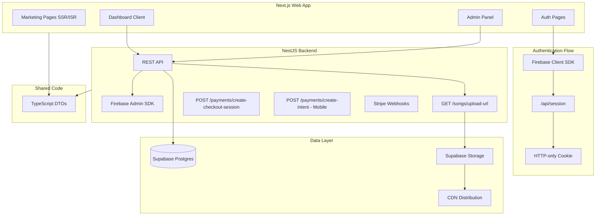
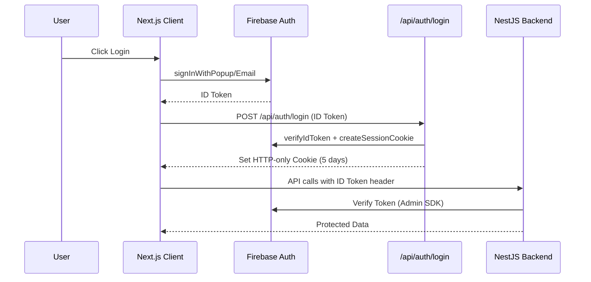
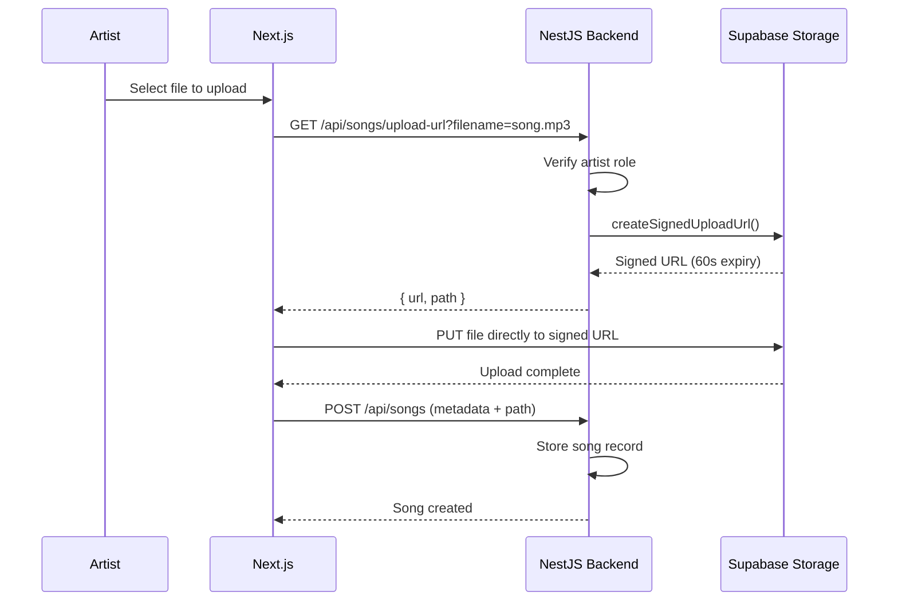
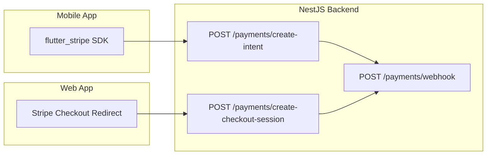

# Web Application Implementation Plan (v2.1)

This plan creates a Next.js web application with improved security (session cookies), scalability (signed uploads), and SEO (SSR/ISR marketing pages). The web app serves three purposes: marketing website, full listener/artist experience, and admin control panel.

## Architecture Overview



## 1. Core Architecture

### Frontend (Web)

- **Framework:** Next.js 14+ (App Router)
- **Styling:** Tailwind CSS
- **Audio Player:** howler.js + Hls.js (unified API for cross-browser compatibility)
- **Rendering Strategy:**
  - SSR/ISR for marketing pages and public artist/song pages (SEO)
  - Client components for interactive dashboards and uploads
- **Deployment:** Vercel

### Backend (NestJS - Existing + New Endpoints)

- **Framework:** NestJS (existing)
- **New Endpoints Required:**
  - `GET /api/songs/upload-url` - Signed URL generation for direct uploads
  - `POST /api/payments/create-checkout-session` - Stripe Checkout for web
- **Existing (Mobile):**
  - `POST /api/payments/create-intent` - PaymentIntent for flutter_stripe
  - Firebase token verification, role guards, analytics

### Authentication Model (Improved)

- Client-side Firebase login (Google, Email, Apple)
- Server-side session cookies for SSR and route protection
- Firebase Admin SDK in Next.js API routes (`createSessionCookie()`)
- NestJS continues to verify Firebase ID tokens on API calls

### Database & Storage

- **Database:** Supabase Postgres
- **Storage:** Supabase Storage
  - `songs` bucket (audio files)
  - `artwork` bucket (images)
- **Access Model:** Backend-generated signed upload URLs

### Shared Code (Type Safety)

- **Shared DTOs** between `web/` and `backend/`
- Options:

  1. `shared/` folder at project root with TypeScript interfaces
  2. Configure `web/tsconfig.json` to import from `../backend/src/`
  3. Turborepo for monorepo management (future)

## 2. Authentication & Authorization Flow



### Session Flow

1. User logs in via Firebase client SDK (Google, Email, Apple)
2. Firebase returns an ID token
3. Client sends ID token to `/api/auth/login`
4. Next.js API route:

   - Verifies token with `firebase-admin.auth().verifyIdToken()`
   - Creates session cookie with `firebase-admin.auth().createSessionCookie()`
   - Sets HTTP-only cookie in response

5. Session cookie enables:

   - SSR personalization
   - Middleware route protection
   - Secure server-side API calls

### Session API Route Implementation

```typescript
// app/api/auth/login/route.ts
import { cookies } from 'next/headers';
import { adminAuth } from '@/lib/firebase-admin';

export async function POST(request: Request) {
  const { idToken } = await request.json();
  
  // Verify the ID token
  const decodedToken = await adminAuth.verifyIdToken(idToken);
  
  // Create a session cookie (5 days)
  const expiresIn = 60 * 60 * 24 * 5 * 1000;
  const sessionCookie = await adminAuth.createSessionCookie(idToken, { expiresIn });
  
  // Set the cookie
  cookies().set('session', sessionCookie, {
    httpOnly: true,
    secure: process.env.NODE_ENV === 'production',
    sameSite: 'lax',
    maxAge: expiresIn / 1000,
    path: '/',
  });
  
  return Response.json({ success: true, uid: decodedToken.uid });
}
```

### Role Enforcement

- Roles stored in Supabase (`listener`, `artist`, `admin`)
- Role guards enforced in:
  - Next.js middleware (UI access)
  - NestJS guards (API access)

## 3. Project Structure

```
RadioApp/
├── shared/                           # NEW - Shared TypeScript types
│   └── types/
│       ├── user.ts                   # User, Role interfaces
│       ├── song.ts                   # Song, UploadResponse interfaces
│       ├── payment.ts                # PaymentIntent, CheckoutSession interfaces
│       └── index.ts                  # Barrel export
├── web/                              # NEW - Main web application
│   ├── app/
│   │   ├── (marketing)/              # Public SSR/ISR pages
│   │   │   ├── page.tsx              # Homepage (featured artists, trending)
│   │   │   ├── about/page.tsx
│   │   │   ├── pricing/page.tsx
│   │   │   ├── faq/page.tsx
│   │   │   ├── contact/page.tsx
│   │   │   ├── artist/[slug]/page.tsx  # Public artist profile
│   │   │   └── song/[id]/page.tsx      # Shareable song page
│   │   ├── (auth)/                   # Auth pages
│   │   │   ├── login/page.tsx
│   │   │   ├── signup/page.tsx
│   │   │   └── layout.tsx
│   │   ├── (dashboard)/              # Protected client pages
│   │   │   ├── dashboard/page.tsx    # Role-aware home
│   │   │   ├── listen/page.tsx       # Radio player + discovery
│   │   │   ├── profile/page.tsx
│   │   │   ├── artist/
│   │   │   │   ├── upload/page.tsx
│   │   │   │   ├── stats/page.tsx    # Artist analytics
│   │   │   │   └── credits/page.tsx
│   │   │   ├── admin/
│   │   │   │   ├── page.tsx          # Admin dashboard
│   │   │   │   ├── songs/page.tsx
│   │   │   │   ├── users/page.tsx
│   │   │   │   └── analytics/page.tsx
│   │   │   └── layout.tsx            # Sidebar + auth guard
│   │   ├── api/
│   │   │   └── auth/
│   │   │       ├── login/route.ts    # Session cookie creation
│   │   │       └── logout/route.ts   # Session cookie deletion
│   │   ├── layout.tsx
│   │   └── globals.css
│   ├── components/
│   │   ├── ui/                       # Reusable UI components
│   │   ├── marketing/                # Marketing page components
│   │   ├── radio/                    # Audio player (howler.js)
│   │   ├── auth/                     # Auth forms
│   │   └── dashboard/                # Dashboard components
│   ├── lib/
│   │   ├── api.ts                    # Backend API client
│   │   ├── firebase-client.ts        # Firebase client config
│   │   ├── firebase-admin.ts         # Firebase Admin SDK (server)
│   │   └── hooks/
│   ├── middleware.ts                 # Route protection
│   ├── tsconfig.json                 # Extends shared types
│   └── contexts/
│       └── AuthContext.tsx
├── backend/                          # EXISTING - New endpoints added
│   └── src/
│       ├── songs/
│       │   └── songs.controller.ts   # Add GET /songs/upload-url
│       └── payments/
│           └── payments.controller.ts # Add POST /payments/create-checkout-session
├── admin/                            # EXISTING - Deprecate after Phase 3
└── mobile/                           # EXISTING - No changes (uses create-intent)
```

## 4. File Upload Flow (Signed URLs)



### Benefits

- Reduced backend bandwidth (files bypass server)
- Faster uploads (direct to storage)
- Improved security (time-limited URLs)
- Better scaling (backend handles only metadata)
- **Prevents OOM crashes** (no RAM buffering)

### Backend Endpoint: GET /api/songs/upload-url

Add to `songs.controller.ts`:

```typescript
@Get('upload-url')
@UseGuards(FirebaseAuthGuard, RolesGuard)
@Roles('artist')
async getUploadUrl(
  @CurrentUser() user: FirebaseUser,
  @Query('filename') filename: string,
  @Query('bucket') bucket: 'songs' | 'artwork' = 'songs',
) {
  const supabase = getSupabaseClient();
  const path = `${user.uid}/${Date.now()}-${filename}`;
  
  const { data, error } = await supabase.storage
    .from(bucket)
    .createSignedUploadUrl(path, 60); // 60 second expiry
    
  if (error) throw new BadRequestException(error.message);
  
  return { 
    signedUrl: data.signedUrl, 
    path: data.path,
    expiresIn: 60,
  };
}
```

## 5. Audio Streaming & Playback

### Web Player Stack (howler.js + Hls.js)

**Why howler.js instead of native HTML5 Audio:**

- Unified API across browsers (Safari quirks handled)
- Volume fading and crossfade support
- Sprite/playlist management
- State management (play/pause/seek)
- Plugin system for HLS integration
```typescript
// components/radio/RadioPlayer.tsx
import { Howl } from 'howler';
import Hls from 'hls.js';

class RadioPlayer {
  private howl: Howl | null = null;
  private hls: Hls | null = null;
  
  play(streamUrl: string) {
    // For HLS streams
    if (streamUrl.includes('.m3u8') && Hls.isSupported()) {
      this.hls = new Hls();
      this.hls.loadSource(streamUrl);
      // Connect to howler for unified controls
    } else {
      // Standard MP3/audio
      this.howl = new Howl({
        src: [streamUrl],
        html5: true, // Required for streaming
        volume: 1.0,
      });
      this.howl.play();
    }
  }
  
  pause() { this.howl?.pause(); }
  setVolume(vol: number) { this.howl?.volume(vol); }
  fade(from: number, to: number, duration: number) {
    this.howl?.fade(from, to, duration);
  }
}
```


### Real-time State Sync

- `GET /api/radio/current` - Current track + server timestamp
- Polling interval: 5-10 seconds
- Future: SSE/WebSocket for instant updates
- Mobile and web sync via shared `played_at` timestamp

### CDN Strategy (Phase 4)

- Cloudflare or similar for audio file delivery
- Cache audio files at edge locations
- HLS segments cached individually for efficiency

## 6. Payments: Dual-Flow Architecture

### The Problem

Mobile and web require different Stripe integrations:

- **Mobile (Flutter):** Uses `flutter_stripe` which requires `PaymentIntent` client secret
- **Web:** Better UX with Stripe Checkout (hosted payment page)

### Solution: Two Endpoints



### Backend: POST /api/payments/create-checkout-session

Add to `payments.controller.ts`:

```typescript
@Post('create-checkout-session')
@UseGuards(FirebaseAuthGuard, RolesGuard)
@Roles('artist')
async createCheckoutSession(
  @CurrentUser() user: FirebaseUser,
  @Body() dto: CreateCheckoutSessionDto,
) {
  return this.paymentsService.createCheckoutSession(user.uid, dto);
}
```

Add to `payments.service.ts`:

```typescript
async createCheckoutSession(userId: string, dto: CreateCheckoutSessionDto) {
  // Create pending transaction in Supabase
  const { data: transaction } = await supabase
    .from('transactions')
    .insert({
      user_id: userId,
      amount: dto.amount,
      credits_purchased: dto.credits,
      status: 'pending',
      payment_method: 'checkout_session',
    })
    .select()
    .single();

  // Create Stripe Checkout Session
  const session = await this.stripe.checkout.sessions.create({
    payment_method_types: ['card'],
    mode: 'payment',
    line_items: [{
      price_data: {
        currency: 'usd',
        product_data: {
          name: `${dto.credits} Radio Credits`,
          description: `Purchase ${dto.credits} credits for radio airplay`,
        },
        unit_amount: dto.amount, // in cents
      },
      quantity: 1,
    }],
    metadata: {
      transaction_id: transaction.id,
      user_id: userId,
      credits: dto.credits.toString(),
    },
    success_url: `${process.env.WEB_URL}/artist/credits?success=true&session_id={CHECKOUT_SESSION_ID}`,
    cancel_url: `${process.env.WEB_URL}/artist/credits?canceled=true`,
  });

  return { sessionId: session.id, url: session.url };
}
```

### Webhook Handling (Shared)

The existing webhook handles both flows via `metadata`:

```typescript
// In handlePaymentSuccess()
const transactionId = session.metadata?.transaction_id 
  || paymentIntent.metadata?.transaction_id;
```

## 7. Admin Dashboard Features

### Capabilities

- Approve/reject uploaded songs
- Feature artists and tracks on homepage
- Monitor payments and revenue
- Moderate abuse and fraud
- View platform analytics
- Manage user roles

### Migration Strategy

- Phase 1-2: Existing admin (`/admin`) remains active
- Phase 3: New admin built in web app
- Phase 4: Deprecate old admin folder

## 8. Analytics & Insights

### Artist Analytics (`/artist/stats`)

- Total plays (all-time, weekly, daily)
- Plays over time chart
- Credits spent vs exposure gained
- Listener engagement metrics
- Top performing songs

### Admin Analytics (`/admin/analytics`)

- Platform usage metrics
- Revenue tracking
- User growth charts
- Abuse detection alerts

## 9. Security & Abuse Prevention

### Authentication Security

- Firebase token verification on all protected endpoints
- HTTP-only session cookies (not accessible to JS)
- Secure cookie flags (SameSite=lax, Secure in production)

### Rate Limiting

- Likes: Max 100/hour per user
- Uploads: Max 10/day per artist
- Play reports: Max 1/song/user/minute

### File Validation

- Type checking (audio/mpeg, audio/wav, image/*)
- Size limits (50MB audio, 5MB images)
- Content scanning (future)

### Play Counting

- Minimum play duration before counting (30 seconds)
- Duplicate play prevention per user per hour

### Audit Logging

- Admin actions logged with timestamp and user
- Payment events logged
- Moderation decisions tracked

## 10. Deployment & CI/CD

| Component | Platform |

|-----------|----------|

| Web (Next.js) | Vercel |

| Backend (NestJS) | Render / Railway / AWS |

| Database | Supabase |

| Storage | Supabase Storage |

| Streaming | Supabase + CDN |

| CI/CD | GitHub Actions |

## 11. Phased Rollout

### Phase 1 - Foundation

- Next.js project setup with TypeScript and Tailwind
- Firebase client auth integration
- Server-side session cookies (`/api/auth/login`)
- Next.js middleware for route protection
- Marketing pages (SSR/ISR): homepage, about, pricing, FAQ, contact

### Phase 2 - Web App Parity

- Login/signup pages with role selection
- Dashboard layout with role-based navigation
- Web radio player (howler.js + Hls.js)
- **Backend:** `GET /api/songs/upload-url` endpoint
- Artist upload page (direct to Supabase via signed URL)
- **Backend:** `POST /api/payments/create-checkout-session` endpoint
- Credits and payment page (Stripe Checkout redirect)
- **Shared types** setup between web/ and backend/

### Phase 3 - Admin & Analytics

- Admin dashboard with platform metrics
- Song moderation page
- User management page
- Artist analytics page

### Phase 4 - Scale & Optimize

- Rate limiting and abuse prevention
- CDN integration for audio streaming (HLS)
- Performance optimization
- Old admin deprecation

## Dependencies

```json
{
  "dependencies": {
    "next": "^14.2.0",
    "react": "^18.3.0",
    "react-dom": "^18.3.0",
    "firebase": "^11.1.0",
    "firebase-admin": "^12.0.0",
    "@stripe/stripe-js": "^4.0.0",
    "axios": "^1.7.0",
    "howler": "^2.2.4",
    "hls.js": "^1.5.0"
  },
  "devDependencies": {
    "typescript": "^5",
    "tailwindcss": "^3.4.0",
    "@types/react": "^18",
    "@types/node": "^20",
    "@types/howler": "^2.2.0"
  }
}
```

## Summary: v2.1 Changes from v2

| Issue | v2 Status | v2.1 Resolution |

|-------|-----------|-----------------|

| Stripe Flow Mismatch | Web needed Checkout, Mobile needs Intent | Added dual-flow with `create-checkout-session` endpoint |

| Audio Player Fragility | Native HTML5 Audio | Replaced with howler.js + Hls.js |

| Type Safety | Not addressed | Added `shared/` folder for DTOs |

| Upload Endpoint | Generic reference | Explicit `GET /songs/upload-url` with code |

| Session Cookie | Mentioned | Added full `createSessionCookie()` implementation |