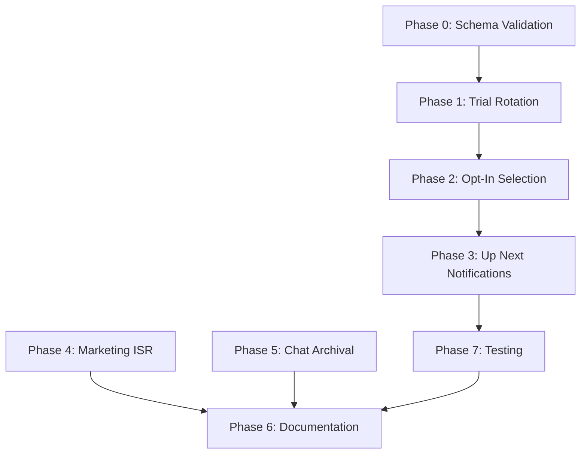

# Fix All Deliverables Gaps (Revised)

This plan addresses all gaps identified in the executive summary to bring the project to 100% implementation.

## Current State

- Project at ~92% implementation
- Key gaps: Trial rotation, opt-in selection, "Up Next" notifications, marketing ISR, chat archival, documentation

---

## Phase 0: Schema Validation (Pre-requisite)

Before implementing, validate that required database columns exist.

### 0.1 Check Trial Columns

Query Supabase to verify `songs` table has:

- `trial_plays_remaining` (INTEGER)
- `trial_plays_used` (INTEGER)

```sql
SELECT column_name, data_type 
FROM information_schema.columns 
WHERE table_name = 'songs' 
AND column_name IN ('trial_plays_remaining', 'trial_plays_used');
```

### 0.2 Create Migration Only If Needed

If columns are missing, create `backend/supabase/migrations/004_trial_rotation_columns.sql`:

```sql
ALTER TABLE songs ADD COLUMN IF NOT EXISTS trial_plays_remaining INTEGER DEFAULT 3;
ALTER TABLE songs ADD COLUMN IF NOT EXISTS trial_plays_used INTEGER DEFAULT 0;

-- Trigger to set trial plays on approval
CREATE OR REPLACE FUNCTION set_trial_plays_on_approval()
RETURNS TRIGGER AS $$
BEGIN
  IF NEW.status = 'approved' AND OLD.status != 'approved' THEN
    NEW.trial_plays_remaining := 3;
    NEW.trial_plays_used := 0;
  END IF;
  RETURN NEW;
END;
$$ LANGUAGE plpgsql;

CREATE TRIGGER trigger_set_trial_plays
  BEFORE UPDATE ON songs
  FOR EACH ROW
  EXECUTE FUNCTION set_trial_plays_on_approval();
```

---

## Phase 1: Trial Rotation (3 Free Plays)

### 1.1 Implement `getTrialSong()` in [backend/src/radio/radio.service.ts](backend/src/radio/radio.service.ts)

```typescript
private async getTrialSong(currentSongId?: string): Promise<{ song: any; competingSongs: number } | null> {
  const supabase = getSupabaseClient();
  const { data: songs } = await supabase
    .from('songs')
    .select('*')
    .eq('status', 'approved')
    .gt('trial_plays_remaining', 0);
  
  if (!songs || songs.length === 0) return null;
  const selectedSong = this.selectWeightedRandom(songs, currentSongId);
  return { song: selectedSong, competingSongs: songs.length };
}
```

### 1.2 Implement `playTrialSong()` in [backend/src/radio/radio.service.ts](backend/src/radio/radio.service.ts)

- Decrement `trial_plays_remaining`, increment `trial_plays_used`
- Log with `selectionReason: 'trial'`
- Set radio state (same pattern as `playCreditedSong()` without credit deduction)

---

## Phase 2: Opt-In Song Selection

### 2.1 Implement `getOptInSong()` in [backend/src/radio/radio.service.ts](backend/src/radio/radio.service.ts)

**Corrected eligibility** (matches [backend/src/admin/admin.service.ts](backend/src/admin/admin.service.ts) lines 608, 702):

```typescript
private async getOptInSong(currentSongId?: string): Promise<{ song: any; competingSongs: number } | null> {
  const supabase = getSupabaseClient();
  const { data: songs } = await supabase
    .from('songs')
    .select('*')
    .eq('status', 'approved')
    .eq('opt_in_free_play', true)
    .eq('admin_free_rotation', true)  // Admin must approve for free rotation
    .lte('credits_remaining', 0);      // No credits remaining
  
  if (!songs || songs.length === 0) return null;
  const selectedSong = this.selectWeightedRandom(songs, currentSongId);
  return { song: selectedSong, competingSongs: songs.length };
}
```

### 2.2 Implement `playOptInSong()` in [backend/src/radio/radio.service.ts](backend/src/radio/radio.service.ts)

- Log with `selectionReason: 'opt_in'`
- No credit deduction
- Same state management as `playFreeRotationSong()`

### 2.3 Integrate into `getNextTrack()` Flow

Update [backend/src/radio/radio.service.ts](backend/src/radio/radio.service.ts) around line 460:

```
Flow: credited → trial → opt-in → admin fallback
```

Insert after credited songs check:

```typescript
// Try trial songs
const trialResult = await this.getTrialSong(currentSongId);
if (trialResult) {
  const result = await this.playTrialSong(trialResult.song, trialResult.competingSongs);
  if (result) return result;
}

// Try opt-in songs
const optInResult = await this.getOptInSong(currentSongId);
if (optInResult) {
  const result = await this.playOptInSong(optInResult.song, optInResult.competingSongs);
  if (result) return result;
}
```

---

## Phase 3: "Up Next" Push Notification Integration

### 3.1 Add Pre-Selection Tracking

Add to [backend/src/radio/radio.service.ts](backend/src/radio/radio.service.ts):

```typescript
private nextSongNotifiedFor: string | null = null;

private async checkAndScheduleUpNext(timeRemainingMs: number, currentSongId: string): Promise<void> {
  // Only trigger between 60-30 seconds remaining
  if (timeRemainingMs > 60000 || timeRemainingMs < 30000) return;
  // Only notify once per song transition
  if (this.nextSongNotifiedFor === currentSongId) return;
  
  const nextSong = await this.preSelectNextSong(currentSongId);
  if (nextSong) {
    await this.pushNotificationService.scheduleUpNextNotification(nextSong, 60);
    this.nextSongNotifiedFor = currentSongId;
  }
}
```

### 3.2 Implement `preSelectNextSong()` Helper

Preview which song would play next without modifying state:

```typescript
private async preSelectNextSong(currentSongId: string): Promise<any | null> {
  // Only notify for credited songs (artists who paid)
  const creditedResult = await this.getCreditedSong(currentSongId);
  if (creditedResult) return creditedResult.song;
  
  // Trial songs also get notifications (new artists)
  const trialResult = await this.getTrialSong(currentSongId);
  if (trialResult) return trialResult.song;
  
  // Opt-in and fallback don't get "Up Next" notifications
  return null;
}
```

### 3.3 Call from `getCurrentTrack()`

Add check in [backend/src/radio/radio.service.ts](backend/src/radio/radio.service.ts) `getCurrentTrack()` around line 156:

```typescript
// Schedule "Up Next" notification ~60 seconds before song ends
if (timeRemainingMs <= 60000 && timeRemainingMs > SONG_END_BUFFER_MS) {
  this.checkAndScheduleUpNext(timeRemainingMs, currentSong.id).catch(e => 
    this.logger.warn(`Failed to schedule Up Next: ${e.message}`)
  );
}
```

---

## Phase 4: Marketing Pages ISR

### 4.1 Add Revalidate to Static Pages

Add `export const revalidate = 3600` (1 hour) to:

- [web/src/app/(marketing)/about/page.tsx](web/src/app/(marketing)/about/page.tsx) - Line 1
- [web/src/app/(marketing)/faq/page.tsx](web/src/app/(marketing)/faq/page.tsx) - Line 1
- [web/src/app/(marketing)/pricing/page.tsx](web/src/app/(marketing)/pricing/page.tsx) - Line 1

These are static pages that rarely change.

---

## Phase 5: Chat Archival Database Structures

### 5.1 Create Migration

Create `backend/supabase/migrations/005_chat_archival.sql`:

```sql
-- Chat archives table (cold storage for 24h+ messages)
CREATE TABLE IF NOT EXISTS chat_archives (
  id UUID PRIMARY KEY,
  user_id UUID NOT NULL,
  song_id UUID,
  display_name TEXT NOT NULL,
  avatar_url TEXT,
  message TEXT NOT NULL,
  created_at TIMESTAMPTZ NOT NULL,
  archived_at TIMESTAMPTZ DEFAULT NOW()
);

CREATE INDEX IF NOT EXISTS idx_chat_archives_created ON chat_archives(created_at);
CREATE INDEX IF NOT EXISTS idx_chat_archives_user ON chat_archives(user_id);

-- Chat config table (kill switch)
CREATE TABLE IF NOT EXISTS chat_config (
  id TEXT PRIMARY KEY DEFAULT 'global',
  enabled BOOLEAN DEFAULT TRUE,
  disabled_reason TEXT,
  updated_at TIMESTAMPTZ DEFAULT NOW()
);

INSERT INTO chat_config (id, enabled) VALUES ('global', true) 
ON CONFLICT (id) DO NOTHING;

-- Archive RPC function
CREATE OR REPLACE FUNCTION archive_old_chat_messages(cutoff_timestamp TIMESTAMPTZ)
RETURNS INTEGER AS $$
DECLARE archived_count INTEGER;
BEGIN
  INSERT INTO chat_archives (id, user_id, song_id, display_name, avatar_url, message, created_at)
  SELECT id, user_id, song_id, display_name, avatar_url, message, created_at
  FROM chat_messages
  WHERE created_at < cutoff_timestamp AND deleted_at IS NULL;
  
  GET DIAGNOSTICS archived_count = ROW_COUNT;
  RETURN archived_count;
END;
$$ LANGUAGE plpgsql;
```

---

## Phase 6: Documentation Updates

### 6.1 Update README.md

Update Key Features section to accurately reflect the 4-tier fallback:

```markdown
- 🔄 **Four-tier fallback**: credited songs → trial songs (3 free) → opt-in songs → admin fallback
```

### 6.2 Update [docs/database-schema.md](docs/database-schema.md)

Add documentation for:

**New Tables:**

- `notifications`, `play_decision_log`, `admin_fallback_songs`, `radio_playlist_state`
- `credit_allocations`, `artist_notification_cooldowns`
- `chat_messages`, `chat_archives`, `chat_config`

**New Columns on `users`:**

- Ban columns: `is_banned`, `banned_at`, `ban_reason`, `banned_by`
- Shadow ban: `is_shadow_banned`, `shadow_banned_at`, etc.

**New Columns on `songs`:**

- Trial: `trial_plays_remaining`, `trial_plays_used`
- Free rotation: `admin_free_rotation`, `opt_in_free_play`, `paid_play_count`
- Rejection: `rejection_reason`, `rejected_at`

---

## Phase 7: Testing and Validation

### 7.1 Unit Tests

Add tests to `backend/src/radio/radio.service.spec.ts`:

- `getTrialSong()` returns songs with `trial_plays_remaining > 0`
- `getOptInSong()` requires both `opt_in_free_play` AND `admin_free_rotation`
- `playTrialSong()` decrements trial counter
- Tier ordering: credited → trial → opt-in → fallback

### 7.2 Integration Tests

- Create song, verify 3 trial plays, then requires credits
- Exhaust trial plays, opt-in, verify plays before fallback
- Verify "Up Next" notification fires ~60s before credited song

---

## Implementation Order




**Recommended execution:**

1. Phase 0 - Validate schema (quick check)
2. Phase 4 - Marketing ISR (3 one-line changes)
3. Phase 1 - Trial rotation
4. Phase 2 - Opt-in selection
5. Phase 3 - Up Next notifications
6. Phase 5 - Chat archival
7. Phase 7 - Testing
8. Phase 6 - Documentation (final)

