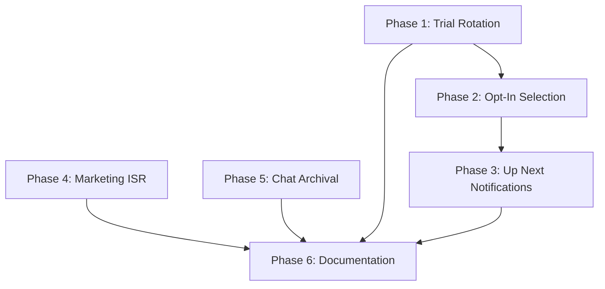

# Fix All Deliverables Gaps

This plan addresses all gaps identified in the executive summary to bring the project to 100% implementation.

## Current State

The project is at ~92% implementation. Key gaps:

- Radio fallback: Only 2 of 4 tiers work (credited, admin fallback)
- "Up Next" push notification: Code exists but never called
- Marketing pages: Missing ISR on 3 pages
- Chat archival: Missing database structures
- Documentation: Outdated README and database-schema.md

---

## Phase 1: Trial Rotation (3 Free Plays)

### 1.1 Add Database Migration for Trial Columns

Create `backend/supabase/migrations/004_trial_rotation_columns.sql`:

- Add `trial_plays_remaining INTEGER DEFAULT 3` to songs table
- Add `trial_plays_used INTEGER DEFAULT 0` to songs table
- Add trigger to set `trial_plays_remaining = 3` on song approval

### 1.2 Implement `getTrialSong()` in Radio Service

Add to [backend/src/radio/radio.service.ts](backend/src/radio/radio.service.ts):

```typescript
private async getTrialSong(currentSongId?: string): Promise<{ song: any; competingSongs: number } | null> {
  const supabase = getSupabaseClient();
  const { data: songs } = await supabase
    .from('songs')
    .select('*')
    .eq('status', 'approved')
    .gt('trial_plays_remaining', 0);
  
  if (!songs || songs.length === 0) return null;
  const selectedSong = this.selectWeightedRandom(songs, currentSongId);
  return { song: selectedSong, competingSongs: songs.length };
}
```

### 1.3 Implement `playTrialSong()` in Radio Service

- Decrement `trial_plays_remaining` and increment `trial_plays_used`
- Log with `selectionReason: 'trial'`
- Use same pattern as `playCreditedSong()` but without credit deduction

### 1.4 Integrate into `getNextTrack()` Flow

Modify `getNextTrack()` around line 464 to add trial tier:

```
credited songs → trial songs → opt-in songs → admin fallback
```

---

## Phase 2: Opt-In Song Selection

### 2.1 Implement `getOptInSong()` in Radio Service

Add to [backend/src/radio/radio.service.ts](backend/src/radio/radio.service.ts):

```typescript
private async getOptInSong(currentSongId?: string): Promise<{ song: any; competingSongs: number } | null> {
  const supabase = getSupabaseClient();
  const { data: songs } = await supabase
    .from('songs')
    .select('*')
    .eq('status', 'approved')
    .eq('opt_in_free_play', true)
    .eq('trial_plays_remaining', 0)  // Exhausted trial plays
    .lte('credits_remaining', 0);     // No credits
  
  if (!songs || songs.length === 0) return null;
  const selectedSong = this.selectWeightedRandom(songs, currentSongId);
  return { song: selectedSong, competingSongs: songs.length };
}
```

### 2.2 Implement `playOptInSong()` in Radio Service

- Log with `selectionReason: 'opt_in'`
- No credit deduction (free play)
- Use same state management pattern as `playFreeRotationSong()`

### 2.3 Integrate into `getNextTrack()` Flow

Insert after trial songs check, before free rotation fallback.

---

## Phase 3: "Up Next" Push Notification Integration

### 3.1 Add Pre-Selection Logic to Radio Service

The challenge: Current flow only selects next song when current ends. Need to pre-select ~60 seconds before.

Add to [backend/src/radio/radio.service.ts](backend/src/radio/radio.service.ts):

```typescript
private nextSongNotified: string | null = null;

private async checkAndScheduleUpNext(timeRemainingMs: number, currentSongId: string): Promise<void> {
  if (timeRemainingMs > 60000 || timeRemainingMs < 30000) return;
  if (this.nextSongNotified === currentSongId) return;
  
  // Pre-select next song
  const nextSong = await this.preSelectNextSong(currentSongId);
  if (nextSong) {
    await this.pushNotificationService.scheduleUpNextNotification(nextSong, 60);
    this.nextSongNotified = currentSongId;
  }
}
```

### 3.2 Call from `getCurrentTrack()`

Add check in `getCurrentTrack()` around line 156 when `timeRemainingMs` is calculated:

```typescript
if (timeRemainingMs <= 60000 && timeRemainingMs > SONG_END_BUFFER_MS) {
  this.checkAndScheduleUpNext(timeRemainingMs, currentSong.id);
}
```

### 3.3 Implement `preSelectNextSong()` Helper

Preview which song would play next without actually playing it:

```typescript
private async preSelectNextSong(currentSongId: string): Promise<any | null> {
  const creditedResult = await this.getCreditedSong(currentSongId);
  if (creditedResult) return creditedResult.song;
  
  const trialResult = await this.getTrialSong(currentSongId);
  if (trialResult) return trialResult.song;
  
  const optInResult = await this.getOptInSong(currentSongId);
  if (optInResult) return optInResult.song;
  
  return null; // Free rotation songs don't get notifications
}
```

---

## Phase 4: Marketing Pages ISR

### 4.1 Add Revalidate to Static Pages

Add `export const revalidate = 3600` (1 hour) to:

- [web/src/app/(marketing)/about/page.tsx](web/src/app/(marketing)/about/page.tsx)
- [web/src/app/(marketing)/faq/page.tsx](web/src/app/(marketing)/faq/page.tsx)
- [web/src/app/(marketing)/pricing/page.tsx](web/src/app/(marketing)/pricing/page.tsx)

These are static pages that rarely change, so 1-hour cache is appropriate.

---

## Phase 5: Chat Archival Database Structures

### 5.1 Create Migration for Chat Tables

Create `backend/supabase/migrations/005_chat_archival.sql`:

```sql
-- Chat archives table (cold storage)
CREATE TABLE chat_archives (
  id UUID PRIMARY KEY,
  user_id UUID NOT NULL,
  song_id UUID,
  display_name TEXT NOT NULL,
  avatar_url TEXT,
  message TEXT NOT NULL,
  created_at TIMESTAMPTZ NOT NULL,
  archived_at TIMESTAMPTZ DEFAULT NOW()
);

CREATE INDEX idx_chat_archives_created ON chat_archives(created_at);
CREATE INDEX idx_chat_archives_user ON chat_archives(user_id);

-- Chat config table (kill switch)
CREATE TABLE chat_config (
  id TEXT PRIMARY KEY DEFAULT 'global',
  enabled BOOLEAN DEFAULT TRUE,
  disabled_reason TEXT,
  updated_at TIMESTAMPTZ DEFAULT NOW()
);

INSERT INTO chat_config (id, enabled) VALUES ('global', true);

-- Archive RPC function
CREATE OR REPLACE FUNCTION archive_old_chat_messages(cutoff_timestamp TIMESTAMPTZ)
RETURNS INTEGER AS $$
DECLARE archived_count INTEGER;
BEGIN
  INSERT INTO chat_archives (id, user_id, song_id, display_name, avatar_url, message, created_at)
  SELECT id, user_id, song_id, display_name, avatar_url, message, created_at
  FROM chat_messages
  WHERE created_at < cutoff_timestamp AND deleted_at IS NULL;
  
  GET DIAGNOSTICS archived_count = ROW_COUNT;
  RETURN archived_count;
END;
$$ LANGUAGE plpgsql;
```

---

## Phase 6: Documentation Updates

### 6.1 Update README.md

Update the "Radio Streaming" section to accurately reflect the 4-tier fallback:

```markdown
- **Four-tier fallback**: credited songs → trial songs (3 free plays) → opt-in songs → admin fallback
```

Remove or update any claims that don't match reality after implementation.

### 6.2 Update docs/database-schema.md

Add documentation for all missing tables and columns:

**New Tables:**

- `notifications`
- `play_decision_log`
- `admin_fallback_songs`
- `radio_playlist_state`
- `credit_allocations`
- `artist_notification_cooldowns`
- `chat_messages`
- `chat_archives`
- `chat_config`

**New Columns on `users`:**

- Ban columns (`is_banned`, `banned_at`, etc.)
- Shadow ban columns

**New Columns on `songs`:**

- Trial columns (`trial_plays_remaining`, `trial_plays_used`)
- Free rotation columns (`admin_free_rotation`, `opt_in_free_play`, `paid_play_count`)
- Rejection columns (`rejection_reason`, `rejected_at`)

---

## Implementation Order




**Recommended order:**

1. Phase 4 (Marketing ISR) - Quick win, 3 one-line changes
2. Phase 1 (Trial Rotation) - Core feature gap
3. Phase 2 (Opt-In Selection) - Builds on Phase 1
4. Phase 3 (Up Next Notifications) - Integration work
5. Phase 5 (Chat Archival) - Database structures
6. Phase 6 (Documentation) - Final cleanup

---

## Testing Considerations

- Trial rotation: Create song, verify 3 plays without credits, then requires credits
- Opt-in: Exhaust trial plays, verify opt-in songs play before fallback
- Up Next: Monitor push notifications ~60s before credited song plays
- Chat archival: Run cleanup task, verify messages archived correctly

