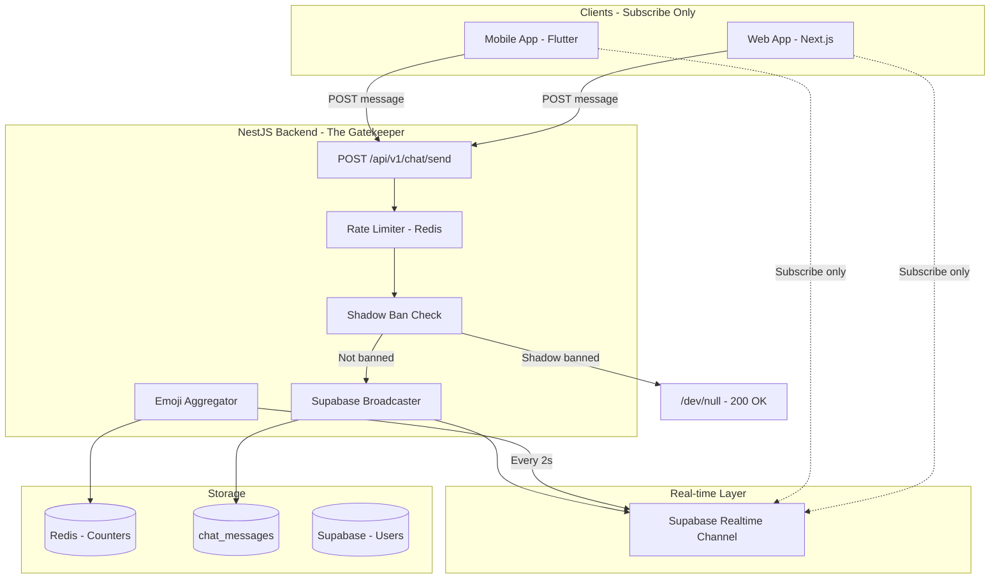
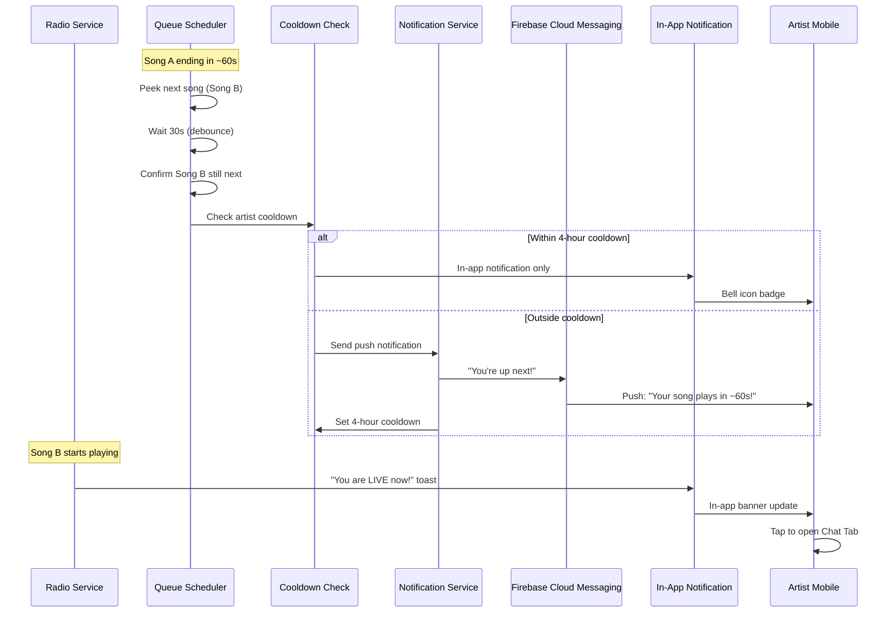

# Future Features Implementation Plan

This document outlines two future features for the RadioApp platform: **Live Radio Chat** and **Artist Song-Up-Next Notifications**.

---

## Feature 1: Live Radio Chat

A real-time text chat where all listeners can interact while tuned in to the radio stream, creating community engagement and allowing artists to see reactions when their song plays.

### Architecture Overview: The "Backend Gatekeeper" Pattern

**CRITICAL SECURITY RULE:** Clients must NEVER broadcast directly to Supabase Realtime. All messages flow through NestJS for validation, rate limiting, and shadow ban checks.



### Message Flow: The "Iron Gate" Pipeline

1. Client sends `POST /api/v1/chat/send` to NestJS
2. NestJS checks rate limits (Redis) - max 1 msg/3s, burst limit 5/10s
3. NestJS checks `is_shadow_banned` on user record
4. If shadow banned: Return `200 OK` (troll thinks it worked), do NOT broadcast
5. If valid: Save to `chat_messages` table
6. NestJS broadcasts to Supabase Realtime channel
7. All subscribed clients receive the message

### The "Hydrate" Pattern (Solving Ghost Town Problem)

New users joining chat see an empty room. Solution:

1. Client connects to app
2. Client calls `GET /api/v1/chat/history` (returns last 50 messages)
3. Client renders historical messages
4. Client subscribes to Supabase Realtime for new messages
5. New messages append to the feed

### Database Schema

New tables and columns required:

```sql
-- Add shadow ban columns to existing users table
ALTER TABLE users ADD COLUMN is_shadow_banned BOOLEAN DEFAULT FALSE;
ALTER TABLE users ADD COLUMN shadow_banned_until TIMESTAMPTZ;

CREATE INDEX idx_users_shadow_banned ON users(is_shadow_banned) WHERE is_shadow_banned = TRUE;

-- Chat messages (ephemeral, auto-delete after 24h)
CREATE TABLE chat_messages (
  id UUID PRIMARY KEY DEFAULT gen_random_uuid(),
  user_id UUID NOT NULL REFERENCES users(id) ON DELETE CASCADE,
  song_id UUID REFERENCES songs(id) ON DELETE SET NULL,
  display_name TEXT NOT NULL,
  avatar_url TEXT,
  message TEXT NOT NULL CHECK (char_length(message) <= 280),
  created_at TIMESTAMPTZ DEFAULT NOW()
);

CREATE INDEX idx_chat_messages_created_at ON chat_messages(created_at DESC);
CREATE INDEX idx_chat_messages_song_id ON chat_messages(song_id);

-- Chat enabled state (for Kill Switch)
CREATE TABLE chat_config (
  id TEXT PRIMARY KEY DEFAULT 'global',
  enabled BOOLEAN DEFAULT TRUE,
  disabled_reason TEXT,
  updated_at TIMESTAMPTZ DEFAULT NOW()
);

INSERT INTO chat_config (id, enabled) VALUES ('global', true);
```

### Backend Endpoints

| Endpoint | Method | Auth | Description |

|----------|--------|------|-------------|

| `/api/v1/chat/send` | POST | Yes | Send a chat message (gatekeeper) |

| `/api/v1/chat/history` | GET | Yes | Get last 50 messages (hydration) |

| `/api/v1/chat/reactions` | POST | Yes | Send emoji reaction (aggregated) |

| `/api/v1/admin/chat/toggle` | POST | Admin | Kill Switch - enable/disable chat globally |

| `/api/v1/admin/chat/shadow-ban/:userId` | POST | Admin | Shadow ban user |

| `/api/v1/admin/chat/unban/:userId` | POST | Admin | Remove shadow ban |

### The "Shadow Realm" (Troll Mitigation)

Shadow banning is more effective than visible bans because trolls don't know they're banned:

```typescript
// chat.service.ts
async sendMessage(userId: string, message: string, songId: string) {
  // Check shadow ban status
  const { data: user } = await supabase
    .from('users')
    .select('is_shadow_banned, shadow_banned_until')
    .eq('id', userId)
    .single();
  
  // If shadow banned and ban hasn't expired
  if (user.is_shadow_banned) {
    if (!user.shadow_banned_until || new Date(user.shadow_banned_until) > new Date()) {
      // Return success but DON'T broadcast - troll screams into the void
      this.logger.log(`Shadow banned message from ${userId} suppressed`);
      return { success: true, id: 'shadow-' + Date.now() };
    }
  }
  
  // Normal flow - save and broadcast
  const saved = await this.saveMessage(userId, message, songId);
  await this.broadcast(saved);
  return saved;
}
```

### Aggregated Emoji Reactions (Solving "Emoji Explosion")

**Problem:** 1,000 users clicking fire emoji = 1,000 WebSocket events = server meltdown.

**Solution:** Aggregate in Redis, broadcast sums every 2 seconds.

```typescript
// reactions.service.ts
private readonly REACTION_INTERVAL_MS = 2000;
private reactionBuffer: Map<string, number> = new Map();

async addReaction(songId: string, emoji: string) {
  // Increment Redis counter (atomic)
  const key = `reactions:${songId}:${emoji}`;
  await this.redis.incr(key);
  await this.redis.expire(key, 300); // 5 min TTL
}

// Cron job every 2 seconds
@Cron('*/2 * * * * *')
async broadcastReactions() {
  const currentSong = await this.radioService.getCurrentTrack();
  if (!currentSong) return;
  
  const emojis = ['fire', 'heart', 'clap', 'hundred'];
  const counts: Record<string, number> = {};
  
  for (const emoji of emojis) {
    const key = `reactions:${currentSong.id}:${emoji}`;
    const count = await this.redis.getdel(key); // Get and reset
    if (count) counts[emoji] = parseInt(count);
  }
  
  if (Object.keys(counts).length > 0) {
    await supabase.channel('radio-chat').send({
      type: 'broadcast',
      event: 'reactions',
      payload: { songId: currentSong.id, counts }
    });
  }
}
```

**Result:** 1 broadcast every 2 seconds, regardless of how many users clicked.

### Real-time Implementation

**Clients subscribe only - never publish:**

```typescript
// Frontend (Flutter/Web)
const channel = supabase.channel('radio-chat')
  .on('broadcast', { event: 'new_message' }, (payload) => {
    addMessage(payload.message);
  })
  .on('broadcast', { event: 'reactions' }, (payload) => {
    updateReactionCounts(payload.counts);
  })
  .subscribe();

// To send a message - POST to backend, NOT broadcast
await api.post('/chat/send', { message: text });
```

**Backend is the only broadcaster:**

```typescript
// chat.service.ts (NestJS)
async broadcast(message: ChatMessage) {
  await supabase.channel('radio-chat').send({
    type: 'broadcast',
    event: 'new_message',
    payload: { message }
  });
}
```

### Key Implementation Details

- **Message limit**: 280 characters (Twitter-style)
- **Rate limiting**: 1 message per 3 seconds, burst limit 5 per 10 seconds
- **Auto-cleanup**: Cron job deletes messages older than 24 hours
- **Song context**: Each message tagged with currently playing `song_id`
- **Shadow bans**: Trolls think messages send but they don't broadcast
- **Kill Switch**: Admin can instantly disable chat for all users
- **Emoji aggregation**: Reactions batched and broadcast every 2 seconds

### Mobile UI ([mobile/lib/features/player/](mobile/lib/features/player/))

Add collapsible chat panel below the player controls:

- Expandable/collapsible chat drawer
- Real-time message feed with user avatars
- Input field with send button
- Badge showing unread message count when collapsed
- Emoji reaction bar (fire, heart, clap, 100)
- Reaction count display with animation

### Web UI ([web/app/(dashboard)/listen/](web/app/\\\\\(dashboard)/listen/))

Sidebar chat panel next to the radio player:

- Persistent chat sidebar (right side)
- Collapsible on mobile breakpoints
- Emoji reaction buttons with live counts
- Visual feedback when reactions aggregate

---

## Feature 2: Artist Song-Up-Next Notifications

Push notifications to artists when their song is about to play, allowing them to log in and see real-time listener reactions in the chat.

### The Notification Timing Dilemma: Two-Stage Hybrid

**Problem:** When should we notify the artist?

| Approach | Pros | Cons |

|----------|------|------|

| "Now Playing" | 100% accurate, no false positives | Artist misses first 30-60s of reactions while opening app |

| "Up Next" (T-60s) | Artist arrives as song starts, catches full reaction wave | Risk of phantom notification if previous song skipped |

**Solution: Two-Stage Hybrid with Debounce**

1. **Stage 1 - "Up Next" Push (T-60s):** Send push notification 60 seconds before song plays, but only if queue has been stable for >30 seconds (debounce prevents phantom notifications from rapid skips)
2. **Stage 2 - "Live Now" Toast:** When song actually starts, send in-app toast/banner update
3. **4-Hour Cooldown:** Max 1 push notification per artist per 4 hours (high-rotation artists use in-app notifications only)

### Architecture Overview



### Database Schema

```sql
-- User device tokens for push notifications
CREATE TABLE user_device_tokens (
  id UUID PRIMARY KEY DEFAULT gen_random_uuid(),
  user_id UUID NOT NULL REFERENCES users(id) ON DELETE CASCADE,
  fcm_token TEXT NOT NULL,
  device_type TEXT CHECK (device_type IN ('ios', 'android', 'web')),
  created_at TIMESTAMPTZ DEFAULT NOW(),
  updated_at TIMESTAMPTZ DEFAULT NOW(),
  UNIQUE(user_id, fcm_token)
);

CREATE INDEX idx_user_device_tokens_user_id ON user_device_tokens(user_id);

-- Artist notification cooldowns (spam prevention)
CREATE TABLE artist_notification_cooldowns (
  artist_id UUID PRIMARY KEY REFERENCES users(id) ON DELETE CASCADE,
  last_push_sent_at TIMESTAMPTZ NOT NULL,
  notification_count_today INTEGER DEFAULT 1
);

CREATE INDEX idx_cooldowns_last_push ON artist_notification_cooldowns(last_push_sent_at);
```

### Backend Changes

#### 1. New Endpoints

| Endpoint | Method | Auth | Description |

|----------|--------|------|-------------|

| `/api/v1/notifications/register-device` | POST | Yes | Register FCM token |

| `/api/v1/notifications/unregister-device` | POST | Yes | Remove FCM token |

| `/api/v1/notifications/preferences` | GET/PUT | Yes | Get/update notification settings |

#### 2. Two-Stage Notification Implementation

```typescript
// notification.service.ts
private readonly COOLDOWN_HOURS = 4;
private readonly DEBOUNCE_SECONDS = 30;
private pendingNotifications: Map<string, NodeJS.Timeout> = new Map();

/**
 * Stage 1: Schedule "Up Next" notification with debounce
 * Called when queue determines next song
 */
async scheduleUpNextNotification(song: any, secondsUntilPlay: number) {
  const artistId = song.artist_id;
  
  // Cancel any pending notification for this artist (debounce)
  if (this.pendingNotifications.has(artistId)) {
    clearTimeout(this.pendingNotifications.get(artistId));
  }
  
  // Schedule notification after debounce period
  const timeout = setTimeout(async () => {
    await this.sendUpNextNotification(song);
    this.pendingNotifications.delete(artistId);
  }, this.DEBOUNCE_SECONDS * 1000);
  
  this.pendingNotifications.set(artistId, timeout);
}

/**
 * Send "Up Next" push notification with cooldown check
 */
async sendUpNextNotification(song: any) {
  const artistId = song.artist_id;
  
  // Check cooldown
  const { data: cooldown } = await supabase
    .from('artist_notification_cooldowns')
    .select('last_push_sent_at')
    .eq('artist_id', artistId)
    .single();
  
  const cooldownExpiry = cooldown?.last_push_sent_at 
    ? new Date(cooldown.last_push_sent_at).getTime() + (this.COOLDOWN_HOURS * 60 * 60 * 1000)
    : 0;
  
  if (Date.now() < cooldownExpiry) {
    // Within cooldown - in-app notification only
    this.logger.log(`Artist ${artistId} in cooldown, sending in-app only`);
    await this.createInAppNotification(artistId, song, 'song_up_next');
    return;
  }
  
  // Outside cooldown - send push notification
  await this.sendPushNotification({
    userId: artistId,
    title: "You're up next!",
    body: `"${song.title}" plays in about a minute. Tune in to see reactions!`,
    data: {
      type: 'song_up_next',
      songId: song.id,
      action: 'open_chat', // Deep link to chat tab
    }
  });
  
  // Update cooldown
  await supabase
    .from('artist_notification_cooldowns')
    .upsert({
      artist_id: artistId,
      last_push_sent_at: new Date().toISOString(),
    });
}

/**
 * Stage 2: Send "Live Now" in-app toast when song actually starts
 */
async sendLiveNowNotification(song: any) {
  await this.createInAppNotification(song.artist_id, song, 'song_live_now');
  
  // Also broadcast to connected clients for immediate toast
  await supabase.channel(`artist-${song.artist_id}`).send({
    type: 'broadcast',
    event: 'song_live',
    payload: { 
      songId: song.id, 
      title: song.title,
      message: 'You are LIVE now! Check out the chat reactions.'
    }
  });
}
```

#### 3. Radio Service Integration

```typescript
// radio.service.ts
private async playCreditedSong(song: any) {
  // ... existing credit deduction logic ...
  
  // Stage 2: Notify artist they are LIVE NOW
  await this.notificationService.sendLiveNowNotification(song);
  
  // ... rest of method ...
}

// Called by queue scheduler when determining next song
async peekNextSong(): Promise<any> {
  const nextSong = await this.getCreditedSong();
  if (nextSong) {
    // Stage 1: Schedule "Up Next" notification (with debounce)
    await this.notificationService.scheduleUpNextNotification(nextSong, 60);
  }
  return nextSong;
}
```

#### 4. FCM Integration (Mobile-First)

```typescript
// notification.service.ts
import * as admin from 'firebase-admin';

async sendPushNotification(dto: SendPushNotificationDto) {
  // Get user's MOBILE device tokens only (web deprioritized)
  const { data: tokens } = await supabase
    .from('user_device_tokens')
    .select('fcm_token, device_type')
    .eq('user_id', dto.userId)
    .in('device_type', ['ios', 'android']); // Mobile only for Phase 1
  
  if (!tokens || tokens.length === 0) {
    // Fallback to in-app notification
    await this.createInAppNotification(dto.userId, null, dto.data.type);
    return;
  }
  
  const messages = tokens.map(t => ({
    token: t.fcm_token,
    notification: {
      title: dto.title,
      body: dto.body,
    },
    data: {
      ...dto.data,
      click_action: 'FLUTTER_NOTIFICATION_CLICK',
    },
    android: {
      priority: 'high' as const,
      notification: { channelId: 'song_alerts' }
    },
    apns: {
      payload: { aps: { sound: 'default', badge: 1 } }
    }
  }));
  
  const response = await admin.messaging().sendEach(messages);
  this.logger.log(`Push sent: ${response.successCount} success, ${response.failureCount} failed`);
  
  // Also store in notifications table for in-app history
  await this.createInAppNotification(dto.userId, null, dto.data.type, dto.title, dto.body);
}
```

### Mobile Implementation ([mobile/lib/](mobile/lib/))

#### 1. FCM Setup

- Add `firebase_messaging: ^15.0.0` to pubspec.yaml
- Request notification permissions on first launch
- Register device token with backend on login
- Create notification channel for Android (`song_alerts`)

#### 2. Deep Link to Chat Tab (Critical)

```dart
// main.dart
FirebaseMessaging.onMessageOpenedApp.listen((RemoteMessage message) {
  final action = message.data['action'];
  final songId = message.data['songId'];
  
  if (action == 'open_chat') {
    // Navigate to player screen with chat expanded
    Navigator.pushNamed(context, '/player', arguments: {
      'expandChat': true,
      'songId': songId,
    });
  }
});
```

#### 3. In-App "Live Now" Toast

```dart
// Listen for live broadcasts when app is open
supabase.channel('artist-${currentUser.id}')
  .on('broadcast', 'song_live', (payload) {
    showTopSnackBar(
      context,
      CustomSnackBar.success(
        message: payload['message'],
        icon: Icon(Icons.radio),
      ),
    );
  })
  .subscribe();
```

### Web Implementation: In-App Notification Center (Deprioritized Browser Push)

**Decision:** Browser push notifications are unreliable and often blocked. For Phase 1, focus on in-app notification center.

#### Implementation:

1. **Bell Icon** in header with unread badge count
2. **Dropdown Panel** showing recent notifications
3. **Real-time Updates** via Supabase subscription to notifications table
4. **No Service Worker** for Phase 1 (avoid complexity)
```typescript
// Web notification center (in-app only)
const NotificationBell = () => {
  const [notifications, setNotifications] = useState([]);
  const [unreadCount, setUnreadCount] = useState(0);
  
  useEffect(() => {
    // Subscribe to user's notifications
    const channel = supabase
      .channel(`notifications-${user.id}`)
      .on('postgres_changes', {
        event: 'INSERT',
        schema: 'public',
        table: 'notifications',
        filter: `user_id=eq.${user.id}`
      }, (payload) => {
        setNotifications(prev => [payload.new, ...prev]);
        setUnreadCount(c => c + 1);
      })
      .subscribe();
      
    return () => channel.unsubscribe();
  }, [user.id]);
  
  return (
    <BellIcon badgeCount={unreadCount} onClick={openNotificationPanel} />
  );
};
```


### Notification Types

| Type | Trigger | Channel | Message |

|------|---------|---------|---------|

| `song_up_next` | T-60s before play | Push (with cooldown) | "You're up next! Tune in ~60s" |

| `song_live_now` | Song starts playing | In-app toast | "You are LIVE now!" |

| `song_liked` | Someone likes during play | In-app only | "Someone liked your song!" (batched) |

| `song_approved` | Admin approves song | Push | "Your song was approved!" |

| `credits_low` | Credits below threshold | Push | "Running low on credits" |

### Spam Prevention Rules

1. **4-Hour Push Cooldown:** High-rotation artists only get 1 push per 4 hours
2. **In-App Always Works:** Even during cooldown, in-app notifications fire
3. **Daily Limit:** Max 6 push notifications per artist per day
4. **Quiet Hours:** Respect device quiet hours (handled by FCM)

---

## Phased Rollout

### Phase 5A: Live Chat (After Phase 4)

1. **Database Setup**

                                                                                                                                                                                                                                                                                                                                                                                                                                                                                                                                                                                                                                                                                                                                                                                                                                                                                                                                                                                                                                                                                                                                                                                                                                                                                                                                                                                                                                                                                                                                                                                                                                                                                                                                                                                                                                                                                                                                                                                                                                                                                                                                                                                                                                                                                                                                                                                                                                                                                                                                                                                                                                                                                                                                                                                                                                                                                                                                                                                                                                                                                                                                                                                                - Add `is_shadow_banned` and `shadow_banned_until` columns to `users` table
                                                                                                                                                                                                                                                                                                                                                                                                                                                                                                                                                                                                                                                                                                                                                                                                                                                                                                                                                                                                                                                                                                                                                                                                                                                                                                                                                                                                                                                                                                                                                                                                                                                                                                                                                                                                                                                                                                                                                                                                                                                                                                                                                                                                                                                                                                                                                                                                                                                                                                                                                                                                                                                                                                                                                                                                                                                                                                                                                                                                                                                                                                                                                                                                - Create `chat_messages` table
                                                                                                                                                                                                                                                                                                                                                                                                                                                                                                                                                                                                                                                                                                                                                                                                                                                                                                                                                                                                                                                                                                                                                                                                                                                                                                                                                                                                                                                                                                                                                                                                                                                                                                                                                                                                                                                                                                                                                                                                                                                                                                                                                                                                                                                                                                                                                                                                                                                                                                                                                                                                                                                                                                                                                                                                                                                                                                                                                                                                                                                                                                                                                                                                - Create `chat_config` table (for Kill Switch)

2. **Infrastructure**

                                                                                                                                                                                                                                                                                                                                                                                                                                                                                                                                                                                                                                                                                                                                                                                                                                                                                                                                                                                                                                                                                                                                                                                                                                                                                                                                                                                                                                                                                                                                                                                                                                                                                                                                                                                                                                                                                                                                                                                                                                                                                                                                                                                                                                                                                                                                                                                                                                                                                                                                                                                                                                                                                                                                                                                                                                                                                                                                                                                                                                                                                                                                                                                                - Set up Redis for rate limiting and emoji aggregation
                                                                                                                                                                                                                                                                                                                                                                                                                                                                                                                                                                                                                                                                                                                                                                                                                                                                                                                                                                                                                                                                                                                                                                                                                                                                                                                                                                                                                                                                                                                                                                                                                                                                                                                                                                                                                                                                                                                                                                                                                                                                                                                                                                                                                                                                                                                                                                                                                                                                                                                                                                                                                                                                                                                                                                                                                                                                                                                                                                                                                                                                                                                                                                                                - Configure Supabase Realtime channel (backend broadcast only)

3. **Backend Gatekeeper**

                                                                                                                                                                                                                                                                                                                                                                                                                                                                                                                                                                                                                                                                                                                                                                                                                                                                                                                                                                                                                                                                                                                                                                                                                                                                                                                                                                                                                                                                                                                                                                                                                                                                                                                                                                                                                                                                                                                                                                                                                                                                                                                                                                                                                                                                                                                                                                                                                                                                                                                                                                                                                                                                                                                                                                                                                                                                                                                                                                                                                                                                                                                                                                                                - Implement `POST /api/v1/chat/send` with rate limiting
                                                                                                                                                                                                                                                                                                                                                                                                                                                                                                                                                                                                                                                                                                                                                                                                                                                                                                                                                                                                                                                                                                                                                                                                                                                                                                                                                                                                                                                                                                                                                                                                                                                                                                                                                                                                                                                                                                                                                                                                                                                                                                                                                                                                                                                                                                                                                                                                                                                                                                                                                                                                                                                                                                                                                                                                                                                                                                                                                                                                                                                                                                                                                                                                - Implement `GET /api/v1/chat/history` for hydration
                                                                                                                                                                                                                                                                                                                                                                                                                                                                                                                                                                                                                                                                                                                                                                                                                                                                                                                                                                                                                                                                                                                                                                                                                                                                                                                                                                                                                                                                                                                                                                                                                                                                                                                                                                                                                                                                                                                                                                                                                                                                                                                                                                                                                                                                                                                                                                                                                                                                                                                                                                                                                                                                                                                                                                                                                                                                                                                                                                                                                                                                                                                                                                                                - Implement `POST /api/v1/chat/reactions` with aggregation
                                                                                                                                                                                                                                                                                                                                                                                                                                                                                                                                                                                                                                                                                                                                                                                                                                                                                                                                                                                                                                                                                                                                                                                                                                                                                                                                                                                                                                                                                                                                                                                                                                                                                                                                                                                                                                                                                                                                                                                                                                                                                                                                                                                                                                                                                                                                                                                                                                                                                                                                                                                                                                                                                                                                                                                                                                                                                                                                                                                                                                                                                                                                                                                                - Implement shadow ban logic (200 OK but no broadcast)

4. **Admin Controls**

                                                                                                                                                                                                                                                                                                                                                                                                                                                                                                                                                                                                                                                                                                                                                                                                                                                                                                                                                                                                                                                                                                                                                                                                                                                                                                                                                                                                                                                                                                                                                                                                                                                                                                                                                                                                                                                                                                                                                                                                                                                                                                                                                                                                                                                                                                                                                                                                                                                                                                                                                                                                                                                                                                                                                                                                                                                                                                                                                                                                                                                                                                                                                                                                - `POST /api/v1/admin/chat/toggle` - Kill Switch
                                                                                                                                                                                                                                                                                                                                                                                                                                                                                                                                                                                                                                                                                                                                                                                                                                                                                                                                                                                                                                                                                                                                                                                                                                                                                                                                                                                                                                                                                                                                                                                                                                                                                                                                                                                                                                                                                                                                                                                                                                                                                                                                                                                                                                                                                                                                                                                                                                                                                                                                                                                                                                                                                                                                                                                                                                                                                                                                                                                                                                                                                                                                                                                                - `POST /api/v1/admin/chat/shadow-ban/:userId`
                                                                                                                                                                                                                                                                                                                                                                                                                                                                                                                                                                                                                                                                                                                                                                                                                                                                                                                                                                                                                                                                                                                                                                                                                                                                                                                                                                                                                                                                                                                                                                                                                                                                                                                                                                                                                                                                                                                                                                                                                                                                                                                                                                                                                                                                                                                                                                                                                                                                                                                                                                                                                                                                                                                                                                                                                                                                                                                                                                                                                                                                                                                                                                                                - `POST /api/v1/admin/chat/unban/:userId`

5. **Emoji Aggregation Service**

                                                                                                                                                                                                                                                                                                                                                                                                                                                                                                                                                                                                                                                                                                                                                                                                                                                                                                                                                                                                                                                                                                                                                                                                                                                                                                                                                                                                                                                                                                                                                                                                                                                                                                                                                                                                                                                                                                                                                                                                                                                                                                                                                                                                                                                                                                                                                                                                                                                                                                                                                                                                                                                                                                                                                                                                                                                                                                                                                                                                                                                                                                                                                                                                - Redis counters for reaction counts
                                                                                                                                                                                                                                                                                                                                                                                                                                                                                                                                                                                                                                                                                                                                                                                                                                                                                                                                                                                                                                                                                                                                                                                                                                                                                                                                                                                                                                                                                                                                                                                                                                                                                                                                                                                                                                                                                                                                                                                                                                                                                                                                                                                                                                                                                                                                                                                                                                                                                                                                                                                                                                                                                                                                                                                                                                                                                                                                                                                                                                                                                                                                                                                                - Cron job broadcasting sums every 2 seconds

6. **Mobile UI**

                                                                                                                                                                                                                                                                                                                                                                                                                                                                                                                                                                                                                                                                                                                                                                                                                                                                                                                                                                                                                                                                                                                                                                                                                                                                                                                                                                                                                                                                                                                                                                                                                                                                                                                                                                                                                                                                                                                                                                                                                                                                                                                                                                                                                                                                                                                                                                                                                                                                                                                                                                                                                                                                                                                                                                                                                                                                                                                                                                                                                                                                                                                                                                                                - Chat panel in player screen
                                                                                                                                                                                                                                                                                                                                                                                                                                                                                                                                                                                                                                                                                                                                                                                                                                                                                                                                                                                                                                                                                                                                                                                                                                                                                                                                                                                                                                                                                                                                                                                                                                                                                                                                                                                                                                                                                                                                                                                                                                                                                                                                                                                                                                                                                                                                                                                                                                                                                                                                                                                                                                                                                                                                                                                                                                                                                                                                                                                                                                                                                                                                                                                                - Emoji reaction bar with animated counts
                                                                                                                                                                                                                                                                                                                                                                                                                                                                                                                                                                                                                                                                                                                                                                                                                                                                                                                                                                                                                                                                                                                                                                                                                                                                                                                                                                                                                                                                                                                                                                                                                                                                                                                                                                                                                                                                                                                                                                                                                                                                                                                                                                                                                                                                                                                                                                                                                                                                                                                                                                                                                                                                                                                                                                                                                                                                                                                                                                                                                                                                                                                                                                                                - Subscribe-only Supabase connection

7. **Web UI**

                                                                                                                                                                                                                                                                                                                                                                                                                                                                                                                                                                                                                                                                                                                                                                                                                                                                                                                                                                                                                                                                                                                                                                                                                                                                                                                                                                                                                                                                                                                                                                                                                                                                                                                                                                                                                                                                                                                                                                                                                                                                                                                                                                                                                                                                                                                                                                                                                                                                                                                                                                                                                                                                                                                                                                                                                                                                                                                                                                                                                                                                                                                                                                                                - Chat sidebar component
                                                                                                                                                                                                                                                                                                                                                                                                                                                                                                                                                                                                                                                                                                                                                                                                                                                                                                                                                                                                                                                                                                                                                                                                                                                                                                                                                                                                                                                                                                                                                                                                                                                                                                                                                                                                                                                                                                                                                                                                                                                                                                                                                                                                                                                                                                                                                                                                                                                                                                                                                                                                                                                                                                                                                                                                                                                                                                                                                                                                                                                                                                                                                                                                - Reaction buttons with live counts

8. **Cleanup**

                                                                                                                                                                                                                                                                                                                                                                                                                                                                                                                                                                                                                                                                                                                                                                                                                                                                                                                                                                                                                                                                                                                                                                                                                                                                                                                                                                                                                                                                                                                                                                                                                                                                                                                                                                                                                                                                                                                                                                                                                                                                                                                                                                                                                                                                                                                                                                                                                                                                                                                                                                                                                                                                                                                                                                                                                                                                                                                                                                                                                                                                                                                                                                                                - Cron job to delete messages older than 24 hours

### Phase 5B: Push Notifications (After Phase 5A)

1. **Database Setup**

                                                                                                                                                                                                                                                                                                                                                                                                                                                                                                                                                                                                                                                                                                                                                                                                                                                                                                                                                                                                                                                                                                                                                                                                                                                                                                                                                                                                                                                                                                                                                                                                                                                                                                                                                                                                                                                                                                                                                                                                                                                                                                                                                                                                                                                                                                                                                                                                                                                                                                                                                                                                                                                                                                                                                                                                                                                                                                                                                                                                                                                                                                                                                                                                - Create `user_device_tokens` table
                                                                                                                                                                                                                                                                                                                                                                                                                                                                                                                                                                                                                                                                                                                                                                                                                                                                                                                                                                                                                                                                                                                                                                                                                                                                                                                                                                                                                                                                                                                                                                                                                                                                                                                                                                                                                                                                                                                                                                                                                                                                                                                                                                                                                                                                                                                                                                                                                                                                                                                                                                                                                                                                                                                                                                                                                                                                                                                                                                                                                                                                                                                                                                                                - Create `artist_notification_cooldowns` table

2. **FCM Integration**

                                                                                                                                                                                                                                                                                                                                                                                                                                                                                                                                                                                                                                                                                                                                                                                                                                                                                                                                                                                                                                                                                                                                                                                                                                                                                                                                                                                                                                                                                                                                                                                                                                                                                                                                                                                                                                                                                                                                                                                                                                                                                                                                                                                                                                                                                                                                                                                                                                                                                                                                                                                                                                                                                                                                                                                                                                                                                                                                                                                                                                                                                                                                                                                                - Set up Firebase Cloud Messaging in NestJS
                                                                                                                                                                                                                                                                                                                                                                                                                                                                                                                                                                                                                                                                                                                                                                                                                                                                                                                                                                                                                                                                                                                                                                                                                                                                                                                                                                                                                                                                                                                                                                                                                                                                                                                                                                                                                                                                                                                                                                                                                                                                                                                                                                                                                                                                                                                                                                                                                                                                                                                                                                                                                                                                                                                                                                                                                                                                                                                                                                                                                                                                                                                                                                                                - Configure Android notification channel (`song_alerts`)

3. **Device Registration**

                                                                                                                                                                                                                                                                                                                                                                                                                                                                                                                                                                                                                                                                                                                                                                                                                                                                                                                                                                                                                                                                                                                                                                                                                                                                                                                                                                                                                                                                                                                                                                                                                                                                                                                                                                                                                                                                                                                                                                                                                                                                                                                                                                                                                                                                                                                                                                                                                                                                                                                                                                                                                                                                                                                                                                                                                                                                                                                                                                                                                                                                                                                                                                                                - `POST /api/v1/notifications/register-device`
                                                                                                                                                                                                                                                                                                                                                                                                                                                                                                                                                                                                                                                                                                                                                                                                                                                                                                                                                                                                                                                                                                                                                                                                                                                                                                                                                                                                                                                                                                                                                                                                                                                                                                                                                                                                                                                                                                                                                                                                                                                                                                                                                                                                                                                                                                                                                                                                                                                                                                                                                                                                                                                                                                                                                                                                                                                                                                                                                                                                                                                                                                                                                                                                - `POST /api/v1/notifications/unregister-device`
                                                                                                                                                                                                                                                                                                                                                                                                                                                                                                                                                                                                                                                                                                                                                                                                                                                                                                                                                                                                                                                                                                                                                                                                                                                                                                                                                                                                                                                                                                                                                                                                                                                                                                                                                                                                                                                                                                                                                                                                                                                                                                                                                                                                                                                                                                                                                                                                                                                                                                                                                                                                                                                                                                                                                                                                                                                                                                                                                                                                                                                                                                                                                                                                - `GET/PUT /api/v1/notifications/preferences`

4. **Two-Stage Notification Logic**

                                                                                                                                                                                                                                                                                                                                                                                                                                                                                                                                                                                                                                                                                                                                                                                                                                                                                                                                                                                                                                                                                                                                                                                                                                                                                                                                                                                                                                                                                                                                                                                                                                                                                                                                                                                                                                                                                                                                                                                                                                                                                                                                                                                                                                                                                                                                                                                                                                                                                                                                                                                                                                                                                                                                                                                                                                                                                                                                                                                                                                                                                                                                                                                                - "Up Next" scheduler with 30s debounce
                                                                                                                                                                                                                                                                                                                                                                                                                                                                                                                                                                                                                                                                                                                                                                                                                                                                                                                                                                                                                                                                                                                                                                                                                                                                                                                                                                                                                                                                                                                                                                                                                                                                                                                                                                                                                                                                                                                                                                                                                                                                                                                                                                                                                                                                                                                                                                                                                                                                                                                                                                                                                                                                                                                                                                                                                                                                                                                                                                                                                                                                                                                                                                                                - "Live Now" toast broadcaster
                                                                                                                                                                                                                                                                                                                                                                                                                                                                                                                                                                                                                                                                                                                                                                                                                                                                                                                                                                                                                                                                                                                                                                                                                                                                                                                                                                                                                                                                                                                                                                                                                                                                                                                                                                                                                                                                                                                                                                                                                                                                                                                                                                                                                                                                                                                                                                                                                                                                                                                                                                                                                                                                                                                                                                                                                                                                                                                                                                                                                                                                                                                                                                                                - 4-hour cooldown enforcement

5. **Mobile Integration**

                                                                                                                                                                                                                                                                                                                                                                                                                                                                                                                                                                                                                                                                                                                                                                                                                                                                                                                                                                                                                                                                                                                                                                                                                                                                                                                                                                                                                                                                                                                                                                                                                                                                                                                                                                                                                                                                                                                                                                                                                                                                                                                                                                                                                                                                                                                                                                                                                                                                                                                                                                                                                                                                                                                                                                                                                                                                                                                                                                                                                                                                                                                                                                                                - Add `firebase_messaging` package
                                                                                                                                                                                                                                                                                                                                                                                                                                                                                                                                                                                                                                                                                                                                                                                                                                                                                                                                                                                                                                                                                                                                                                                                                                                                                                                                                                                                                                                                                                                                                                                                                                                                                                                                                                                                                                                                                                                                                                                                                                                                                                                                                                                                                                                                                                                                                                                                                                                                                                                                                                                                                                                                                                                                                                                                                                                                                                                                                                                                                                                                                                                                                                                                - Request permissions on first launch
                                                                                                                                                                                                                                                                                                                                                                                                                                                                                                                                                                                                                                                                                                                                                                                                                                                                                                                                                                                                                                                                                                                                                                                                                                                                                                                                                                                                                                                                                                                                                                                                                                                                                                                                                                                                                                                                                                                                                                                                                                                                                                                                                                                                                                                                                                                                                                                                                                                                                                                                                                                                                                                                                                                                                                                                                                                                                                                                                                                                                                                                                                                                                                                                - **Critical:** `onMessageOpenedApp` deep links to Chat Tab, not App Home
                                                                                                                                                                                                                                                                                                                                                                                                                                                                                                                                                                                                                                                                                                                                                                                                                                                                                                                                                                                                                                                                                                                                                                                                                                                                                                                                                                                                                                                                                                                                                                                                                                                                                                                                                                                                                                                                                                                                                                                                                                                                                                                                                                                                                                                                                                                                                                                                                                                                                                                                                                                                                                                                                                                                                                                                                                                                                                                                                                                                                                                                                                                                                                                                - In-app toast for "Live Now" updates

6. **Web Notification Center**

                                                                                                                                                                                                                                                                                                                                                                                                                                                                                                                                                                                                                                                                                                                                                                                                                                                                                                                                                                                                                                                                                                                                                                                                                                                                                                                                                                                                                                                                                                                                                                                                                                                                                                                                                                                                                                                                                                                                                                                                                                                                                                                                                                                                                                                                                                                                                                                                                                                                                                                                                                                                                                                                                                                                                                                                                                                                                                                                                                                                                                                                                                                                                                                                - Bell icon with unread badge
                                                                                                                                                                                                                                                                                                                                                                                                                                                                                                                                                                                                                                                                                                                                                                                                                                                                                                                                                                                                                                                                                                                                                                                                                                                                                                                                                                                                                                                                                                                                                                                                                                                                                                                                                                                                                                                                                                                                                                                                                                                                                                                                                                                                                                                                                                                                                                                                                                                                                                                                                                                                                                                                                                                                                                                                                                                                                                                                                                                                                                                                                                                                                                                                - Notification dropdown panel
                                                                                                                                                                                                                                                                                                                                                                                                                                                                                                                                                                                                                                                                                                                                                                                                                                                                                                                                                                                                                                                                                                                                                                                                                                                                                                                                                                                                                                                                                                                                                                                                                                                                                                                                                                                                                                                                                                                                                                                                                                                                                                                                                                                                                                                                                                                                                                                                                                                                                                                                                                                                                                                                                                                                                                                                                                                                                                                                                                                                                                                                                                                                                                                                - Real-time subscription to notifications table
                                                                                                                                                                                                                                                                                                                                                                                                                                                                                                                                                                                                                                                                                                                                                                                                                                                                                                                                                                                                                                                                                                                                                                                                                                                                                                                                                                                                                                                                                                                                                                                                                                                                                                                                                                                                                                                                                                                                                                                                                                                                                                                                                                                                                                                                                                                                                                                                                                                                                                                                                                                                                                                                                                                                                                                                                                                                                                                                                                                                                                                                                                                                                                                                - (No browser push for Phase 1)

7. **Notification Settings Screen**

                                                                                                                                                                                                                                                                                                                                                                                                                                                                                                                                                                                                                                                                                                                                                                                                                                                                                                                                                                                                                                                                                                                                                                                                                                                                                                                                                                                                                                                                                                                                                                                                                                                                                                                                                                                                                                                                                                                                                                                                                                                                                                                                                                                                                                                                                                                                                                                                                                                                                                                                                                                                                                                                                                                                                                                                                                                                                                                                                                                                                                                                                                                                                                                                - Toggle push notifications on/off
                                                                                                                                                                                                                                                                                                                                                                                                                                                                                                                                                                                                                                                                                                                                                                                                                                                                                                                                                                                                                                                                                                                                                                                                                                                                                                                                                                                                                                                                                                                                                                                                                                                                                                                                                                                                                                                                                                                                                                                                                                                                                                                                                                                                                                                                                                                                                                                                                                                                                                                                                                                                                                                                                                                                                                                                                                                                                                                                                                                                                                                                                                                                                                                                - Configure quiet hours
                                                                                                                                                                                                                                                                                                                                                                                                                                                                                                                                                                                                                                                                                                                                                                                                                                                                                                                                                                                                                                                                                                                                                                                                                                                                                                                                                                                                                                                                                                                                                                                                                                                                                                                                                                                                                                                                                                                                                                                                                                                                                                                                                                                                                                                                                                                                                                                                                                                                                                                                                                                                                                                                                                                                                                                                                                                                                                                                                                                                                                                                                                                                                                                                - Choose notification types

---

## Final Implementation Checklist

| # | Category | Task | Priority |

|---|----------|------|----------|

| 1 | Architecture | Implement Backend Gatekeeper pattern - no client-side broadcasting | Critical |

| 2 | Database | Add `is_shadow_banned`, `shadow_banned_until` to `users` | Critical |

| 3 | Database | Create `chat_messages`, `chat_config` tables | Critical |

| 4 | Database | Create `user_device_tokens`, `artist_notification_cooldowns` tables | Critical |

| 5 | Infrastructure | Set up Redis for rate limiting and emoji aggregation | Critical |

| 6 | Realtime | Implement Aggregated Emojis (broadcast sums every 2s) | High |

| 7 | API | Add `GET /chat/history` endpoint for client hydration | High |

| 8 | API | Add `POST /admin/chat/toggle` Kill Switch endpoint | High |

| 9 | Logic | Implement "Up Next" notification (T-60s) with 30s debounce | High |

| 10 | Logic | Implement 4-hour push notification cooldown per artist | High |

| 11 | Mobile | Ensure `onMessageOpenedApp` deep links to Chat Tab | High |

| 12 | Web | Build in-app notification center (deprioritize browser push) | Medium |

| 13 | Moderation | Implement shadow ban logic (200 OK, no broadcast) | Medium |

---

## Dependencies

### Backend (New)

```json
{
  "firebase-admin": "^12.0.0",  // Already installed for auth
  "ioredis": "^5.3.0",          // Redis client for rate limiting + emoji aggregation
  "@nestjs/schedule": "^4.0.0"  // Cron jobs for aggregation broadcasts
}
```

### Infrastructure (New)

- **Redis:** Required for rate limiting and emoji reaction aggregation
                                                                                                                                                                                                                                                                                                                                                                                                                                                                                                                                                                                                                                                                                                                                                                                                                                                                                                                                                                                                                                                                                                                                                                                                                                                                                                                                                                                                                                                                                                                                                                                                                                                                                                                                                                                                                                                                                                                                                                                                                                                                                                                                - Options: Upstash Redis (serverless), Railway Redis, or self-hosted
                                                                                                                                                                                                                                                                                                                                                                                                                                                                                                                                                                                                                                                                                                                                                                                                                                                                                                                                                                                                                                                                                                                                                                                                                                                                                                                                                                                                                                                                                                                                                                                                                                                                                                                                                                                                                                                                                                                                                                                                                                                                                                                                - Minimal usage: ~100MB should suffice for MVP

### Mobile (New)

```yaml
dependencies:
  firebase_messaging: ^15.0.0
```

### Web (New)

```json
{
  "firebase": "^11.1.0"  // Already installed, messaging NOT needed for Phase 1
}
```

---

## Considerations

### Chat Security (Backend Gatekeeper)

- **Never trust the client:** All messages go through NestJS before broadcast
- **Rate limiting:** 1 message/3s sustained, 5 message/10s burst
- **Shadow bans:** More effective than visible bans - trolls don't know they're banned
- **Kill Switch:** Instant global chat disable if moderation fails

### Emoji Explosion Mitigation

- **Problem:** 1,000 users clicking emoji = 1,000 events = server meltdown
- **Solution:** Redis counters + throttled broadcast every 2 seconds
- **Result:** 1 event/2s regardless of user count

### Notification Strategy

- **Two-Stage:** "Up Next" (T-60s) gives artist time to open app
- **Debounce:** 30s stability check prevents phantom notifications
- **Cooldown:** 4-hour limit prevents spam for high-rotation artists
- **In-App Fallback:** Always works even during cooldown

### Web Push Reality Check

- **Problem:** Browser push is unreliable and often blocked
- **Decision:** Focus engineering on mobile FCM for Phase 1
- **Web Strategy:** In-app notification center (bell icon + dropdown)

### Scalability

- **Supabase Realtime:** Handles thousands of concurrent connections
- **Redis:** Offloads rate limiting from Supabase
- **Message cleanup:** Cron deletes 24h+ old messages
- **Future:** Redis pub/sub if scaling beyond Supabase limits

### Privacy

- **Chat messages:** Public (all listeners can see)
- **Display names only:** No email exposure in chat
- **Shadow bans:** Not visible to banned user (privacy of moderation action)
- **Notification opt-out:** Artists can disable push notifications