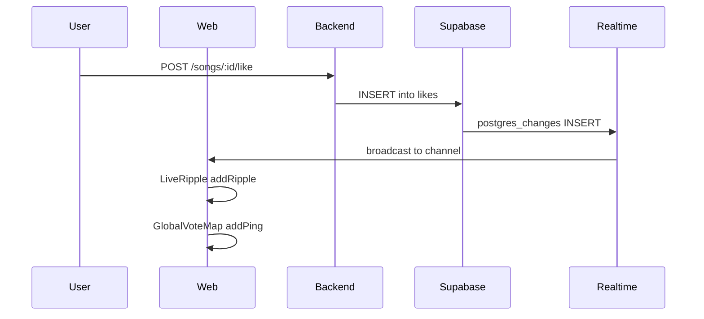

# ROI, Leaderboard, Quick-Buy, Catalyst Deep-Link, PWA, Visualizer

## 1. ROI dashboard (formula + heatmap)

**Formula:** \text{ROI} = (\text{New Followers} / \text{Credits Spent}) \times 100 over a chosen window (e.g. last 7 or 30 days).

**Data sources (existing):**

- **New followers:** [artist_follows](backend/supabase/migrations) — count rows where `artist_id = X` and `created_at` in window.
- **Credits spent:** [credits](backend) has `total_used`; for a window use [credit_allocations](backend) (direction = 'allocate' / 'withdraw') or derive from [transactions](backend) + credits consumed in that period. Simplest: use `credits.total_used` delta (e.g. store snapshot or compute from allocations/plays in window).

**Backend:**

- Add endpoint e.g. `GET /analytics/me/roi?days=7` in [backend/src/analytics](backend/src/analytics) that returns `{ newFollowers, creditsSpentInWindow, roi }`. Implement by: (1) counting `artist_follows` for current artist where `created_at >= now - days`; (2) summing credits used in window — either from `credit_allocations` where `artist_id` and `created_at` in window and direction = 'withdraw', or approximate from `plays` * cost per play for artist’s songs in window. Prefer `credit_allocations` if it tracks time; otherwise use `credits.total_used` with a stored “baseline” at window start (or same-window plays * 36 credits per 180s).
- Expose in [web/src/lib/api.ts](web/src/lib/api.ts) and add an **ROI card** on [web/src/app/(dashboard)/artist/stats/page.tsx](web/src/app/(dashboard)/artist/stats/page.tsx) (above or beside existing credits/analytics).

**Heatmap (listener locations during 1‑minute rotation):**

- **Data gap:** [plays](backend) has no `listener_region` or geo. Options: (A) Add optional `listener_region` (or `listener_country`) to `plays` when a play is recorded (from request IP or user profile `region`); (B) Use existing [profile_clicks](backend) + user `region` for “where clicks came from” as a proxy.
- **Recommendation:** Add optional `listener_region` to `plays` (nullable, set when play is reported if available from profile or IP). Backend: new endpoint e.g. `GET /analytics/me/plays-by-region?days=7` returning `{ region: string, count: number }[]`. Frontend: heatmap component (e.g. simple region list + counts, or a map library like Leaflet/Mapbox with points or region shading). If no geo yet, implement ROI first and heatmap as “region counts” list with placeholder map styling.

---

## 2. Trial by Fire leaderboard (upvotes/min + Rising Star alert)

**Upvotes per minute (algorithmic ranking):**

- **Metric:** For a sliding or fixed window (e.g. last 60 minutes), compute per song: `(count of leaderboard_likes in window) / (count of plays in window)` or total likes in window / total plays in window for that song. Rank songs by this rate.
- **Backend:** Extend [backend/src/leaderboard/leaderboard.service.ts](backend/src/leaderboard/leaderboard.service.ts): add method e.g. `getSongsByUpvotesPerMinute(windowMinutes: number, limit, offset)`. Query `plays` with `played_at >= now - windowMinutes`, join or subquery `leaderboard_likes` (linked by `play_id` or by song_id + time). Aggregate likes per song and plays per song in window; compute rate; return sorted list. Expose via new endpoint e.g. `GET /leaderboard/upvotes-per-minute?windowMinutes=60`.
- **Frontend:** Use on competition/leaderboard page or a dedicated “Trial by Fire” section; show ranked list with “upvotes/min” or similar label.

**Rising Star (5% conversion alert):**

- **Logic:** When a song’s conversion rate in its current or recent play reaches ≥ 5% (e.g. likes_during / listener_count at start or end), broadcast a “Rising Star” event to all listeners on the station.
- **Implementation:** (1) **Option A (backend):** After each like, or in a short-interval job, compute conversion for the current play (from `plays.likes_during` and `plays.listener_count` or `listener_count_at_end`). If ≥ 5%, emit event (e.g. Supabase Realtime broadcast, or write to a `rising_star_events` table that clients poll/subscribe to). (2) **Option B (client):** Listen page subscribes to a Realtime channel; backend (on like or cron) publishes a message like `{ type: 'rising_star', artistName, songTitle }` when threshold is hit.
- **Frontend:** Listen page subscribes to the same channel; on `rising_star`, show a toast or inline “Butterfly Ripple” alert (“Rising Star: [Artist] just hit 5% conversion!”). Reuse or extend [web/src/components/chat/ChatSidebar.tsx](web/src/components/chat/ChatSidebar.tsx) Supabase usage, or add a dedicated channel for station events.

---

## 3. Credits Quick-Buy (Apple/Google Pay)

**Goal:** While the artist is listening to their own track, show “Add 5 Minutes” with one-tap Apple Pay / Google Pay.

**Stripe:** Checkout Session supports `payment_method_types: ['card']`. For Apple Pay / Google Pay, use [Stripe Payment Request Button](https://stripe.com/docs/stripe-js#payment-request-button) (Payment Request API) or Checkout with `payment_method_types: ['card', 'apple_pay', 'google_pay']` where available. Alternatively, use Stripe Elements with Payment Request Button for a one-tap flow without redirect.

**Backend:**

- Add endpoint e.g. `POST /payments/quick-add-minutes` (or reuse existing song-plays checkout with a fixed “5 minutes” product). Request body: `{ songId?: string }` (optional, for context). Logic: fixed amount (e.g. 5 min = 300 seconds → 36 credits at 1 credit per 5s, or use existing [ALLOWED_PLAYS_LIST](backend/src/payments/dto/buy-song-plays.dto.ts) pricing). Return either a Checkout Session URL (redirect) or a PaymentIntent client_secret for Stripe Elements + Payment Request Button.
- If using Payment Request API: backend creates a PaymentIntent for the fixed amount; frontend uses `stripe.paymentRequest({ country, currency, total: { label, amount } })` and `paymentRequest.on('token')` to confirm; then backend confirms and allocates credits.

**Frontend:**

- On [web/src/app/(dashboard)/listen/page.tsx](web/src/app/(dashboard)/listen/page.tsx) or [web/src/components/radio/RadioPlayer.tsx](web/src/components/radio/RadioPlayer.tsx): when `radioApi.getCurrentTrack()` returns a song and `profile.id === track.artist_id`, show a prominent “Add 5 Minutes” button. On click, create PaymentIntent or Checkout Session (quick-add-minutes), then either redirect to Checkout or mount Stripe Payment Request Button (one-tap). On success, refresh credits and optionally show confirmation.

**Files:** [backend/src/payments](backend/src/payments) (new or extended endpoint), [web](web) (listen page or player component, Stripe.js/Payment Request or Checkout).

---

## 4. Catalyst deep-link (pinned profile during song airtime)

**Data:** [song_catalyst_credits](backend/supabase/migrations/011_catalyst_engine_postgis_venue_ads_song_credits_referrals.sql) already exists: `song_id`, `user_id` (catalyst), `role` (e.g. 'cover_art', 'video').

**Backend:**

- In [backend/src/radio/radio.service.ts](backend/src/radio/radio.service.ts) `getCurrentTrack()`, after loading the current song, query `song_catalyst_credits` for that `song_id`. Join with `users` (or service_providers) to get display name and profile link. Include in the returned payload e.g. `pinnedCatalysts: { userId, displayName, role }[]`.
- Optional: endpoint for artists to attach/detach catalysts to their songs (e.g. `POST /songs/:id/catalyst-credits`, body `{ userId, role }`); enforce that the song’s `artist_id` is the current user.

**Frontend:**

- [web/src/components/radio/RadioPlayer.tsx](web/src/components/radio/RadioPlayer.tsx) (or listen page): when `track.pinnedCatalysts` is present, render a “Cover art by [Name]” / “Video by [Name]” line with link to `/artist/[userId]`. Style as a small “Pinned” or “Credits” section below or beside Now Playing.

---

## 5. PWA (manifest + service worker)

**Manifest:**

- Add [web/public/manifest.json](web/public/manifest.json) (or use Next.js metadata): `name`, `short_name`, `description`, `start_url: '/'`, `display: 'standalone'` (or `minimal-ui`), `theme_color`, `background_color`, `icons` (e.g. 192x192, 512x512). Use existing Networx branding (Obsidian Night, Butterfly Electric) for theme/background.

**Service worker:**

- Use [next-pwa](https://www.npmjs.com/package/next-pwa) or [@serwist/next](https://serwist.pjs.io/) (successor to workbox) to generate a service worker that caches static assets and optionally API/radio for offline resilience. Register in [web/src/app/layout.tsx](web/src/app/layout.tsx) or via next-pwa’s automatic registration. Ensure `manifest.json` is linked from the root layout (e.g. `<link rel="manifest" href="/manifest.json" />`).

**Scope:** Prefer minimal PWA: installable + offline fallback for the shell; do not cache radio stream aggressively (or use short cache for current track URL).

---

## 6. Global State Visualizer (homepage map + ping on upvote)

**Goal:** Small map on the homepage that shows a “ping” every time someone upvotes a song (proves the platform is alive).

**Data:** Same as Live Ripple — global vote events. No PII; optional: approximate region (e.g. from Supabase Realtime payload or a backend broadcast that includes a generic “region” for map placement).

**Implementation:**

- **Backend or Realtime:** Either (A) Supabase Realtime on `likes` table INSERT (filter to only broadcast “vote happened” + optional region/country), or (B) backend endpoint that streams SSE or WebSocket “vote” events (backend subscribes to DB changes or is notified on like). Prefer (A) for simplicity: frontend subscribes to `likes` INSERT (anon) and on each insert triggers a ping.
- **Frontend:** New component e.g. [web/src/components/marketing/GlobalVoteMap.tsx](web/src/components/marketing/GlobalVoteMap.tsx): simple world or regional map (SVG or library like Leaflet/Mapbox with a single layer). On each vote event, add a short-lived “ping” at a random position or at a region centroid (if region is provided). Reuse the same Supabase Realtime subscription as Live Ripple (see below) so one subscription drives both the ripple and the map ping.
- **Placement:** Add the map to [web/src/app/(marketing)/page.tsx](web/src/app/(marketing)/page.tsx) (e.g. below hero or in a “Live activity” section).

---

## 7. Wire Live Ripple to real vote events

**Current state:** [web/src/components/marketing/LiveRippleVisualizer.tsx](web/src/components/marketing/LiveRippleVisualizer.tsx) uses a timer placeholder; comment says “Wire to vote/like events”.

**Approach:**

- **Supabase Realtime:** Subscribe to INSERT on `likes` table. Use [createClient](web/src/components/chat/ChatSidebar.tsx) pattern: `supabase.channel('likes').on('postgres_changes', { event: 'INSERT', schema: 'public', table: 'likes' }, (payload) => { addRipple(); })`. No need to send PII; just trigger one ripple per insert.
- **Constraint:** Supabase Realtime for `likes` must be enabled in Supabase dashboard (Realtime → enable for `public.likes`). If Realtime is not enabled, fallback: backend endpoint `GET /analytics/vote-events` (SSE or short polling) that returns recent vote timestamps; frontend polls and triggers ripple on new events.
- **Code change:** In `LiveRippleVisualizer`, create Supabase client (using existing `NEXT_PUBLIC_SUPABASE_URL` and `NEXT_PUBLIC_SUPABASE_ANON_KEY`), subscribe to `likes` INSERT in a `useEffect`, call `addRipple()` on each event (and optionally pass a random x,y for variety). Remove or reduce the timer-based ripple. Ensure cleanup (unsubscribe on unmount).

**Shared subscription:** If both Live Ripple and GlobalVoteMap need vote events, use one Supabase channel in a small hook or context (e.g. `useVoteEvents(callback)`) and have both components consume it.

---

## Implementation order (suggested)

1. **Catalyst deep-link** — Small backend + frontend change; table exists.
2. **ROI dashboard** — New analytics endpoint + ROI card on artist stats; heatmap can follow with optional `listener_region` on plays.
3. **Trial by Fire leaderboard** — Leaderboard service + endpoint; then Rising Star (Realtime or polling).
4. **Live Ripple + Global Visualizer** — One Supabase Realtime subscription for `likes`, drive both ripple and map pings.
5. **Credits Quick-Buy** — Backend quick-add-minutes endpoint; frontend “Add 5 Minutes” + Stripe Payment Request or Checkout.
6. **PWA** — manifest + next-pwa (or Serwist) and icon set.
7. **Heatmap** — After `listener_region` (or proxy) is available, add plays-by-region endpoint and heatmap UI.

---

## Diagram (data flow for vote-driven features)

---

## Files to add or touch (summary)

| Feature            | Backend                                                  | Frontend                                               |
| ------------------ | -------------------------------------------------------- | ------------------------------------------------------ |
| ROI                | analytics.service + controller (roi, plays-by-region)    | artist/stats ROI card, heatmap component               |
| Leaderboard        | leaderboard.service + controller (upvotes-per-minute)    | competition or leaderboard page                        |
| Rising Star        | Realtime broadcast on 5% conversion (or table + channel) | listen page subscription + toast                       |
| Quick-Buy          | payments (quick-add-minutes or reuse song-plays)         | listen/RadioPlayer “Add 5 Minutes” + Stripe            |
| Catalyst deep-link | radio.service getCurrentTrack + song_catalyst_credits    | RadioPlayer pinned catalysts line                      |
| PWA                | —                                                        | public/manifest.json, next-pwa or Serwist, layout link |
| Global map         | — (or SSE)                                               | GlobalVoteMap.tsx, marketing page                      |
| Live Ripple        | —                                                        | LiveRippleVisualizer Supabase subscription             |

