# NETWORX Platform — Use Case and Activity UML Diagrams

**Product:** NETWORX Radio: The Butterfly Effect  
**Tagline:** By artists, for artists.

This document contains Use Case diagrams and Activity diagrams for all platform scenarios. Diagrams use Mermaid syntax and render in GitHub, VS Code, and most markdown viewers.

---

## Actors

| Actor | Description |
|-------|-------------|
| **Listener (Prospector)** | Authenticated user who listens to radio, votes, earns Yield, uses Refinery |
| **Artist** | Content creator; can upload songs, allocate credits, go live, view analytics |
| **Catalysts (service providers)** | Pro-NETWORX professional; listed in directory, receives DMs and job applications |
| **Admin** | Platform administrator; moderation, user management, radio control |
| **System** | Automated backend processes (cron, webhooks, push) |

---

## Part 1: Use Case Diagrams

### UC1: Authentication System

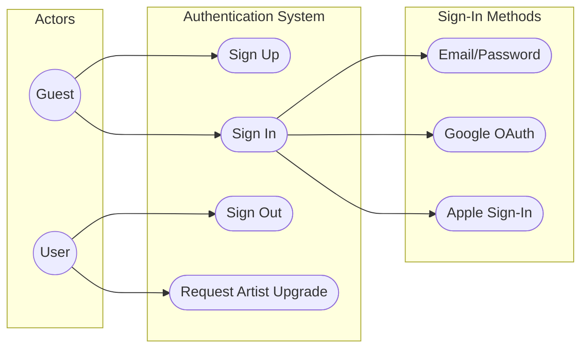

---

### UC2: Live Radio (All Users)

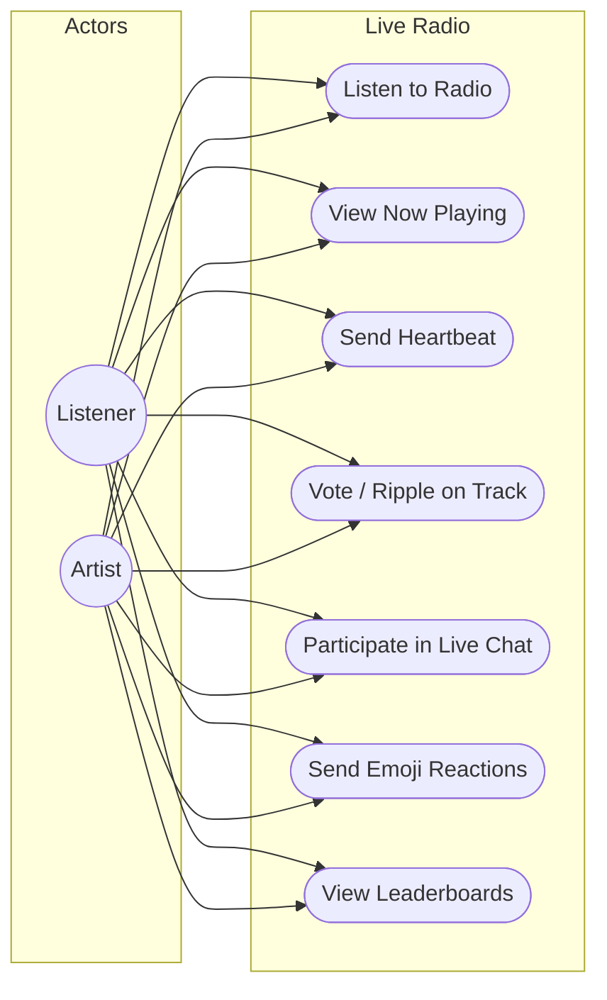

---

### UC3: Artist Content Management

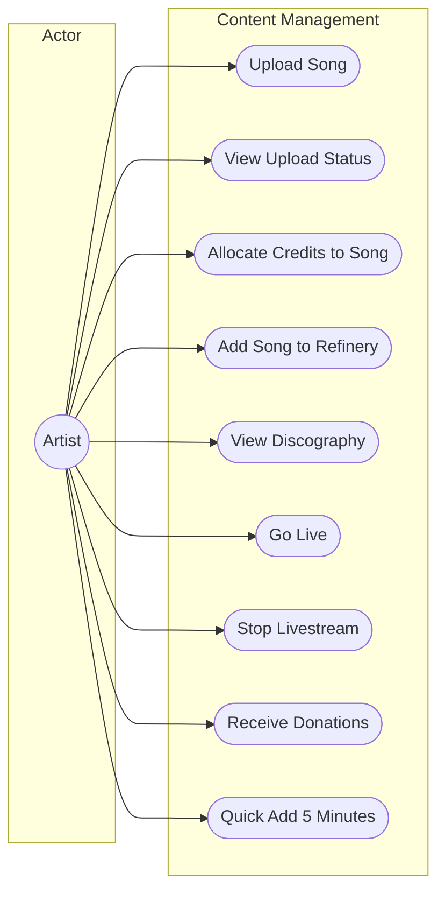

---

### UC4: Prospector Rewards (The Yield)

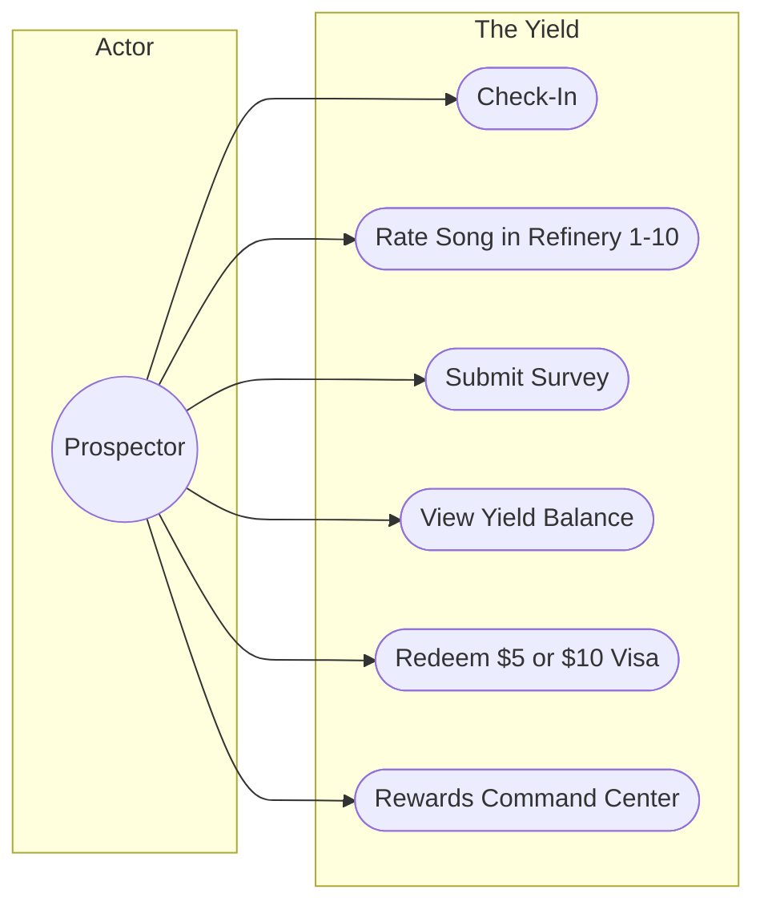

---

### UC5: Credits and Payments

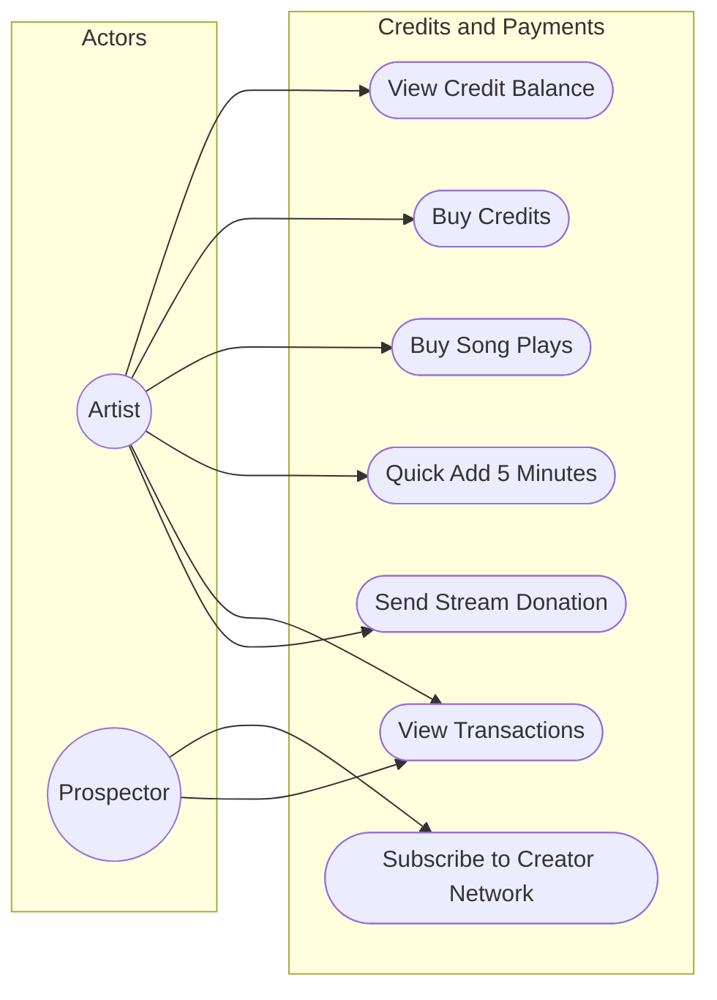

---

### UC6: Analytics (The Wake)

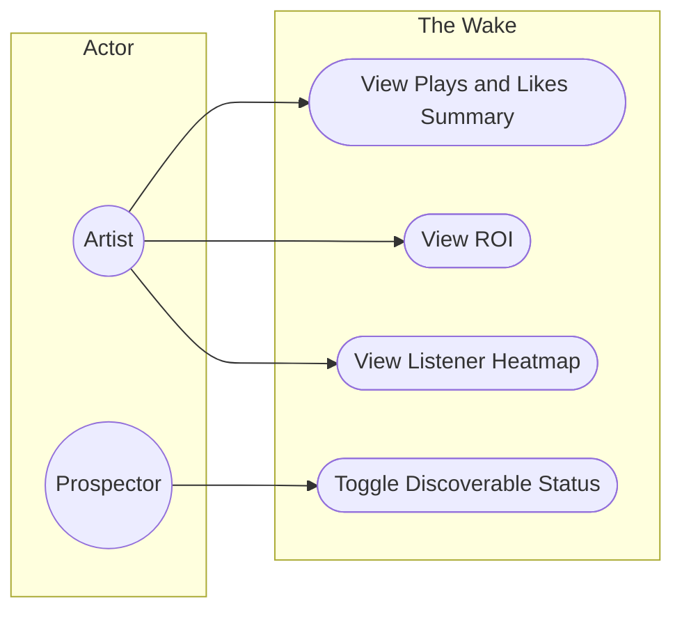

---

### UC7: Discovery and Pro-Directory

```mermaid
flowchart LR
    subgraph actors [Actors]
        Listener((Listener))
        ServiceProvider((Catalysts (service providers)))
    end

    subgraph discovery [Discovery and Pro-Directory]
        BrowsePeople([Browse People])
        SearchByFilters([Search by Filters])
        ViewProviderProfile([View Provider Profile])
        NearbySearch([Nearby Search - Mobile])
        EditProProfile([Edit Pro-NETWORX Profile])
        CompleteOnboarding([Complete Onboarding])
    end

    Listener --> BrowsePeople
    Listener --> SearchByFilters
    Listener --> ViewProviderProfile
    Listener --> NearbySearch
    ServiceProvider --> EditProProfile
    ServiceProvider --> CompleteOnboarding
    ServiceProvider --> ViewProviderProfile
```

---

### UC8: Messaging and Creator Network

```mermaid
flowchart LR
    subgraph actors [Actors]
        User((User))
        ServiceProvider((Catalysts (service providers)))
    end

    subgraph messaging [Messaging and Creator Network]
        ViewConversations([View Conversations])
        SendMessage([Send Message])
        ViewJobBoard([View Job Board])
        ApplyToJob([Apply to Job])
    end

    User --> ViewConversations
    User --> SendMessage
    User --> ViewJobBoard
    User --> ApplyToJob
    ServiceProvider --> ViewConversations
    ServiceProvider --> SendMessage
    ServiceProvider --> ViewJobBoard
    ServiceProvider --> ApplyToJob
```

**Note:** Send Message requires active Creator Network subscription (paywall).

---

### UC9: Admin Operations

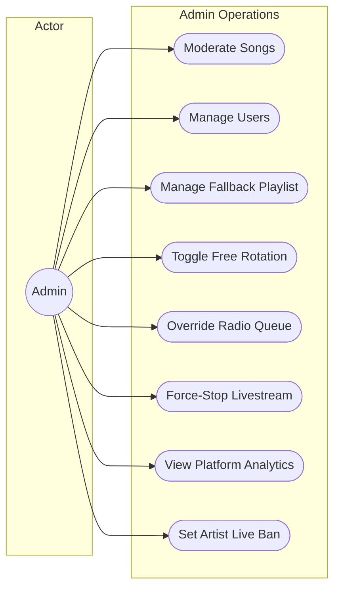

---

## Part 2: Activity Diagrams

### AD1: User Registration Flow

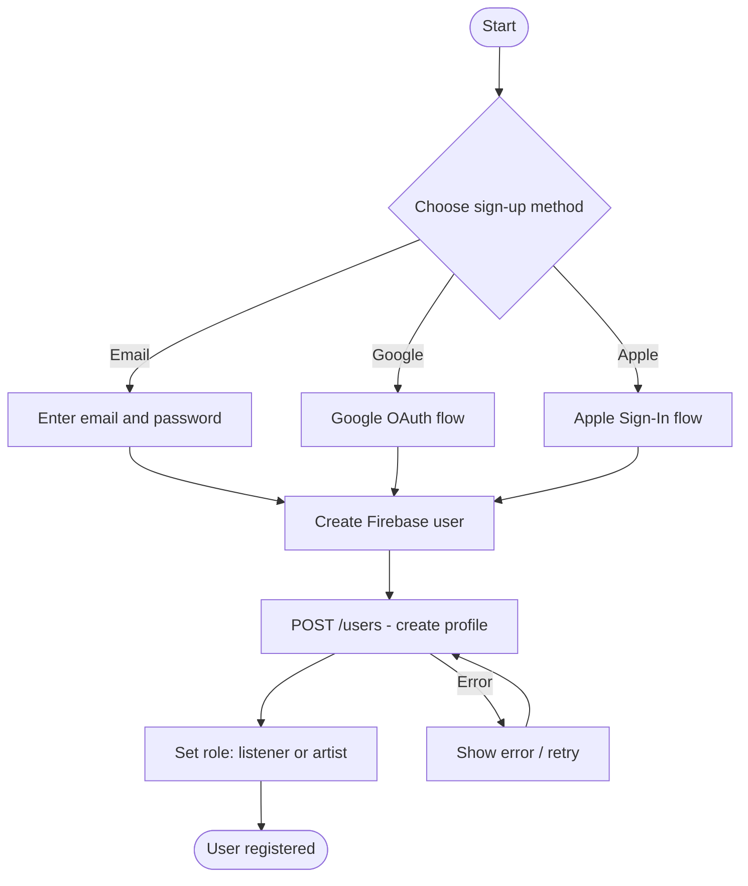

---

### AD2: Song Upload and Approval Flow

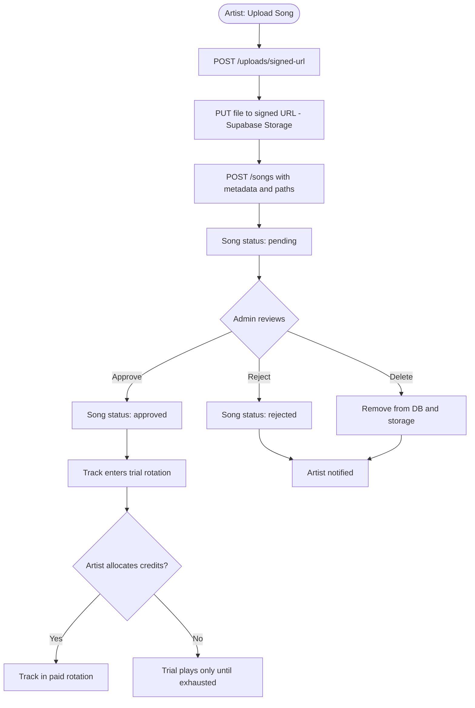

---

### AD3: Live Radio Playback Flow

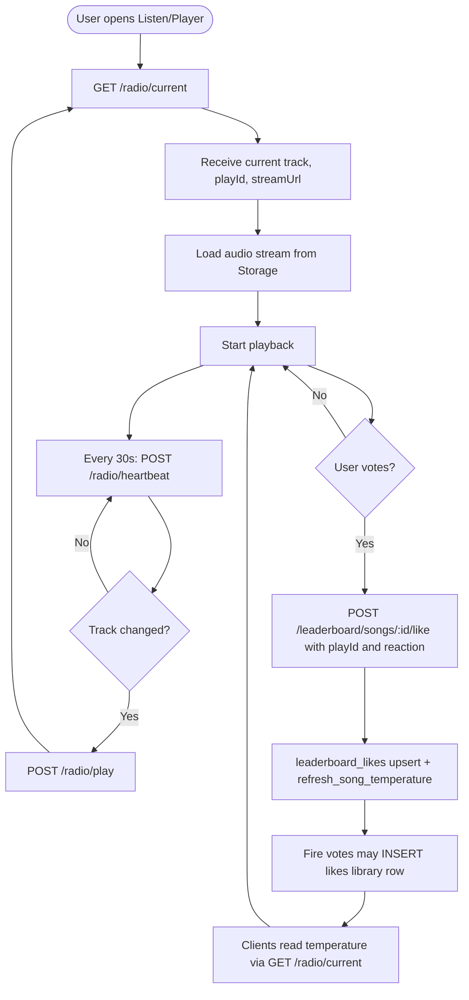

---

### AD4: Credit Purchase Flow (Web vs Mobile)

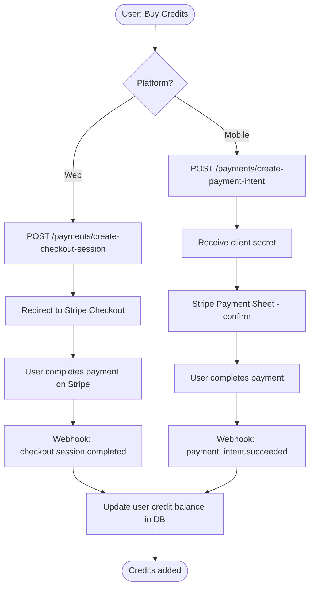

---

### AD5: Ripple / radio vote flow

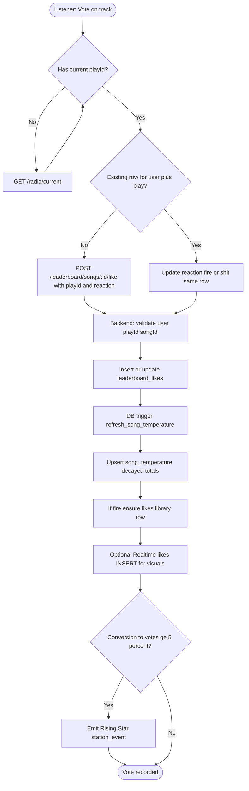

---

### AD6: Yield Redemption Flow

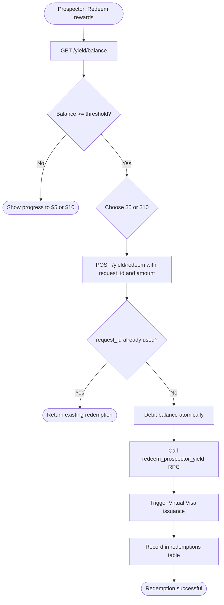

---

### AD7: Artist Livestream Flow

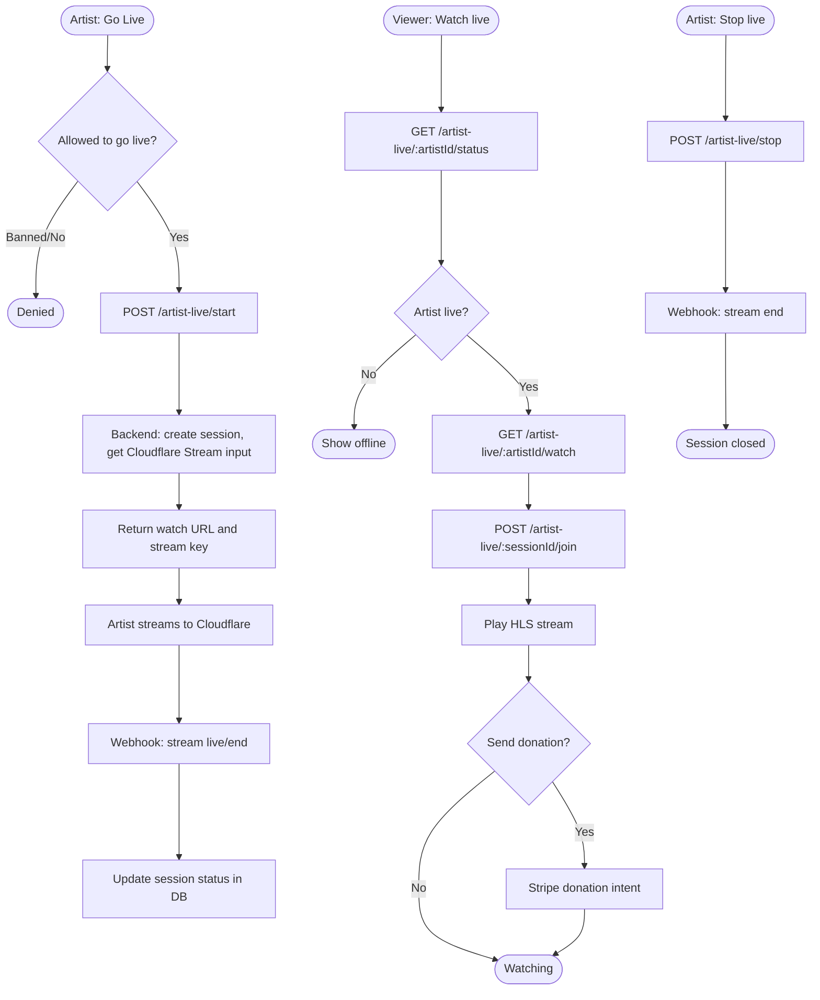

---

### AD8: Song Rotation Selection (Backend)

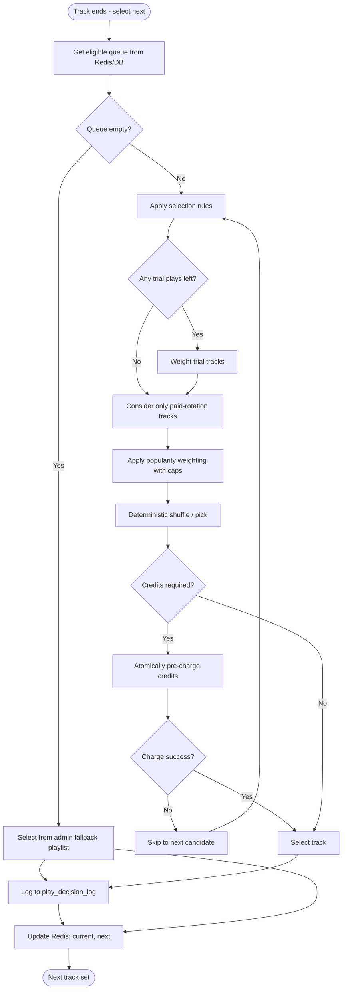

---

### AD9: Refinery Rating Flow

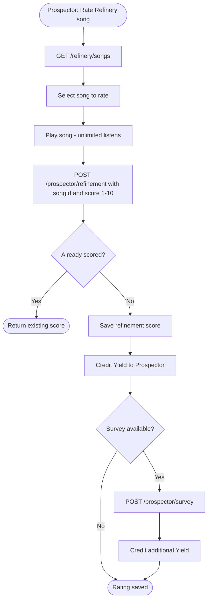

---

### AD10: Creator Network Message Flow

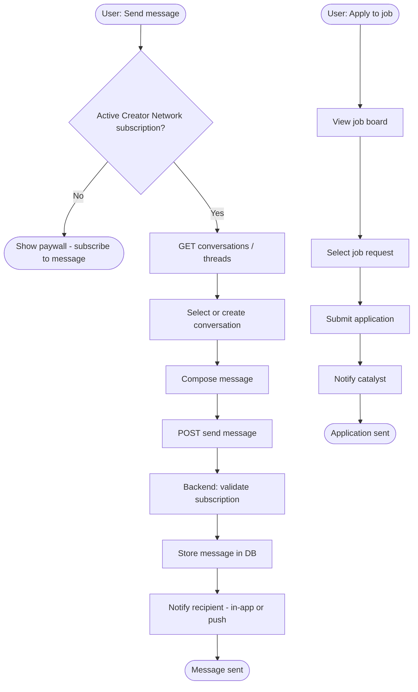

---

## Part 4: Architecture, schema, and flows (Mermaid)

### ARCH1: Containers (web, mobile, backend, data stores)

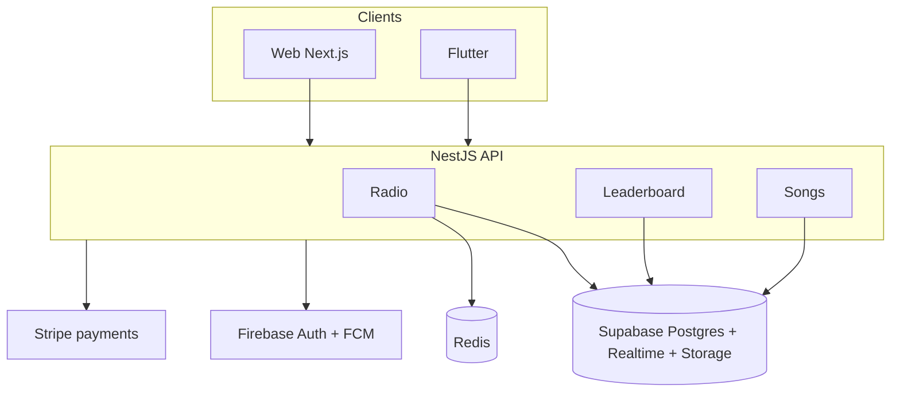

### ER1: Core entities for radio votes and temperature

```mermaid
erDiagram
  users ||--o{ leaderboard_likes : submits
  songs ||--o{ leaderboard_likes : target
  plays ||--o{ leaderboard_likes : play_scope
  songs ||--o| song_temperature : cache
  users ||--o{ likes : library
  songs ||--o{ likes : saved

  leaderboard_likes {
    uuid id PK
    uuid user_id FK
    uuid song_id FK
    uuid play_id FK
    text reaction
    timestamptz created_at
  }

  song_temperature {
    uuid song_id PK
    int fire_votes
    int shit_votes
    int total_votes
    int temperature_percent
    timestamptz updated_at
  }
```

### SEQ1: Per-play vote, cache refresh, current track read

```mermaid
sequenceDiagram
  participant C as Client
  participant API as NestJS
  participant DB as Supabase Postgres
  C->>API: POST leaderboard songs id like playId reaction
  API->>DB: upsert leaderboard_likes
  Note over DB: trigger trg_refresh_song_temperature
  API->>DB: RPC refresh_song_temperature p_song_id
  API->>DB: select song_temperature by song_id
  API-->>C: liked reaction
  C->>API: GET radio current
  API->>DB: RPC refresh_song_temperature
  API->>DB: select song_temperature
  API-->>C: now playing plus temperature_percent
```

### ACT1: Temperature lifecycle (zero baseline plus decay)

```mermaid
flowchart TD
  N([New or idle song]) --> Z[temperature_percent defaults to 0]
  Z --> V{leaderboard_likes has votes?}
  V -->|no| Z
  V -->|yes| R[refresh_song_temperature recomputes]
  R --> D[Decay each vote by age half-life 24h]
  D --> P[percent equals clamped decayed fire minus decayed shit]
  P --> E[Clients show bar from GET radio current]
  E --> T{Time passes or new vote?}
  T --> R
```

---

## Summary

| Diagram | Type | Scope |
|---------|------|--------|
| UC1 | Use Case | Authentication |
| UC2 | Use Case | Live Radio |
| UC3 | Use Case | Artist Content |
| UC4 | Use Case | The Yield |
| UC5 | Use Case | Credits and Payments |
| UC6 | Use Case | The Wake (Analytics) |
| UC7 | Use Case | Discovery and Pro-Directory |
| UC8 | Use Case | Messaging |
| UC9 | Use Case | Admin Operations |
| AD1 | Activity | User Registration |
| AD2 | Activity | Song Upload and Approval |
| AD3 | Activity | Live Radio Playback |
| AD4 | Activity | Credit Purchase |
| AD5 | Activity | Ripple/Vote |
| AD6 | Activity | Yield Redemption |
| AD7 | Activity | Artist Livestream |
| AD8 | Activity | Song Rotation Selection |
| AD9 | Activity | Refinery Rating |
| AD10 | Activity | Creator Network Messaging |
| ARCH1 | Flowchart | Containers and integrations |
| ER1 | ER diagram | Votes, library, temperature cache |
| SEQ1 | Sequence | Vote, RPC, current track |
| ACT1 | Activity | Temperature decay lifecycle |

*Updated: March 2026 — aligned with migrations 047–049 and leaderboard query modes.*
