# NETWORX UML Diagrams (Current State)

This document captures the current product flows for web, mobile, backend, and shared services.

## Actors

| Actor | Description |
| --- | --- |
| Guest | Unauthenticated visitor |
| Listener (Prospector) | Authenticated listener using radio, votes, and discovery |
| Artist | Uploads songs, manages credits, tracks analytics, can stream |
| ServiceProvider (Catalyst) | Pro-NETWORX profile owner and service provider |
| Admin | Moderates content/users and manages operational controls |
| System | Automated workers, triggers, webhooks, and push events |

## UC1 Authentication and Profile Provisioning

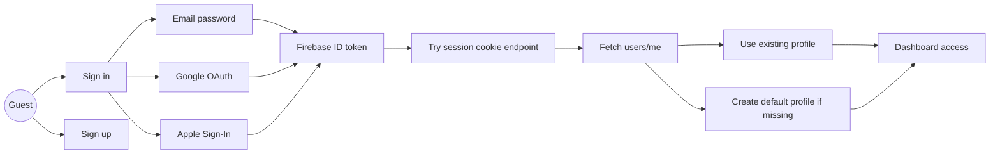

## UC2 Live Radio, Voting, and Temperature

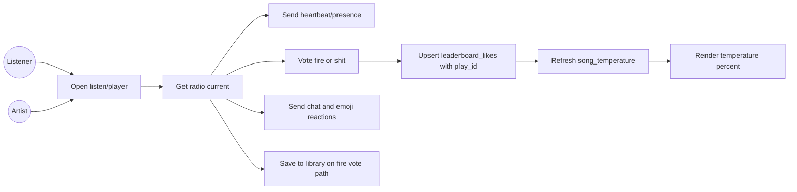

## UC3 Artist Workflow

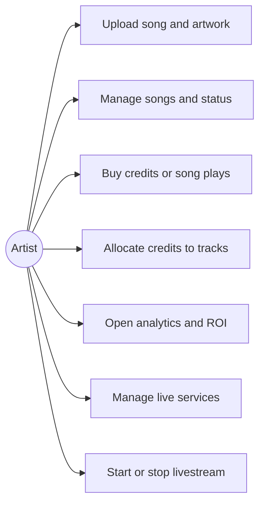

## UC4 Competition and Spotlight

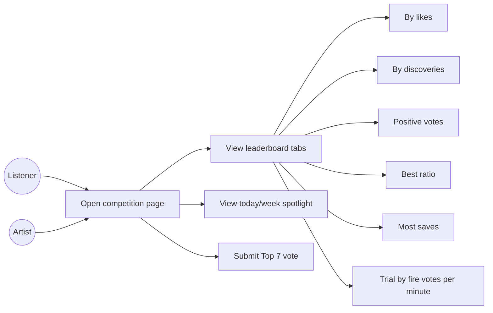

## UC5 Discovery, Pro-NETWORX, and Messaging

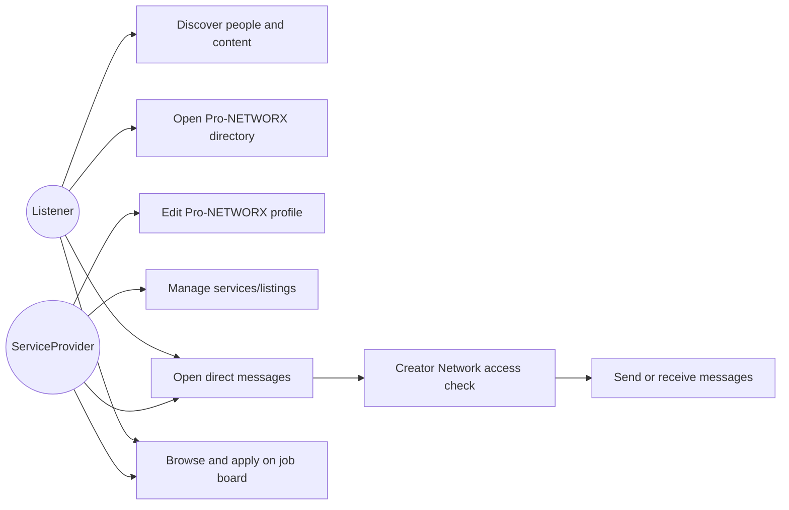

## UC6 Admin Operations

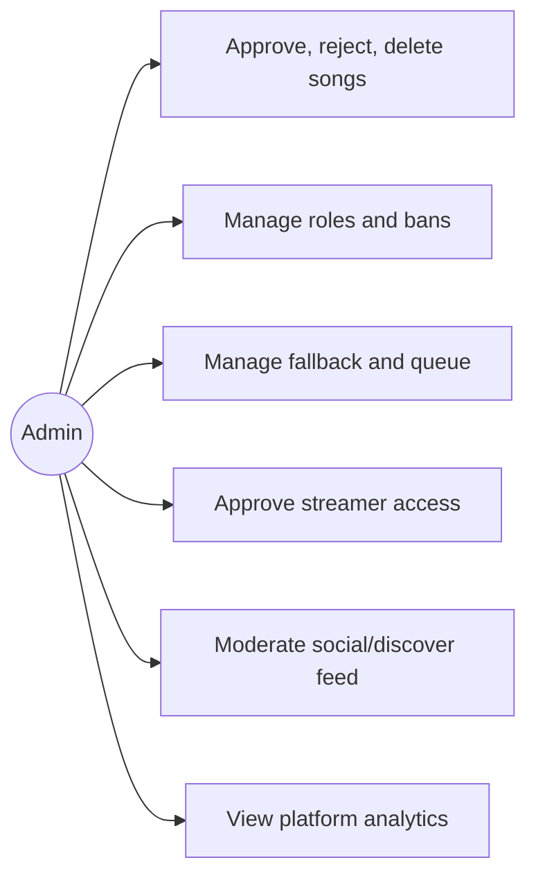

## AD1 Song Upload to Rotation

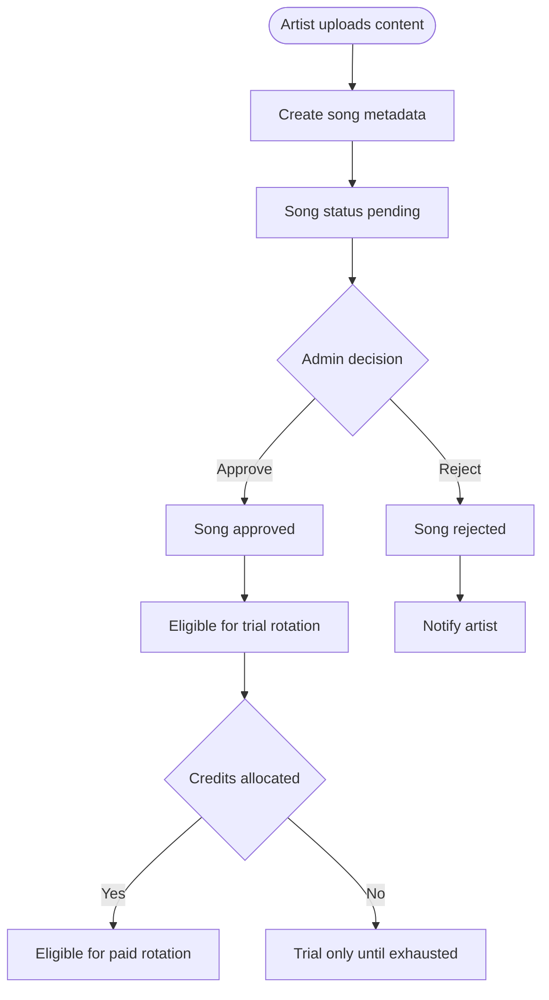

## AD2 Playback and Vote Processing

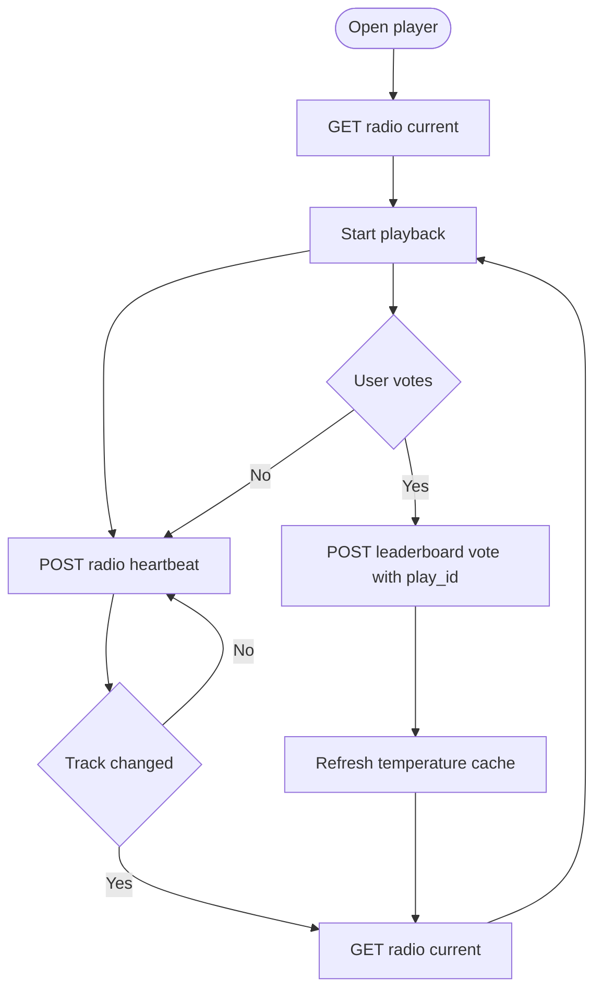

## AD3 Web Login Resilient Session Flow

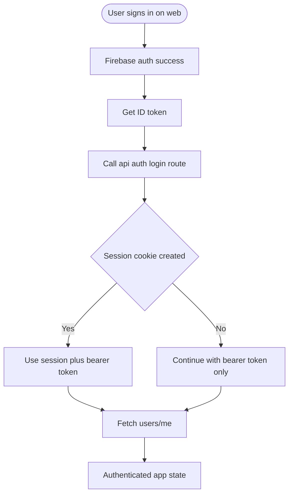

## AD4 Competition Data Load

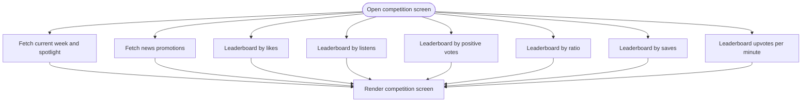

## ARCH1 Container Overview

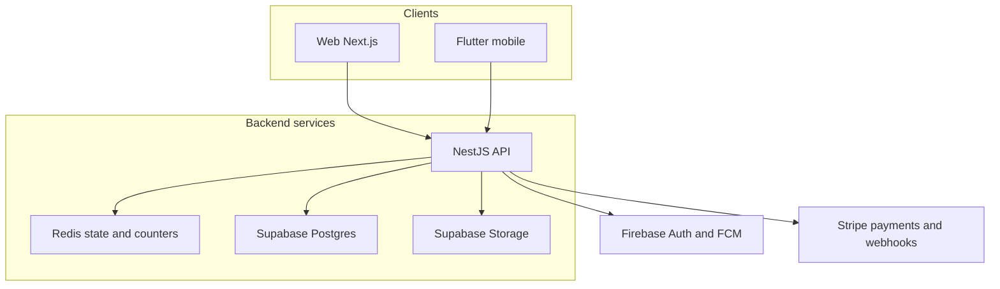

## ER1 Core Voting Entities

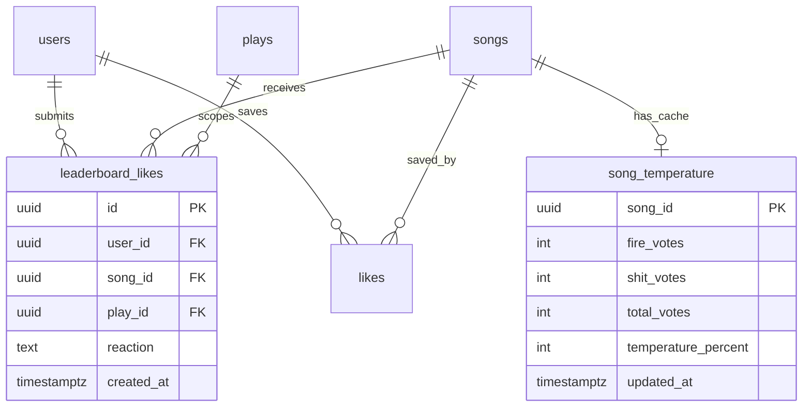

## SEQ1 Vote Round Trip

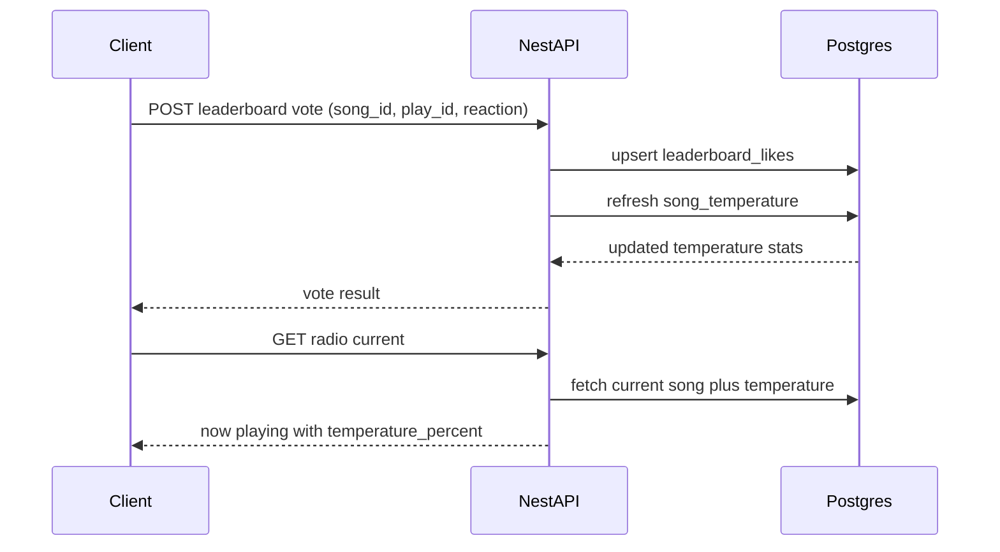

---

Updated: April 2026
