# RadioApp / Discover Me Development Timeline

## Executive Summary for Clients
This timeline shows how the platform evolved from an initial radio streaming MVP (artists pay credits for airplay, listeners get continuous music) into a robust **Discover Me** creator networking platform. Development followed a clear workflow: detailed planning documents, status reviews to track progress and gaps, focused implementation sprints, rigorous testing (including a master 10-step E2E flow and 14 radio-specific logic tests), and rapid bug fixes. 

Key themes:
- **Reliability first**: Early in-memory state issues and April 2026 radio playback problems (stuttering, songs restarting, Supabase overload) were systematically addressed with Redis for state, database checkpoints, atomic credit operations, caching, and fallback mechanisms.
- **Transparency and fairness**: Added detailed logging of every song selection decision so artists can trust the rotation system.
- **Cross-platform parity**: Consistent experience across web (Next.js), mobile (Flutter), and backend.
- **Business evolution**: From pure radio pay-per-play to professional networking for artists and "Catalysts" (service providers like producers, designers, marketers) with job boards, portfolios, and Pro features.

The project now has stable radio streaming, rich artist analytics (new stats tables and dashboard), refinery for paid submissions/reviews, compliance features, and a clear path for competitions, livestreams, and full Discover Me networking.

## Timeline Graphic (Mermaid)

```mermaid
timeline
    title RadioApp → Discover Me Platform Evolution (Jan - May 2026)
    section Foundation MVP
        Jan 16 : First commit + Phase 1 MVP (auth, uploads, basic radio, payments) [20cefc8, 3ac50e0]
        Jan 24 : Phase 2 - Admin dashboard, credits, likes, persistent queue [58daaec]
        Jan 27 : Phase 3 + Radio persistence, hysteresis, testing procedures [a43c3ef]
        Early Gaps Identified : Status Review 1 - In-memory radio state (lost on restart), no mobile navigation, songs stuck pending, no credit deduction on play, incomplete admin approval [Status_Review_1.md, Plan.md]
    section MVP Completion & Pivot
        Jan 24 2025 : Status Review 2 - ALL Review 1 gaps closed. Persistent queue with credit deduction, full Next.js admin (approve/reject songs, analytics), mobile bottom nav + Stripe PaymentSheet + Credits screen + player like button [Status_Review_2.md]
        Feb 2026 : Feature expansion, Spotify-like discography + per-play voting, PRO-NETWORX site MVP, Discover Me pivot begins (professional networking for creators + Catalysts/service providers, job board, portfolio browse) [discover_me_pivot*.plan.md, spotify-like-*.plan.md]
        Mar 2026 : Instagram-style likes/notifications/swipes, domain migration to pro-networx.com, analytics/leaderboard foundations, refinery (paid submissions) groundwork [d78578c, 31a6e6b, competition_spotlight plans]
    section Reliability Crisis & Major Fixes
        Apr 6 : Radio regression investigation branch merged [1f02858]
        Apr 19-23 : Radio bugs surfaced at scale - stuttering/skipping on track changes, songs restarting, listener count errors, Supabase 503 errors, high disk IO/query pressure. 30+ bugs identified across backend/web/mobile [radio-regression-investigation, 3b648e9]
        Apr 20-28 : Comprehensive fixes
            - Redis hybrid state management (`radio-state.service.ts`, `radio_playlist_state` table with checkpoints/versioning) - eliminates in-memory loss
            - Atomic Supabase RPCs for credits (`deduct_play_credits`, pre-charge based on real duration)
            - Circuit breakers, SWR caching, direct Postgres fallbacks, parallelization
            - `play_decision_log` table for full transparency (why each song was chosen, weights, competing songs, seed)
            - Hysteresis (paid vs free rotation based on listener count), trial plays (3 free on approval), admin fallback songs, no-content handling
            - FFmpeg server-side duration validation to prevent spoofing
            - Fixed autoplay, hydration, profile DTO mapping, realtime chat
        Apr 28-May : Supabase optimizations (throttle SWR, cache hot values like listener counts, catalysts, signed URLs). Refinery overhaul completed [dd29511, 65d9306]
    section Maturation & Analytics
        May 4+ : Artist stats dashboard (`web/src/app/(dashboard)/artist/stats/page.tsx`), new DB migrations (059_artist_song_stats_with_window.sql, 060_artist_daily_stats.sql), `analytics.service.ts` enhancements, self-service account deletion page (Google Play compliance), My Songs real per-song stats from plays/likes [f4192c0, 206dc86, recent untracked changes]
        Ongoing : Full test suite (unit, integration, Master E2E 10-step flow, Radio R1-R14 logic tests per Testing_Procedures.md), Discover Me UI completion (browse feed, DM paywall), livestreams/competitions/PWA, Pro-Networx integration
    section Workflow & Tools
        Continuous : Cursor AI plans (27+ documents with YAML todos/status), Status Reviews as milestones, Testing_Procedures.md as living spec (DB schema, RPCs, test matrix, implemented modules list), git workflow with feature branches, Supabase best practices (migrations, RLS, RPCs for atomicity), cross-platform parity focus, Vercel deploys, Redis for realtime/state
```

## Key Bugs, When They Appeared, and How They Were Fixed

**Early MVP Bugs (Jan 2026 - Status_Review_1.md):**
- Radio state lost on server restart (in-memory only) → Fixed with persistent `rotation_queue` table then full Redis + `radio_playlist_state` checkpoints.
- No automatic credit deduction on play, songs stuck "pending" (no admin approval workflow) → Added admin dashboard approval + atomic RPCs.
- Mobile navigation broken (routes existed but unusable) → Implemented role-based BottomNavigationBar.
- Inconsistent error handling and unprotected endpoints → Standardized NestJS exceptions and guards.

**Scaling & Radio Reliability Bugs (April 2026):**
- Stuttering, skipping during transitions, songs restarting, player hangs, double-counted listeners.
- Supabase overload (503 errors, high disk IO, query pressure, schema cache timeouts).
- These appeared as user load increased after initial MVP success.
- **Fixed in intense 2-week sprint**: 
  - Comprehensive codebase audit (30+ bugs fixed).
  - Switched to stateless architecture with Redis primary state + DB durability.
  - Added `play_decision_log` for auditability and trust.
  - Caching, circuit breakers, fallbacks, parallel queries, SWR optimizations.
  - Real duration validation via FFmpeg on backend.
  - Result: Stable, transparent, scalable radio that handles hysteresis between free/paid rotation and gracefully manages "no content" scenarios.

**Current State**: Radio is production-ready. Analytics matured with dedicated artist stats page and windowed/daily stats tables. Platform successfully pivoted to support professional creator networking while keeping radio as a core engagement feature. 497 commits demonstrate methodical, iterative progress with strong focus on reliability and user trust.

**Next Steps**: Complete remaining test suite execution, polish Discover Me browse/DM/job flows, add competitions/livestreams, and prepare for broader launch.

*Generated from git history (497 commits), all .cursor/plans/* documents, Status Reviews, Testing_Procedures.md, and recent code changes (analytics, stats page, migrations).*
